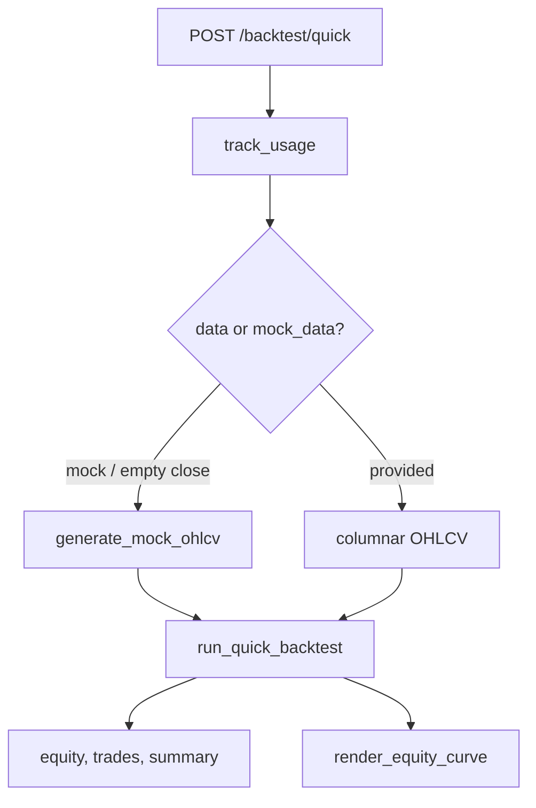

# Copyright (C) 2024-2026 jango_blockchained
#
# This file is part of pynescript.
#
# pynescript is free software: you can redistribute it and/or modify
# it under the terms of the GNU Affero General Public License as published by
# the Free Software Foundation, either version 3 of the License, or
# (at your option) any later version.
#
# pynescript is distributed in the hope that it will be useful,
# but WITHOUT ANY WARRANTY; without even the implied warranty of
# MERCHANTABILITY or FITNESS FOR A PARTICULAR PURPOSE.  See the
# GNU Affero General Public License for more details.
#
# You should have received a copy of the GNU Affero General Public License
# along with pynescript.  If not, see <https://www.gnu.org/licenses/>.
#
# SPDX-License-Identifier: AGPL-3.0-or-later

---
title: "Backtest Endpoint"
description: "POST /backtest/quick — usage-tracked strategy metrics, equity curve, and optional mock OHLCV."
---

# Backtest Endpoint

## Abstract

`POST /backtest/quick` is a Pro, usage-tracked route that runs a **simplified** strategy simulation over columnar OHLCV (or generated mock bars), returns trade lists + summary metrics, and embeds a base64 equity-curve PNG. It is optimized for speed/demo UX; it is not a full fidelity substitute for event-aware `Runtime` strategy evaluation on `/run`.

## Conceptual model



Blueprint: `backtest_bp`, prefix `/backtest`.

## Interface surface

### Request

```json
{
  "script": "//@version=6\nstrategy(\"s\")…",
  "data": {
    "open": [], "high": [], "low": [], "close": [], "volume": []
  },
  "initial_capital": 10000.0,
  "mock_data": false,
  "mock_bars": 252
}
```

| Field | Default | Notes |
| --- | --- | --- |
| `script` | required | Empty → `NO_SCRIPT` |
| `data` | `{}` | Columnar; may be omitted if `mock_data` |
| `initial_capital` | `10000` | Starting equity |
| `mock_data` | `false` | Force synthetic bars |
| `mock_bars` | `252` | Length of mock series |

If neither usable `close` nor `mock_data` → `NO_DATA`.

### Success

```json
{
  "status": "success",
  "result": {
    "equity_curve": [10000, …],
    "trades": [
      {
        "entry_time": 0,
        "entry_price": 0,
        "exit_time": 0,
        "exit_price": 0,
        "direction": "long",
        "pnl": 0,
        "pnl_pct": 0,
        "size": 1
      }
    ],
    "summary": {
      "total_pnl": 0,
      "total_pnl_pct": 0,
      "sharpe_ratio": 0,
      "max_drawdown": 0,
      "max_drawdown_pct": 0,
      "win_rate": 0,
      "profit_factor": 0,
      "total_trades": 0,
      "winning_trades": 0,
      "losing_trades": 0,
      "avg_win": 0,
      "avg_loss": 0
    },
    "equity_chart": "<base64 png>"
  },
  "tier_info": {},
  "meta": {
    "bars": 252,
    "initial_capital": 10000,
    "completed_at": 0
  }
}
```

### Errors

| code | HTTP | When |
| --- | --- | --- |
| `NO_SCRIPT` | 400 | Empty script |
| `NO_DATA` | 400 | No data and not mock |
| `BACKTEST_ERROR` | 500 | Exception in simulation |
| `UNAUTHORIZED` / `RATE_LIMITED` | 401 / 429 | Auth |

## Internals

`run_quick_backtest` wraps `run_backtest(..., plot_chart=True)` and returns `BacktestResult.to_dict()` (`backend/services/backtest.py`). `avg_bars_in_trade` exists on the dataclass but is **not** exported in `summary`.

MVP simulation characteristics:

1. Optionally `parse(script)` (errors soft-ignored for MVP path).
2. Precompute long/short entry signals from dual SMA cross (10 vs 20) starting at bar 20.
3. Exit heuristics via RSI-like average and opposite signals / end of series.
4. Equity curve + trade PnL with optional commission/slippage parameters on the lower-level API.
5. Metrics: Sharpe (√252 scaling), max drawdown, win rate, profit factor.
6. Chart via `render_equity_curve`.

`generate_mock_ohlcv(n_bars)` produces synthetic columns for demos.

| Path | Role |
| --- | --- |
| `backend/api/preview.py` | `quick_backtest` route |
| `backend/services/backtest.py` | Simulation + metrics |
| `backend/services/chart_renderer.py` | Equity PNG |

## Invariants and edge cases

1. **Script content is lightly used** in the MVP sim — do not treat results as broker-accurate for arbitrary strategies. Prefer `/run` events for engine-faithful strategy traces.
2. **Columnar data**, same family as preview, not `/run` bar lists.
3. **Mock path** ignores incomplete user data when `mock_data` or empty close.
4. One usage increment per successful HTTP response under `track_usage`.

## Worked example

```bash
curl -s http://127.0.0.1:5002/backtest/quick \
  -H "Authorization: Bearer $API_KEY" \
  -H 'Content-Type: application/json' \
  -d '{
    "script": "//@version=6\nstrategy(\"demo\")\n// body optional for MVP",
    "mock_data": true,
    "mock_bars": 120,
    "initial_capital": 25000
  }' | jq '.result.summary'
```

## Failure modes

| Symptom | Cause |
| --- | --- |
| Implausible trades vs script logic | MVP signal model, not full evaluator |
| Empty trade list | No crosses in series / short history |
| Missing `equity_chart` | Renderer exception swallowed → empty string |

## See also

- [Runtime bridge](/pyne/docs/api/runtime-bridge) — faithful strategy events via `/run`
- [Chart renderer](/pyne/docs/api/services/chart-renderer)
- [Strategy builtins](/pyne/docs/runtime/builtins/strategy)
