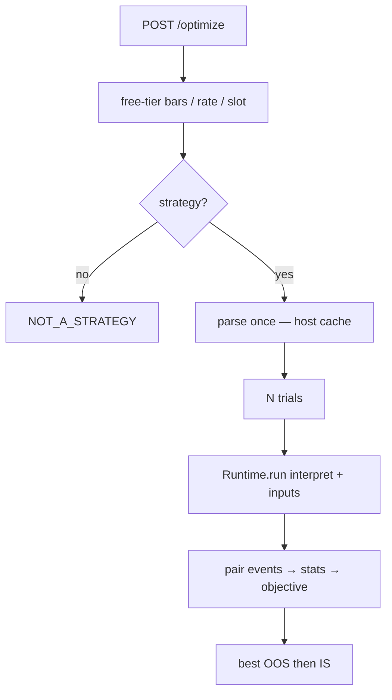

# Copyright (C) 2024-2026 jango_blockchained
#
# This file is part of pynescript.
#
# SPDX-License-Identifier: AGPL-3.0-or-later

---
title: "POST /optimize"
description: "Strategy hyperparameter search — N interpret Runtime runs with input.* overrides, TPE/random/grid, holdout or walk-forward."
---

# POST `/optimize`

## Abstract

`/optimize` searches Pine `input.*` values for a **`strategy()`** script. It loops the package **Runtime** (same interpret path as `/run`) with different overrides, scores closed trades, and returns the best assignment plus every trial.

This is **not** `/backtest/quick` (that route is a demo SMA simulator). It is **not** a Pine language surface — there is no `optimize.*` builtin.

AXIS Hyperparameter Optimisation calls this when the active engine is the Pro API (`server`). Pyodide / edge engines fall back to a client-side loop.

## Conceptual model



## Request

| Field | Type | Required | Default | Notes |
| --- | --- | --- | --- | --- |
| `script` | string | yes | | Must declare `strategy(` |
| `data` | list | yes | | Same OHLCV objects as `/run` |
| `space` | object | yes | | `{ params: [{ name, kind, min, max, step?, choices? }] }` |
| `n_trials` | int | no | 30 | Capped at 200 |
| `sampler` | string | no | `auto` | `auto` \| `random` \| `tpe` \| `grid` (`auto` → random if N&lt;20 else TPE) |
| `objective` | string | no | `composite` | `net_pnl` \| `profit_factor` \| `calmar` \| `composite` |
| `validation` | object | no | `{ mode: "holdout" }` | `holdout` \| `walk-forward` \| `in-sample` |
| `min_trades` | int | no | 5 | Trials below this score `-inf` |
| `seed` | int | no | | RNG seed |
| `symbol` | string | no | `CHART` | |
| `oos_every_trial` | bool | no | true | Holdout: score every trial on the test slice |
| `fixed_inputs` | object | no | `{}` | Current `input.*` values for names **not** in `space` (trial params win on overlap) |
| `libraries` | list | no | `[]` | Same AXIS git-publish list as `/run` |

`space.params[].kind`: `int` \| `float` \| `bool` \| `categorical`. Numeric axes **require** `min` and `max`.

`validation` extras: `holdout_frac` (default 0.3), `train_bars` / `test_bars` / `step_bars` for walk-forward.

Estimated engine runs are capped at 400 (`n_trials * folds`).

## Success

```json
{
  "status": "success",
  "sampler": "tpe",
  "objective": "composite",
  "validation": { "mode": "holdout", "holdout_frac": 0.3, "train_bars": 200, "test_bars": 50, "step_bars": 50, "warmup_bars": 0 },
  "n_trials": 30,
  "trials": [
    {
      "index": 0,
      "params": { "Fast": 8 },
      "is_score": 12.4,
      "oos_score": 3.1,
      "is_stats": { "total_pnl": 10, "trades": 8, "max_dd": 0.1 },
      "oos_stats": { "total_pnl": 3, "trades": 6, "max_dd": 0.08 },
      "error": null,
      "engine_runs": 2,
      "ms": 210.4
    }
  ],
  "best_index": 4,
  "best_params": { "Fast": 6 },
  "best_is_score": 15.0,
  "best_oos_score": 4.2,
  "engine_runs": 60,
  "ms": 8421.2,
  "warning": null
}
```

Full event arrays are **not** returned (memory). Re-run the winner via `/run` + `inputs`. Success includes `validation` and per-trial `oos_stats` / `engine_runs` / `ms`.

## Errors

| HTTP | code | When |
| --- | --- | --- |
| 400 | `MISSING_FIELD` / `INVALID_FIELD` / `UNKNOWN_FIELDS` / `INVALID_BODY` | Schema — empty/`{}` body, missing required fields, wrong types, extras |
| 400 | `NO_SCRIPT` / `NO_DATA` | `script` / `data` present but empty after schema |
| 400 | `NOT_A_STRATEGY` | Script is not `strategy()` |
| 400 | `INVALID_SPACE` | Missing bounds / empty params |
| 400 | `INVALID_VALIDATION` | `validation.mode` not `holdout` \| `walk-forward` \| `in-sample` |
| 400 | `TOO_MANY_RUNS` | Estimated runs exceed 400 |
| 400 | `GRID_TOO_LARGE` | Grid sampler product exceeds 200 cells |
| 413 / 429 | same as `/run` | Free-tier caps |

## Invariants

1. Always **interpret** (input overrides skip compile).
2. Train and test are **bar slices**, not trade filters on a full-sample run.
3. In-sample mode is allowed and **warned**.
4. Ranking prefers **OOS** score when validation is holdout or walk-forward.

## CLI

```bash
pyne optimize strat.pine --trials 20 --sampler tpe \
  --space '{"params":[{"name":"Fast","kind":"int","min":3,"max":12}]}'
# walk-forward: --validation walk-forward  (derives train/test from --bars)
# override: --train-bars 80 --test-bars 20 --step-bars 20
```

## See also

- [POST /run](/pyne/docs/api/endpoints/run)
- [Runtime bridge](/pyne/docs/api/runtime-bridge)
- AXIS end-user guide: Hyperparameter Optimisation
