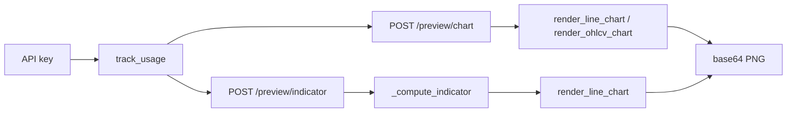

# Copyright (C) 2024-2026 jango_blockchained
#
# This file is part of pynescript.
#
# pynescript is free software: you can redistribute it and/or modify
# it under the terms of the GNU Affero General Public License as published by
# the Free Software Foundation, either version 3 of the License, or
# (at your option) any later version.
#
# pynescript is distributed in the hope that it will be useful,
# but WITHOUT ANY WARRANTY; without even the implied warranty of
# MERCHANTABILITY or FITNESS FOR A PARTICULAR PURPOSE.  See the
# GNU Affero General Public License for more details.
#
# You should have received a copy of the GNU Affero General Public License
# along with pynescript.  If not, see <https://www.gnu.org/licenses/>.
#
# SPDX-License-Identifier: AGPL-3.0-or-later

---
title: "Preview Endpoints"
description: "Pro chart and indicator thumbnail routes under /preview with usage tracking."
---

# Preview Endpoints

## Abstract

Preview routes render **PNG thumbnails** (base64) for desk UIs and docs. They require an API key via `@track_usage`, accept OHLCV-shaped **objects** (column arrays), and do **not** run the full `Runtime` bar loop for `/preview/chart` (data is plotted directly). `/preview/indicator` evaluates a small set of closed-form `ta.*` expressions in pure Python for the series, then plots.

## Conceptual model



Blueprint: `preview_bp` with `url_prefix="/preview"` in `backend/api/preview.py`.

## Interface surface

### Auth

Both routes: `@track_usage` → must pass `require_api_key` and consume one call on success.

### `POST /preview/chart`

#### Body (documented; schemas exist as `PREVIEW_CHART_SCHEMA`)

```json
{
  "script": "optional string",
  "data": {
    "open": [], "high": [], "low": [], "close": [], "volume": []
  },
  "options": {
    "type": "line",
    "color": "#2196F3",
    "show_volume": false,
    "width": 600,
    "height": 300
  }
}
```

| Option | Default | Clamp |
| --- | --- | --- |
| `type` | `"line"` | `"ohlcv"` selects candlestick renderer |
| `color` | `#2196F3` | line chart only |
| `width` | 600 | max 1200 |
| `height` | 300 | max 600 |
| `show_volume` | false | twin-axis volume on line chart |

#### Success

```json
{
  "status": "success",
  "chart": "<base64 png>",
  "meta": {
    "type": "line",
    "bars": 252,
    "last_value": 0,
    "first_value": 0,
    "change": 0,
    "change_pct": 0,
    "rendered_at": 0
  },
  "tier_info": {}
}
```

#### Errors

| code | When |
| --- | --- |
| `NO_DATA` | Missing `data` |
| `NO_CLOSE_DATA` | Empty `close` array |
| `RENDER_ERROR` | matplotlib / renderer exception |

Note: `script` is accepted for API symmetry but **not executed** on this path today — the chart is pure data visualization.

### `POST /preview/indicator`

#### Body

```json
{
  "expression": "ta.sma(close, 14)",
  "data": { "close": [/* … */] },
  "options": { "color": "#FF9800", "width": 600, "height": 300 }
}
```

Supported expression prefixes in `_compute_indicator`:

| Expression | Series |
| --- | --- |
| `ta.sma(…, period)` | SMA of close |
| `ta.ema(…, period)` | EMA |
| `ta.rsi(…, period)` | RSI |
| `ta.macd(…)` | MACD histogram (12/26/9) |
| other | falls back to raw `close` |

Parse failures in the helper fall back to plotting `close`.

## Internals

| Path | Role |
| --- | --- |
| `backend/api/preview.py` | Route handlers + indicator math |
| `backend/services/chart_renderer.py` | PNG encode |
| `backend/middleware/auth.py` | `track_usage` |

Schemas `PREVIEW_*` in `schemas.py` document intended validation; current handlers use `request.get_json() or {}` directly.

## Invariants and edge cases

1. **Data shape differs from `/run`:** preview uses **columnar dicts**; `/run` uses **list of bar dicts**.
2. **Not a full Pine interpreter** for indicator expressions — string prefix parsing only.
3. **Width/height clamps** protect worker memory/CPU.
4. Successful responses include `tier_info` from the authenticated key.

## Worked example

```bash
curl -s http://127.0.0.1:5002/preview/chart \
  -H "Authorization: Bearer $API_KEY" \
  -H 'Content-Type: application/json' \
  -d '{
    "data": {"close": [1,2,3,4,5], "volume": [10,10,10,10,10]},
    "options": {"type": "line", "show_volume": true}
  }' | jq '.meta'
```

## Failure modes

| Symptom | Cause |
| --- | --- |
| 401 | Missing key |
| 429 | Tier limit |
| Empty-looking PNG | Renderer empty-chart path when all values null |

## See also

- [Chart renderer](/pyne/docs/api/services/chart-renderer)
- [Auth and keys](/pyne/docs/api/auth-and-keys)
- [Run](/pyne/docs/api/endpoints/run)
