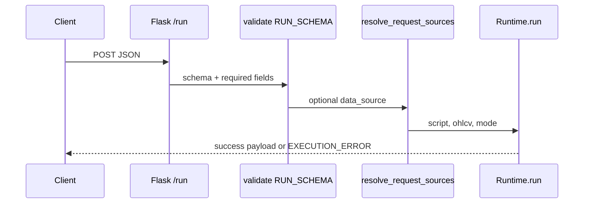

# POST `/run` and `/run/batch`

## Abstract

`/run` is the primary free evaluate entry: accept Pine source + bar list, optionally wire `request.*` data sources, execute via `Runtime`, and return plots/series/events/drawings. `/run/batch` runs up to eight scripts on the **same** OHLCV (AXIS multi-indicator), isolating per-script errors so one failure does not discard siblings.

## Conceptual model



## Interface surface

### `POST /run`

#### Request (`RUN_SCHEMA`)

| Field | Type | Required | Default | Notes |
| --- | --- | --- | --- | --- |
| `script` | string | yes | | Pine source |
| `data` | list | yes | | OHLCV bar objects |
| `symbol` | string | no | `"CHART"` | Syminfo / request wiring |
| `data_source` | string | no | `""` | `mock` / `ccxt` / `yahoo` / … |
| `data_options` | object | no | `{}` | Provider options |
| `mode` | string | no | `"interpret"` | `"interpret"` \| `"compile"` |

Unknown fields → `UNKNOWN_FIELDS` 400. Empty script/data still checked after schema with `NO_SCRIPT` / `NO_DATA`.

Bar shape (runtime expectation):

```json
{ "time": 0, "open": 1, "high": 1, "low": 1, "close": 1, "volume": 1 }
```

Optional `bid` / `ask` per bar update runtime bid/ask state.

#### Success response

```json
{
  "status": "success",
  "plots": [],
  "series": {},
  "plot_meta": {},
  "events": [],
  "drawings": [],
  "script_id": "16hex",
  "run_id": "16hex",
  "count": 0,
  "mode": "interpret",
  "data_source": "chart"
}
```

| Field | Meaning |
| --- | --- |
| `plots` | Primary series (first plot) — backward compatible list |
| `series` | Named multi-plot map title → values per bar |
| `plot_meta` | Per-title color, linewidth, index |
| `events` | Strategy events with `script_id` / `run_id` stamps |
| `drawings` | Exported line/label/box registry for AXIS |
| `script_id` | `sha256(source)[:16]` |
| `run_id` | Per-`Runtime` instance id |

#### Errors

| HTTP | code | When |
| --- | --- | --- |
| 400 | `MISSING_FIELD` / `INVALID_FIELD` / `UNKNOWN_FIELDS` / `INVALID_BODY` | Schema |
| 400 | `NO_SCRIPT` / `NO_DATA` | Empty after defaults |
| 400 | `DATA_SOURCE_ERROR` | `resolve_request_sources` failed |
| 500 | `EXECUTION_ERROR` | Runtime returned `error` key |

### `POST /run/batch`

#### Request (`RUN_BATCH_SCHEMA`)

| Field | Type | Required | Notes |
| --- | --- | --- | --- |
| `scripts` | list | yes | strings or `{id, script}` objects |
| `data` | list | yes | Shared OHLCV |
| `symbol` / `data_source` / `data_options` / `mode` | optional | same as `/run` |

Hard cap: `RUN_BATCH_MAX_SCRIPTS = 8` → `TOO_MANY_SCRIPTS`.

#### Response

```json
{
  "status": "success" | "partial",
  "results": [ { "id": "…", "status": "success|error", … } ],
  "count": 2,
  "ok": 1,
  "data_source": "chart"
}
```

HTTP **200** for partial success (per-script errors inside `results`). Envelope validation failures still 400.

## Internals

```python
runtime = Runtime(symbol=str(symbol))
result = runtime.run(script, ohlcv, data_feed=…, data_provider=…, mode=…)
```

See [runtime bridge](/pyne/docs/api/runtime-bridge) for bar-loop details and compile mode.

Paths: `backend/app.py` (`run_pine_script`, `run_pine_script_batch`), `backend/middleware/schemas.py`.

## Invariants and edge cases

1. **No API key** on these routes — protect at the edge if needed.
2. **Batch isolates exceptions** per script (`try/except` around `runtime.run`).
3. **Whitespace-only `data_source`** coerced to `None` → chart default.
4. **Compile mode** requires numba; errors surface as `EXECUTION_ERROR` message from runtime.
5. Schema rejects extras — clients must not send AXIS-only fields without updating schema.

## Worked example

```bash
curl -s http://127.0.0.1:5002/run \
  -H 'Content-Type: application/json' \
  -d '{
    "script": "//@version=5\nindicator(\"t\")\nplot(close)",
    "data": [
      {"time": 1, "open": 1, "high": 2, "low": 0.5, "close": 1.5, "volume": 10},
      {"time": 2, "open": 1.5, "high": 2.5, "low": 1.0, "close": 2.0, "volume": 12}
    ],
    "symbol": "TEST:DEMO"
  }'
```

## Failure modes

| Symptom | Cause |
| --- | --- |
| `UNKNOWN_FIELDS` | Typo’d property (e.g. `ohlcv` instead of `data`) |
| Parse errors in message | Invalid Pine — same engine as CLI |
| Batch `status: partial` | At least one script failed; inspect `results[i].message` |

## See also

- [Contract](/pyne/docs/api/contract)
- [Runtime bridge](/pyne/docs/api/runtime-bridge)
- [App lifecycle](/pyne/docs/api/app-lifecycle)
