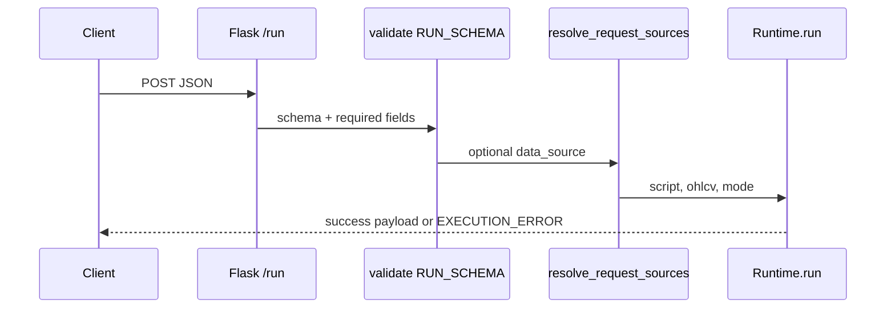

# Copyright (C) 2024-2026 jango_blockchained
#
# This file is part of pynescript.
#
# pynescript is free software: you can redistribute it and/or modify
# it under the terms of the GNU Affero General Public License as published by
# the Free Software Foundation, either version 3 of the License, or
# (at your option) any later version.
#
# pynescript is distributed in the hope that it will be useful,
# but WITHOUT ANY WARRANTY; without even the implied warranty of
# MERCHANTABILITY or FITNESS FOR A PARTICULAR PURPOSE.  See the
# GNU Affero General Public License for more details.
#
# You should have received a copy of the GNU Affero General Public License
# along with pynescript.  If not, see <https://www.gnu.org/licenses/>.
#
# SPDX-License-Identifier: AGPL-3.0-or-later

---
title: "POST /run"
description: "Free evaluate endpoints: single-script /run and multi-script /run/batch over shared OHLCV."
---

# POST `/run` and `/run/batch`

## Abstract

`/run` is the primary free evaluate entry: accept Pine source + bar list, optionally wire `request.*` data sources, execute via package **`pynescript.runtime.Runtime`** (Pro API uses `backend.runtime` re-export), and return plots/series/events/drawings/**alerts**. `/run/batch` runs up to eight scripts on the **same** OHLCV (AXIS multi-indicator), isolating per-script errors so one failure does not discard siblings. Free paths enforce **bar/script caps, rate limit, concurrency, and chart/mock-only data** (`backend/middleware/free_limits.py`). Optional **L2 webhooks** POST last-bar (default) `alert()` / `alertcondition()` firings to `webhook_url` or env `ALERT_WEBHOOK_URL` (SSRF-safe).

## Conceptual model



## Interface surface

### `POST /run`

#### Request (`RUN_SCHEMA`)

| Field | Type | Required | Default | Notes |
| --- | --- | --- | --- | --- |
| `script` | string | yes | | Pine source |
| `data` | list | yes | | OHLCV bar objects |
| `symbol` | string | no | `"CHART"` | Syminfo / request wiring |
| `data_source` | string | no | `""` | `mock` / `ccxt` / `yahoo` / … |
| `data_options` | object | no | `{}` | Provider options |
| `mode` | string | no | `"auto"` | `"interpret"` \| `"compile"` \| `"auto"` |
| `inputs` | object | no | `{}` | Pine `input.*` overrides by title |
| `profiler` | bool | no | `false` | Per-line timing on interpret |
| `webhook_url` | string | no | `""` | L2 alert webhook (overrides `ALERT_WEBHOOK_URL`) |
| `forward_alerts` | bool | no | `true` | When false, skip outbound webhook |
| `alert_last_bar` | bool | no | `true` | Webhook only last OHLCV bar firings |
| `alert_batch` | bool | no | `true` | One batch POST vs per-alert |
| `libraries` | list | no | `[]` | `[{namespace, name, version, source}]` — AXIS git-publish emulator (max 32) |

**Not in `RUN_SCHEMA`:** `timeout_seconds` (in-process `Runtime.run` only — sending it here is `UNKNOWN_FIELDS`). Query `?mode=` is accepted when the body omits `mode`.

Unknown fields → `UNKNOWN_FIELDS` 400. Empty script/data still checked after schema with `NO_SCRIPT` / `NO_DATA`. `import` and any `request.` token are compile-ineligible; `mode=auto` falls back to interpret and **keeps** `libraries` on that path.

Bar shape (runtime expectation):

```json
{ "time": 0, "open": 1, "high": 1, "low": 1, "close": 1, "volume": 1 }
```

Optional `bid` / `ask` per bar update runtime bid/ask state.

#### Success response

```json
{
  "status": "success",
  "plots": [],
  "series": {},
  "plot_meta": {},
  "events": [],
  "drawings": [],
  "alerts": [],
  "script_id": "16hex",
  "run_id": "16hex",
  "count": 0,
  "mode": "compile",
  "auto_backend": "compile",
  "data_source": "chart",
  "alert_forward": {
    "forwarded": 0,
    "failed": 0,
    "filter": "last_bar",
    "url": "https://hooks.example.com/pine",
    "batch": true
  }
}
```

| Field | Meaning |
| --- | --- |
| `plots` | Primary series (first plot) — backward compatible list |
| `series` | Named multi-plot map title → values per bar |
| `plot_meta` | Per-title color, linewidth, index |
| `events` | Strategy events with `script_id` / `run_id` stamps |
| `drawings` | Exported line/label/box registry for AXIS |
| `alerts` | `alert()` / true `alertcondition()` firings (interpret; empty on compile) |
| `alert_conditions` | Optional full condition evaluations (when present) |
| `alert_forward` | Present when a webhook URL was configured; delivery summary |
| `script_id` | `sha256(source)[:16]` |
| `run_id` | Per-`Runtime` instance id |
| `auto_backend` | `compile` \| `interpret` when requested `mode` was `auto` |
| `compile_fallback_reason` | Why `auto` used interpret (eligibility or compile error) |
| `object_mode` / `compile_cached` / `compile_ms` | Compile diagnostics when that path ran |
| `nopython_fallback_reason` | Numeric JIT failed; engine re-emitted object mode (still compile) |

#### Errors

| HTTP | code | When |
| --- | --- | --- |
| 400 | `MISSING_FIELD` / `INVALID_FIELD` / `UNKNOWN_FIELDS` / `INVALID_BODY` | Schema |
| 400 | `NO_SCRIPT` / `NO_DATA` | Empty after defaults |
| 400 | `DATA_SOURCE_ERROR` | `resolve_request_sources` failed |
| 400 | `WEBHOOK_URL_BLOCKED` | `webhook_url` is private/loopback/metadata (SSRF denylist) |
| 403 | `DATA_SOURCE_FORBIDDEN` | Free path rejected live provider (`ccxt` / `yahoo` / …) |
| 413 | `TOO_MANY_BARS` / `SCRIPT_TOO_LARGE` | Exceeded `FREE_MAX_BARS` (5000) or `FREE_MAX_SCRIPT_CHARS` (256 KiB) |
| 429 | `RATE_LIMITED` / `TOO_MANY_REQUESTS` | Free IP rate (60 / 60s) or concurrency (4) |
| 500 | `EXECUTION_ERROR` | Runtime returned `error` key; body may include `error_kind` / `error_type` / `error_bar` |

### `POST /run/batch`

#### Request (`RUN_BATCH_SCHEMA`)

| Field | Type | Required | Notes |
| --- | --- | --- | --- |
| `scripts` | list | yes | strings or `{id, script}` objects |
| `data` | list | yes | Shared OHLCV |
| `symbol` / `data_source` / `data_options` / `mode` / `profiler` | optional | same as `/run` (no `libraries` / `inputs` / `timeout_seconds`) |
| `webhook_url` / `forward_alerts` / `alert_last_bar` / `alert_batch` | optional | same L2 webhook fields as `/run` (applied per script result) |

Hard cap: `RUN_BATCH_MAX_SCRIPTS = 8` → `TOO_MANY_SCRIPTS`.

#### Response

```json
{
  "status": "success" | "partial",
  "results": [ { "id": "…", "status": "success|error", … } ],
  "count": 2,
  "ok": 1,
  "data_source": "chart"
}
```

HTTP **200** for partial success (per-script errors inside `results`). Envelope validation failures still 400.

## Internals

```python
runtime = Runtime(symbol=str(symbol))
result = runtime.run(script, ohlcv, data_feed=…, data_provider=…, mode=…)
```

See [runtime bridge](/pyne/docs/api/runtime-bridge) for bar-loop details and compile mode.

Paths: `backend/app.py` (`run_pine_script`, `run_pine_script_batch`, `compile_prewarm`, `WS /ws/run`), `backend/middleware/schemas.py`, `backend/middleware/free_limits.py`, `backend/alert_forwarder.py`.

## Invariants and edge cases

1. **No API key** on these routes — free-tier guards still apply (see [Pro API usage](/pyne/docs/enduser/guides/pro-api-usage)); protect further at the edge if needed.
2. **Batch isolates exceptions** per script (`try/except` around `runtime.run`).
3. **Whitespace-only `data_source`** coerced to `None` → chart default; free paths reject live providers (ccxt/yahoo/…).
4. **Compile mode** may omit alert side effects (`alerts: []`); use interpret/`auto` for alerts.
5. Schema rejects extras — clients must not send AXIS-only fields without updating schema.
6. **Webhook delivery is best-effort** — evaluate still returns `status: success` if the hook fails; check `alert_forward`.
7. Structured errors may include `error_kind` (`parse|compile|runtime|data|order|mode`), `error_type`, `error_bar`. `timed_out` is set only when the **in-process** host passed `timeout_seconds` — Flask `/run` never does.

## Worked example

```bash
curl -s http://127.0.0.1:5002/run \
  -H 'Content-Type: application/json' \
  -d '{
    "script": "//@version=6\nindicator(\"t\")\nplot(close)",
    "data": [
      {"time": 1, "open": 1, "high": 2, "low": 0.5, "close": 1.5, "volume": 10},
      {"time": 2, "open": 1.5, "high": 2.5, "low": 1.0, "close": 2.0, "volume": 12}
    ],
    "symbol": "TEST:DEMO"
  }'
```

## Failure modes

| Symptom | Cause |
| --- | --- |
| `UNKNOWN_FIELDS` | Typo’d property (e.g. `ohlcv` instead of `data`) |
| Parse errors in message | Invalid Pine — same engine as CLI |
| Batch `status: partial` | At least one script failed; inspect `results[i].message` |

## `POST /compile/prewarm`

Free readiness hook (same rate/concurrency gates). Body optional:

```json
{ "scripts": ["//@version=6\nindicator(\"x\")\nplot(close)"], "force": false }
```

Caps at 16 sources. Returns `has_numba`, `builtins_warmed`, `scripts_ok` / `scripts_failed`, `prewarm_ms`. Does **not** execute on OHLCV.

## `WS /ws/run`

When `flask-sock` is installed: JSON text frames `{type: "run", id, script, data, mode?}`. Reply `{type: "result", …}` or `{type: "error"}`. Ping/pong supported. Same `execute_run_payload` as HTTP `/run`.

## Alert webhooks (L2)

```bash
# Server default (optional)
export ALERT_WEBHOOK_URL=https://hooks.example.com/pine

curl -s http://127.0.0.1:5002/run \
  -H 'Content-Type: application/json' \
  -d '{
    "script": "//@version=6\nindicator(\"a\")\nif bar_index == last_bar_index\n    alert(\"fire\")\nplot(close)",
    "mode": "interpret",
    "webhook_url": "https://hooks.example.com/pine",
    "data": [
      {"time": 1, "open": 1, "high": 2, "low": 0.5, "close": 1.5, "volume": 10},
      {"time": 2, "open": 1.5, "high": 2.5, "low": 1.0, "close": 2.0, "volume": 12}
    ]
  }'
```

Full engine rules and batch payload shape: [Alerts](/pyne/docs/runtime/alerts).

## See also

- [Alerts](/pyne/docs/runtime/alerts)
- [Contract](/pyne/docs/api/contract)
- [Runtime bridge](/pyne/docs/api/runtime-bridge)
- [App lifecycle](/pyne/docs/api/app-lifecycle)
