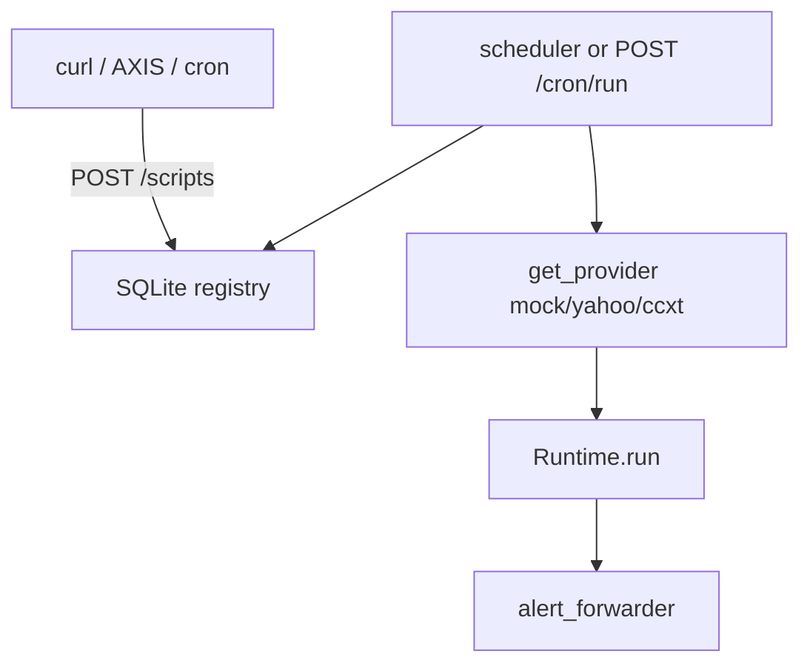

# Copyright (C) 2024-2026 jango_blockchained
#
# This file is part of pynescript.
#
# pynescript is free software: you can redistribute it and/or modify
# it under the terms of the GNU Affero General Public License as published by
# the Free Software Foundation, either version 3 of the License, or
# (at your option) any later version.
#
# pynescript is distributed in the hope that it will be useful,
# but WITHOUT ANY WARRANTY; without even the implied warranty of
# MERCHANTABILITY or FITNESS FOR A PARTICULAR PURPOSE.  See the
# GNU Affero General Public License for more details.
#
# You should have received a copy of the GNU Affero General Public License
# along with pynescript.  If not, see <https://www.gnu.org/licenses/>.
#
# SPDX-License-Identifier: AGPL-3.0-or-later

---
title: "Hosted runner"
description: "Optional Flask/VPS/container script registry + bar-close scheduler (PYNE_RUNNER). Off by default."
---

# Hosted runner

## Abstract

The Pro API is request/response: AXIS (or curl) POSTs bars, gets `alerts[]` in that reply, and nothing runs after the client disconnects. **`PYNE_RUNNER`** is an optional Flask-side loop that matches pyne-worker’s “upload then keep going” model on **local, Docker, VPS, and Cloudflare Containers**.

Off unless `PYNE_RUNNER=1` (or `true` / `yes` / `on`). Routes then 404 with `RUNNER_DISABLED`. Health reports `features.script_runner`.

This is **not** HOOX order routing. Alerts leave via the same L2 webhooks as `POST /run`. Strategy events stay on the tick JSON unless you forward them yourself.

## Conceptual model



Each tick fetches OHLCV for the script’s `symbol` / `timeframe` / `data_source`. If last bar time did not advance, the job is skipped. Otherwise a full `Runtime.run` (same evaluate contract as `/run`) and last-bar alert webhooks.

## Interface surface

### Environment

| Variable | Default | Role |
| --- | --- | --- |
| `PYNE_RUNNER` | off | Master switch — HTTP registry + `/cron/run` |
| `PYNE_RUNNER_SCHEDULER` | off | In-process poll loop (needs `PYNE_RUNNER`) |
| `PYNE_RUNNER_POLL_SECONDS` | `60` | Poll interval (floor 5s) |
| `PYNE_RUNNER_DB` | `/data/runner.db` if `/data` exists | SQLite file |
| `ADMIN_TOKEN` | unset | When set, writes require `X-Admin-Token` |

Gunicorn multi-worker: every worker may start a scheduler thread; ticks take a flock on `PYNE_RUNNER_DB.lock`. Prefer `GUNICORN_WORKERS=1` when the scheduler is on.

### Routes (`PYNE_RUNNER=1`)

| Method | Path | Auth | Role |
| --- | --- | --- | --- |
| `POST` | `/scripts` | admin if `ADMIN_TOKEN` | Deploy / replace |
| `GET` | `/scripts` | none | List (no source) |
| `GET` | `/scripts/:id` | none | Source + cron state |
| `DELETE` | `/scripts/:id` | admin if `ADMIN_TOKEN` | Remove |
| `GET` | `/cron/jobs` | none | Scripts + last tick |
| `PUT` | `/cron/jobs` | admin if `ADMIN_TOKEN` | `{jobs:[{script_id, enabled}]}` |
| `POST` | `/cron/run` | admin if `ADMIN_TOKEN` | Tick now (`force`, optional `script_id`) |

### Deploy body

```json
{
  "id": "btc-sma",
  "script": "//@version=6\nindicator(\"t\")\nplot(close)\nalertcondition(close>open,\"up\",\"green\")",
  "symbol": "BTCUSDT",
  "timeframe": "1d",
  "mode": "interpret",
  "data_source": "mock",
  "period": "6mo",
  "max_bars": 500,
  "enabled": true,
  "webhook_url": "https://hooks.example.com/pine",
  "forward_alerts": true
}
```

`data_source`: `mock` (deterministic, no network), `yahoo`, `ccxt` (`data_options.exchange`), `alphavantage`. Same provider factory as CLI `pyne data`.

## Worked examples

Local (no Docker):

```bash
export PYNE_RUNNER=1 PYNE_RUNNER_SCHEDULER=1
python -m backend.app   # :5002
pyne runner deploy script.pine --id demo --symbol BTCUSDT --source mock
pyne runner tick --id demo --force
pyne runner list
```

Same HTTP without the CLI:

```bash
curl -sS -X POST http://127.0.0.1:5002/scripts -H 'Content-Type: application/json' \
  -d '{"id":"demo","script":"//@version=6\nindicator(\"t\")\nplot(close)","data_source":"mock","timeframe":"1d","max_bars":80}'
curl -sS -X POST http://127.0.0.1:5002/cron/run -d '{"force":true}' -H 'Content-Type: application/json'
```

Docker:

```bash
PYNE_RUNNER=1 PYNE_RUNNER_SCHEDULER=1 docker compose up --build api
```

VPS: set the same env on `pynescript-api.service` (or the process environment `scripts/deploy_vps.sh` restarts). SQLite path should sit on a persistent disk (`PYNE_RUNNER_DB=/data/runner.db`).

Cloudflare Container: keep `PYNE_RUNNER=0` in `cf/src/index.ts` unless you want the runner inside the isolate; one gunicorn worker is already the default.

## Failure modes

| Symptom | Cause | Fix |
| --- | --- | --- |
| `RUNNER_DISABLED` 404 | Switch off | `PYNE_RUNNER=1` |
| `FORBIDDEN` 403 | `ADMIN_TOKEN` set, header missing | `X-Admin-Token` |
| `skipped` / `no_new_bar` | Last close unchanged | Wait, or `force: true` |
| `fetch_failed` | yahoo/ccxt error | Use `mock` or fix `data_options` |
| Double ticks | Several gunicorn workers | `GUNICORN_WORKERS=1` or rely on flock |

## See also

- [POST /run](/pyne/docs/api/endpoints/run)
- [Alerts](/pyne/docs/runtime/alerts)
- [pyne-worker cron](/pyne/docs/pyne-worker/run) — edge equivalent
- [Docker](/pyne/docs/devops/docker)
- [App lifecycle](/pyne/docs/api/app-lifecycle)
