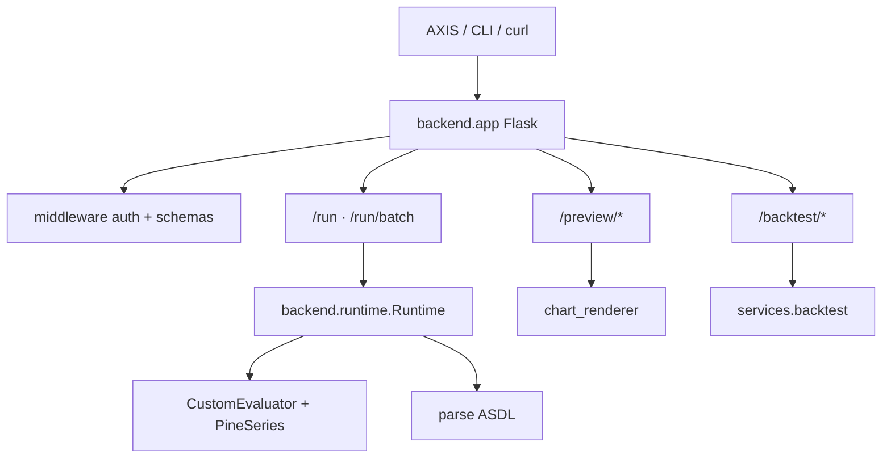

# Pro API

The PYNE **Pro API** is a Flask HTTP service that runs Pine scripts over caller-supplied OHLCV, returns plots / series / strategy events / drawings, and gates thumbnail + backtest routes behind API keys. It is intentionally **not** the language server: different auth, scaling, and failure domains.

## Abstract

Where the LSP answers *static* editor questions, the Pro API answers *dynamic* evaluate questions:

```text
POST JSON { script, data: OHLCV[], … }
  → backend.runtime.Runtime.run
  → { plots, series, plot_meta, events, drawings, script_id, run_id, … }
```

Free-tier evaluate (`POST /run`, `POST /run/batch`) validates bodies with hand-rolled schemas, enforces a 5 MB body cap, and restricts CORS. Pro routes under `/preview/*` and `/backtest/*` use `track_usage` (Bearer / ApiKey / query key). Chart PNGs are matplotlib Agg renders encoded as base64.

The same **evaluate contract** is mirrored by edge workers (pyne-worker / pine-worker) so AXIS and HOOX can swap hosts without redesigning payloads — see [contract](/pyne/docs/api/contract).

## Conceptual model



## Interface surface

| Method | Path | Auth | Role |
| --- | --- | --- | --- |
| `GET` | `/` | none | Health + endpoint map |
| `POST` | `/run` | none (free) | Single-script evaluate |
| `POST` | `/run/batch` | none (free) | ≤8 scripts, shared OHLCV |
| `POST` | `/preview/chart` | API key + usage | Line / OHLCV PNG |
| `POST` | `/preview/indicator` | API key + usage | Expression series PNG |
| `POST` | `/backtest/quick` | API key + usage | Quick strategy metrics + equity PNG |
| `POST` | `/auth/create_key` | admin decorator | Mint `pyn_…` key |
| `GET` | `/auth/usage` | API key | Usage counters |
| `POST` | `/auth/validate` | none (body key) | Validate without consuming quota |

Local runner: `make run` → `python -m backend.app` (default `127.0.0.1:5002`).

## Tracks in this tab

1. [App lifecycle](/pyne/docs/api/app-lifecycle) — Flask app, CORS, limits, blueprints
2. [Auth and keys](/pyne/docs/api/auth-and-keys) — tiers, stores, decorators
3. [Run](/pyne/docs/api/endpoints/run) · [Preview](/pyne/docs/api/endpoints/preview) · [Backtest](/pyne/docs/api/endpoints/backtest)
4. [Chart renderer](/pyne/docs/api/services/chart-renderer)
5. [Runtime bridge](/pyne/docs/api/runtime-bridge) — `Runtime` / series / evaluator glue
6. [Contract](/pyne/docs/api/contract) — shared evaluate schema across Flask and workers

## Internals (map)

| Path | Role |
| --- | --- |
| `backend/app.py` | App factory surface, `/run*`, `/auth*`, CORS |
| `backend/api/preview.py` | Preview + backtest blueprints |
| `backend/middleware/*` | Auth, schemas, optional Redis/SQLite stores |
| `backend/runtime.py` | Bar-loop evaluate façade |
| `backend/evaluator.py` | `CustomEvaluator` bridge |
| `backend/series.py` | `PineSeries` history deque |
| `backend/services/*` | Charts + backtest simulation |

## See also

- [Evaluate scripts (end user)](/pyne/docs/enduser/guides/evaluate-scripts)
- [Pro API usage guide](/pyne/docs/enduser/guides/pro-api-usage)
- [Runtime hub](/pyne/docs/runtime)
- [LSP hub](/pyne/docs/lsp) — editor path, not HTTP
