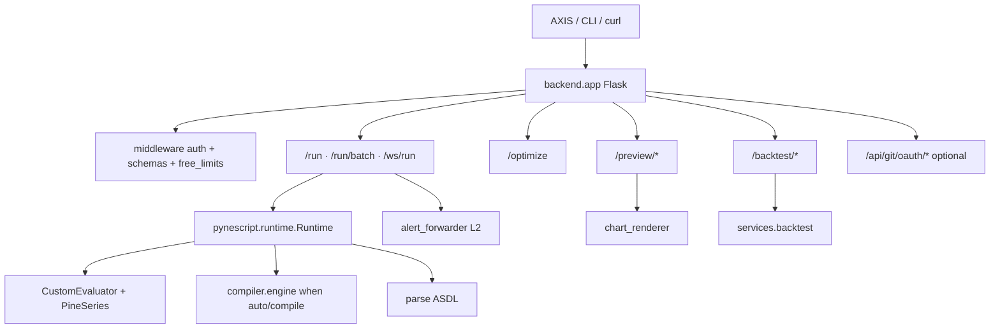

# Copyright (C) 2024-2026 jango_blockchained
#
# This file is part of pynescript.
#
# pynescript is free software: you can redistribute it and/or modify
# it under the terms of the GNU Affero General Public License as published by
# the Free Software Foundation, either version 3 of the License, or
# (at your option) any later version.
#
# pynescript is distributed in the hope that it will be useful,
# but WITHOUT ANY WARRANTY; without even the implied warranty of
# MERCHANTABILITY or FITNESS FOR A PARTICULAR PURPOSE.  See the
# GNU Affero General Public License for more details.
#
# You should have received a copy of the GNU Affero General Public License
# along with pynescript.  If not, see <https://www.gnu.org/licenses/>.
#
# SPDX-License-Identifier: AGPL-3.0-or-later

---
title: "Pro API"
description: "Flask Pro API — /run with mode=auto, /optimize strategy search, plot_meta/fill, alerts + L2 webhooks, preview, backtest, and shared evaluate contract."
---

# Pro API

The PYNE **Pro API** is a Flask HTTP service that runs Pine scripts over caller-supplied OHLCV, returns plots / series / **`plot_meta`** (incl. `fill` bands) / strategy events / drawings / **alerts**, optional **L2 alert webhooks**, and gates thumbnail + backtest routes behind API keys. Default evaluate path is **`mode=auto`** (compile when safe, interpret on fallback). It is intentionally **not** the language server: different auth, scaling, and failure domains.

## Abstract

Where the LSP answers *static* editor questions, the Pro API answers *dynamic* evaluate questions:

```text
POST JSON { script, data: OHLCV[], mode?, libraries?, webhook_url?, … }
  → pynescript.runtime.Runtime.run  (Pro API re-export; mode default: auto)
  → { plots, series, plot_meta, events, drawings, alerts,
      mode, auto_backend?, compile_fallback_reason?,
      script_id, run_id, alert_forward?, … }
```

Free-tier evaluate (`POST /run`, `POST /run/batch`) validates bodies with hand-rolled schemas, enforces a 5 MB body cap, **bar/script/rate/concurrency** guards (`backend/middleware/free_limits.py`), and restricts CORS. `GET /` and `GET /health` are the same unauthenticated readiness payload. Optional **L2 webhooks** POST last-bar `alert()` / `alertcondition()` firings to `webhook_url` or env `ALERT_WEBHOOK_URL` (see [Alerts](/pyne/docs/runtime/alerts)). Pro routes under `/preview/*` and `/backtest/*` use `track_usage` (Bearer / ApiKey / query key). Chart PNGs are matplotlib Agg renders encoded as base64.

The same **evaluate contract** is mirrored by **[pyne-worker](/pyne/docs/pyne-worker)** so AXIS and HOOX can swap hosts without redesigning payloads — see [contract](/pyne/docs/api/contract).

## Conceptual model



## Interface surface

| Method | Path | Auth | Role |
| --- | --- | --- | --- |
| `GET` | `/` · `/health` | none | Health + endpoint map + compile cache section |
| `POST` | `/run` | none (free) | Single-script evaluate (`mode` default `auto`; `libraries[]`; alerts + optional webhooks) |
| `POST` | `/run/batch` | none (free) | ≤8 scripts, shared OHLCV |
| `POST` | `/optimize` | none (free) | Strategy `input.*` search — N interpret Runtime runs ([docs](/pyne/docs/api/endpoints/optimize)) |
| `WS` | `/ws/run` | none (free) | Same evaluate contract over JSON frames (`flask-sock` optional) |
| `POST` | `/preview/chart` | API key + usage | Line / OHLCV PNG |
| `POST` | `/preview/indicator` | API key + usage | Expression series PNG |
| `POST` | `/backtest/quick` | API key + usage | Quick strategy metrics + equity PNG |
| `POST` | `/auth/create_key` | admin decorator | Mint `pyn_…` key (fail-closed `ADMIN_TOKEN`) |
| `GET` | `/auth/usage` | API key | Usage counters |
| `POST` | `/auth/validate` | none (body key) | Validate without consuming quota |
| `POST` | `/compile/prewarm` | none (free, rate-gated) | Product warm-compile — skip cold Numba JIT |
| `POST` | `/lsp/*` | none (free) | AXIS editor completion / hover / diagnostics |
| `POST` | `/api/git/oauth/device/*` | none (device flow) | Optional GitHub/GitLab device OAuth for SPA git (blueprint) |

### `/run` response highlights

| Field | Role |
| --- | --- |
| `series` / `plots` / `plot_meta` | Bar values + display meta (color, linewidth, `kind`, `fill` band refs) |
| `events` | Strategy broker events |
| `drawings` | Drawing registry / compile `__drawings` |
| `alerts` | Structured `alert()` / `alertcondition()` firings |
| `mode` / `auto_backend` | Effective path (`interpret` \| `compile`) |
| `compile_fallback_reason` | Why `auto` chose interpret (eligibility or compile error) |
| `alert_forward` | Present when a webhook URL was configured |
| `error_kind` | On failure: `parse` \| `compile` \| `runtime` \| `data` \| `order` \| `mode` |

Local runner: `make run` → `python -m backend.app` (default `127.0.0.1:5002`).

## Tracks in this tab

1. [App lifecycle](/pyne/docs/api/app-lifecycle) — Flask app, CORS, limits, blueprints
2. [Auth and keys](/pyne/docs/api/auth-and-keys) — tiers, stores, decorators
3. [Run](/pyne/docs/api/endpoints/run) · [Preview](/pyne/docs/api/endpoints/preview) · [Backtest](/pyne/docs/api/endpoints/backtest)
4. [Chart renderer](/pyne/docs/api/services/chart-renderer)
5. [Runtime bridge](/pyne/docs/api/runtime-bridge) — `Runtime` / series / evaluator glue
6. [Contract](/pyne/docs/api/contract) — shared evaluate schema across Flask and workers

## Internals (map)

| Path | Role |
| --- | --- |
| `backend/app.py` | App object, `/run*`, `/health`, `/compile/prewarm`, `/auth*`, CORS |
| `backend/api/preview.py` | Preview + backtest blueprints |
| `backend/api/git_oauth.py` | Optional device OAuth for SPA git |
| `backend/api/lsp_http.py` | Free AXIS editor LSP-HTTP |
| `backend/middleware/*` | Auth, schemas, free_limits, optional Redis/SQLite stores |
| `src/pynescript/runtime/host.py` | Package SoT bar-loop (`mode=auto`, alerts pack) |
| `backend/runtime.py` | Compat re-export of the package host |
| `backend/alert_forwarder.py` | L2 HTTP webhook delivery |
| `backend/evaluator.py` / `backend/series.py` | Compat shims |
| `backend/services/*` | Charts + backtest simulation |

## See also

- [Evaluate scripts (end user)](/pyne/docs/enduser/guides/evaluate-scripts)
- [Pro API usage guide](/pyne/docs/enduser/guides/pro-api-usage)
- [Alerts](/pyne/docs/runtime/alerts)
- [Runtime hub](/pyne/docs/runtime)
- [LSP hub](/pyne/docs/lsp) — editor path, not HTTP
