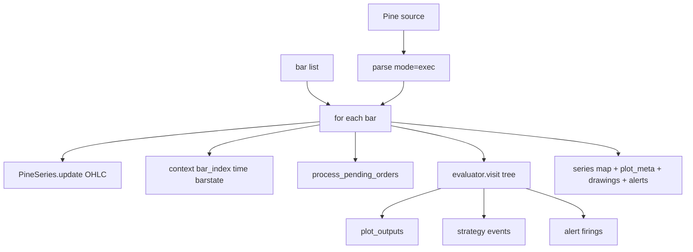

# Copyright (C) 2024-2026 jango_blockchained
#
# This file is part of pynescript.
#
# pynescript is free software: you can redistribute it and/or modify
# it under the terms of the GNU Affero General Public License as published by
# the Free Software Foundation, either version 3 of the License, or
# (at your option) any later version.
#
# pynescript is distributed in the hope that it will be useful,
# but WITHOUT ANY WARRANTY; without even the implied warranty of
# MERCHANTABILITY or FITNESS FOR A PARTICULAR PURPOSE.  See the
# GNU Affero General Public License for more details.
#
# You should have received a copy of the GNU Affero General Public License
# along with pynescript.  If not, see <https://www.gnu.org/licenses/>.
#
# SPDX-License-Identifier: AGPL-3.0-or-later

---
title: "Runtime Bridge"
description: "pynescript.runtime.Runtime — package SoT bar-loop evaluate façade, PineSeries context, compile mode, and result packaging."
---

# Runtime Bridge

## Abstract

**Package Runtime SoT:** the bar-loop host, series, and `CustomEvaluator` live under **`pynescript.runtime`** (`src/pynescript/runtime/host.py`). The Pro API still imports `backend.runtime.Runtime`, which **re-exports** the package implementation (`sys.modules` alias) so monorepo and wheel installs share one host.

`Runtime` owns symbol metadata namespaces (`syminfo`, `timeframe`, `barstate`, …), walks OHLCV bars, updates `PineSeries` for OHLC, visits a shared `CustomEvaluator` on the parsed AST each bar, drains strategy events, and packages multi-plot series for AXIS. Compile mode optionally swaps the AST walker for a Numba-backed subset engine. Optional **`timeout_seconds`** provides a wall-clock circuit breaker on the interpret path (checked every 32 bars) for edge/cron budgets — Flask `/run` does **not** expose this field.

This is the bridge between Flask handlers and the language core — not a second semantics.

## Conceptual model



## Interface surface

### Construction

```python
Runtime(symbol: str = "AAPL", run_id: str | None = None)
```

- Sets `syminfo.tickerid` / `name` / `prefix` (prefix from `EXCHANGE:SYMBOL` form).
- Generates `run_id` as `uuid4().hex[:16]` when omitted.

Helpers: `configure_footprint`, `update_bid_ask`.

### `run(source_code, ohlcv_data, data_feed=None, data_provider=None, mode="interpret", …)`

| Arg | Role |
| --- | --- |
| `source_code` | Pine text |
| `ohlcv_data` | `list[dict]` with open/high/low/close/time[/volume/bid/ask] |
| `data_feed` / `data_provider` | `request.*` wiring; auto-resolved from chart bars when unset |
| `mode` | `"interpret"` (default for direct calls) · `"compile"` · `"auto"` (Pro API schema default) |
| `timeout_seconds` | Optional wall-clock budget (seconds); interpret path only — partial results + `timed_out` + `error_kind=runtime` when exceeded. Not accepted by Flask `RUN_SCHEMA` |
| `libraries` | Optional `[{namespace, name, version, source}]` registered via `register_library_source` before `import ns/Name/ver`. `mode=auto` forwards libs into interpret fallback. Flask `/run` caps at 32 |
| `inputs` / `profiler` | `input.*` overrides (interpret); non-empty `inputs` or `profiler` force interpret under `auto` (`compile_fallback_reason`) |
| `realtime_*` | Optional host simulation for `varip` multi-tick tests (`realtime_last_bar`, `realtime_ticks`, `realtime_bars`, `realtime_from_bar`) |

#### Interpret path (default)

1. Resolve request sources (non-fatal on failure).
2. `parse(source_code, mode="exec")` — on failure `{ "error": "Parse Error: …" }`.
3. Init `PineSeries` for OHLC + context dict (timeframe daily defaults, barstate, chart colors).
4. Construct `CustomEvaluator(context=…, data_feed=…, data_provider=…)`, reset var declarations + drawing registry + `clear_alerts()`.
5. Per bar:
   - Update series + calendar fields from timestamp
   - Update barstate flags (`isfirst` / `islast` / history confirmed)
   - `process_pending_orders` when available
   - `evaluator.visit(tree)` — on failure `{ "error": "Runtime Error at bar …" }`
   - Lock pine defs after first bar (`_pine_defs_locked`) to avoid multi-dispatch blow-ups
   - Drain strategy events; stamp `script_id` / `run_id`
   - Capture plot outputs
6. Build `series` / `plot_meta` from all plot indices (disambiguate duplicate titles with `_2` suffixes).
7. Export drawings via `DrawingRegistry.export_for_api(bar_times)`.
8. Export alerts via `export_alerts_from_evaluator` (optional `alert_conditions`).

Return keys: `plots`, `series`, `plot_meta`, `events`, `drawings`, `alerts`, `count`, `script_id`, `run_id`, `mode` (+ optional `alert_conditions`, `timed_out`, `error_kind`).

#### `mode=auto`

1. Non-empty `inputs` → interpret immediately (`compile_fallback_reason = "input.* overrides require interpret path"`).
2. `_compile_eligible`: reject top-level `import` and any `request.` token (cached per source hash).
3. Eligible → `_run_compiled`. On success set `auto_backend=compile`. On compile/runtime error, fall back to interpret and set `compile_fallback_reason`.
4. Ineligible → interpret + `compile_fallback_reason` (e.g. `"import statements not supported in compile path"`).

Value mismatch never triggers a backend switch — that is the parity harness’s job.

#### Compile path

1. Import `pynescript.compiler.engine` — missing → `error_kind=compile`.
2. **Do not** require `has_numba()`. Object-mode scripts (strategy, UDT, drawings) compile to a Python/numpy loop. Missing Numba only fails pure-numeric emit (`CompileNumbaRequiredError`); `auto` caches that failure.
3. Host LRU by raw-source sha256 → `compile_script` on miss.
4. Pack OHLCV to float64 columns **including `time=`** bar-open ms (`_ohlcv_pack_cached`).
5. `compiled.run(opens, highs, lows, closes, volumes, time=times)`.
6. Lift `__drawings` / `__events`; GC compile drawings by declaration caps; merge visual series (bgcolor / plotshape / …) into titled keys.
7. Envelope: `mode: "compile"`, `alerts: []`, `object_mode`, `compile_cached`, `compile_ms`. `generated_code` only when `PYNESCRIPT_RETURN_GENERATED_CODE=1`.

### `PineSeries` (`pynescript.runtime.series`)

History deque (default maxlen **1000**, raised by `max_bars_back` / `PYNE_SERIES_MAX`). `PYNE_SERIES_CAP` default **on** (list-length trim). `PYNE_SERIES_RING` default **off** (chronological O(1) lookback when `1`). `series[0]` current / `series[n]` lookback, arithmetic on **current** values, `None` propagates as na-like absence. Negative indices raise — Pine Script™ does not allow them. `backend.series` re-exports the package type.

### Context namespaces

Defined on the host: `Syminfo`, `Chartinfo`, `Timeframe`, `Barstate`, `Chart` — attribute names aim at Pine Script™ v5–v6 surface (`timeframe.isdaily`, `syminfo.isin`, …).

## Internals

| Path | Role |
| --- | --- |
| `src/pynescript/runtime/host.py` | Package SoT `Runtime` bar loop |
| `src/pynescript/runtime/evaluator.py` | `CustomEvaluator` specialization |
| `src/pynescript/runtime/series.py` | `PineSeries` |
| `backend/runtime.py` | Compat shim → `pynescript.runtime` |
| `backend/evaluator.py` / `backend/series.py` | Compat shims |
| `src/pynescript/ast/helper.py` | `parse` |
| `src/pynescript/ast/evaluator/**` | Builtin + strategy semantics |
| `src/pynescript/compiler/engine.py` | Compile mode |

Flask wiring: `backend/app.py` constructs a **fresh** `Runtime` per request (and per batch job) so `run_id` and drawing registries do not leak across users.

## Invariants and edge cases

1. **Parse once, visit many** — AST is not re-parsed per bar.
2. **Defs locked after bar 0** — performance invariant for large function tables.
3. **Drawing registry reset** at run start — isolation between requests.
4. **Primary `plots` list** is plot index 0 for backward compatibility; AXIS should prefer `series` + `plot_meta`.
5. **Errors are dicts**, not exceptions, for control-flow at the HTTP boundary (`"error" in result`).
6. Compile mode supports a **subset**; `mode=auto` falls back to interpret with `compile_fallback_reason` rather than failing the request.

## Worked example

```python
from pynescript.runtime import Runtime
# or: from backend.runtime import Runtime  # Pro API monorepo path

rt = Runtime(symbol="NASDAQ:AAPL")
out = rt.run(
    '//@version=6\nindicator("x")\nplot(close, "C")',
    [{"time": i, "open": 1, "high": 2, "low": 0.5, "close": 1.0 + i * 0.01, "volume": 1} for i in range(50)],
)
assert "error" not in out
assert out["count"] == 50
assert "C" in out["series"] or "plot_0" in out["series"]
```

## Failure modes

| Message prefix | Cause |
| --- | --- |
| `Parse Error:` | Grammar / syntax |
| `Runtime Error at bar` | Evaluator exception |
| `Order fill error at bar` | Broker sim pending orders |
| `Compile mode requires numba` / `CompileNumbaRequiredError` | Numeric emit without Numba (object-mode scripts still run) |
| `Compile Error:` / `Compiled Runtime Error:` | Engine path (`error_kind=compile` / `runtime`) |
| `Script execution timed out` | `timeout_seconds` exceeded (`timed_out`, `error_kind=runtime`) |

## See also

- [Contract](/pyne/docs/api/contract)
- [Run endpoint](/pyne/docs/api/endpoints/run)
- [Series and history](/pyne/docs/runtime/series-and-history)
- [Strategy events](/pyne/docs/runtime/events)
