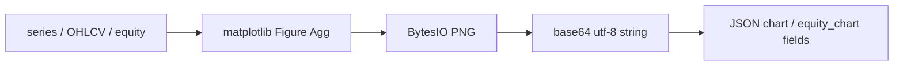

# Copyright (C) 2024-2026 jango_blockchained
#
# This file is part of pynescript.
#
# pynescript is free software: you can redistribute it and/or modify
# it under the terms of the GNU Affero General Public License as published by
# the Free Software Foundation, either version 3 of the License, or
# (at your option) any later version.
#
# pynescript is distributed in the hope that it will be useful,
# but WITHOUT ANY WARRANTY; without even the implied warranty of
# MERCHANTABILITY or FITNESS FOR A PARTICULAR PURPOSE.  See the
# GNU Affero General Public License for more details.
#
# You should have received a copy of the GNU Affero General Public License
# along with pynescript.  If not, see <https://www.gnu.org/licenses/>.
#
# SPDX-License-Identifier: AGPL-3.0-or-later

---
title: "Chart Renderer"
description: "Matplotlib Agg PNG services: line charts, OHLCV candles, equity curves, base64 encoding."
---

# Chart Renderer

## Abstract

`backend/services/chart_renderer.py` is a headless plotting façade. It forces `matplotlib` into **Agg**, draws dark-theme charts for desk thumbnails, and returns **base64-encoded PNG** strings suitable for JSON transport. Callers are the preview and backtest routes; the module has no Flask dependency.

## Conceptual model



## Interface surface

### `render_line_chart`

| Param | Default | Role |
| --- | --- | --- |
| `values` | required | Y series; `None` → NaN gaps |
| `dates` | `None` | Optional x tick labels (≤ ~6 ticks) |
| `title` | `"Chart"` | Title string |
| `color` | `#2196F3` | Line + fill |
| `height` / `width` | 300 / 600 | Pixel intent → figsize `/100`, dpi 100 |
| `show_volume` | false | Twin axis bars from `ohlcv["volume"]` |
| `ohlcv` | `None` | Volume source when enabled |

Empty / all-null values → `_render_empty_chart` placeholder.

### `render_ohlcv_chart`

Candlestick + volume subplot pair from dict keys `open`, `high`, `low`, `close`, `volume`. Green/red body colors (`#4CAF50` / `#F44336`). Shared x-axis.

### `render_equity_curve`

Single series with profit/loss fill relative to zero baseline and a dashed reference at the first equity point. Title fixed `"Equity Curve"`.

### Return type

All public renderers → `str` (base64 PNG without data-URI prefix). Clients typically use:

```text
data:image/png;base64,{chart}
```

## Internals

| Detail | Implementation |
| --- | --- |
| Backend | `matplotlib.use("Agg")` before pyplot import |
| Theme | fig `#1E1E1E`, axes `#252526`, muted grids |
| Cleanup | `plt.close(fig)` after `savefig` |
| Empty state | Centered “No data available” text |

| Path | Role |
| --- | --- |
| `backend/services/chart_renderer.py` | Renderers |
| `backend/api/preview.py` | Consumers |
| `backend/services/backtest.py` | Equity chart hook |

## Invariants and edge cases

1. **Not interactive** — no GUI backend; safe for servers.
2. **NaNs** break lines at gaps (numpy nan).
3. **Candle body height** uses `+ 1e-9` to keep zero-range bodies visible.
4. **Thread safety:** matplotlib global state is historically process-local; multi-threaded gunicorn workers should avoid concurrent pyplot use on one worker or serialize renders.
5. Exceptions in callers often become HTTP `RENDER_ERROR` or empty equity chart strings.

## Worked example

```python
from backend.services.chart_renderer import render_line_chart

b64 = render_line_chart([1.0, 1.2, 1.1, 1.4], title="demo", color="#A3E635")
assert isinstance(b64, str) and len(b64) > 100
```

## Failure modes

| Symptom | Cause |
| --- | --- |
| ImportError Agg | Incomplete matplotlib install |
| Huge base64 | High width/height — routes clamp preview sizes |
| Blank image | Empty input path succeeded with placeholder |

## See also

- [Preview endpoints](/pyne/docs/api/endpoints/preview)
- [Backtest](/pyne/docs/api/endpoints/backtest)
