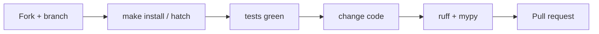

# Copyright (C) 2024-2026 jango_blockchained
#
# This file is part of pynescript.
#
# pynescript is free software: you can redistribute it and/or modify
# it under the terms of the GNU Affero General Public License as published by
# the Free Software Foundation, either version 3 of the License, or
# (at your option) any later version.
#
# pynescript is distributed in the hope that it will be useful,
# but WITHOUT ANY WARRANTY; without even the implied warranty of
# MERCHANTABILITY or FITNESS FOR A PARTICULAR PURPOSE.  See the
# GNU Affero General Public License for more details.
#
# You should have received a copy of the GNU Affero General Public License
# along with pynescript.  If not, see <https://www.gnu.org/licenses/>.
#
# SPDX-License-Identifier: AGPL-3.0-or-later

---
title: "Contributing"
description: "Hard constraints, workflow, and style rules for contributors and agents working on PYNE."
---

# Contributing

## Abstract

Contributions to PYNE are welcome when they respect the repo’s **mechanical invariants**: generated code boundaries, src-layout packaging, dual console scripts, test corpus costs, and encryption secrets. This page distills `CONTRIBUTING.md` and `AGENTS.md` into an operational contract for humans and agents.

## Conceptual model



## Interface surface

### Baseline workflow

1. Fork and branch from `main`
2. Install: `make install` or hatch envs
3. Run tests: `make test` / `hatch run test:test`
4. Implement with tests (prefer TDD for non-trivial behavior)
5. Lint/format: `make lint` / `make fmt` or `hatch run lint:style` + `lint:typing`
6. Open a PR with rationale + test evidence

Official short form also lives in root `CONTRIBUTING.md`.

### Everyday commands

| Goal | Command |
| --- | --- |
| Editable install + LSP | `make install` |
| Full tests | `make test` |
| LSP only | `make test-lsp` |
| Backend only | `make test-backend` |
| Lint / format | `make lint` / `make fmt` |
| Fast build sanity | `make build-check` |
| API | `make run` |
| LSP process | `make run-lsp` |

## Hard constraints

### Grammar & generated code

- **Edit only** `src/pynescript/ast/grammar/antlr4/resource/*.g4` for grammar work
- **Never hand-edit** `…/antlr4/generated/` or `…/asdl/generated/`
- Regenerate via hatch `lint:gen-parser` / project scripts; see grammar guides under `.opencode/context/`

### No stale backups

Do not recreate removed backups such as `builder.py.bak` or `evaluator/builtins/technical_refactored.py`. Live `builder.py` and `technical.py` are sole sources of truth.

### Future annotations

Every new Python file must start with:

```python
from __future__ import annotations
```

Enforced by ruff isort `required-imports`.

### Console scripts

| Preferred | Alias | Role |
| --- | --- | --- |
| `pyne` | `pynescript` | Click CLI |
| `pyne-lsp` | `pynescript-lsp` | Language Server (pygls) |

Import package remains `pynescript`. Do not conflate CLI and LSP entrypoints in docs, packaging, or process managers.

### Optional example-script fixture

`tests/conftest.py` only expands `pinescript_filepath` when `--example-scripts-dir` points at a local directory of `*.pine` files. **No third-party corpus is shipped** in the repository.

`tests/data/library/` is reference material, not auto-parametrized.

### Builtin metadata

`builtin_metadata.json` is **generated from code**. After adding builtins:

```bash
python scripts/generate_builtin_metadata.py
```

Do not hand-maintain the catalog long-term.

### Interpret / compile parity

When changing `pynescript.runtime.Runtime`, the compiler, or plot/series export, check **series parity** between `mode="interpret"` and `mode="compile"`:

```bash
# Local corpus harness (default 50 scripts × 1000 bars)
python scripts/compare_interp_compile.py --bars 1000 --limit 50

# Broader pass from a path list; ignore one-sided hline/fill keys
python scripts/compare_interp_compile.py --file-list path.txt --limit 0 --workers 4 --timeout-sec 30 --ignore-hline-keys --ignore-fill-keys
```

Always-on unit coverage lives in `tests/test_interp_compile_parity.py` (harness helpers + a small smoke subset). Optional longer path:

```bash
pytest tests/test_interp_compile_parity.py -m interp_compile_full
# or: PYNE_INTERP_COMPILE_FULL=1 pytest tests/test_interp_compile_parity.py
```

Report artifact: `.cache/interp_compile_parity.json`. Value mismatches on shared `series` keys are regressions. First-party hline/fill/bgcolor/plotshape keys match (0.3.11); `--ignore-hline-keys` / `--ignore-fill-keys` are optional for leftover corpus noise. End-user mode semantics: [Evaluate scripts — Runtime modes](/pyne/docs/enduser/guides/evaluate-scripts#runtime-modes-interpret--compile--auto).

### Secrets & crypto

- `scripts/build/.metadata.key` is **gitignored**
- CI must supply stable `CRYPTO_KEY` from `METADATA_KEY` / `_METADATA_KEY` for reproducible `.enc` blobs
- Never commit Fernet keys or API admin tokens

## Internals (where to change what)

| Want to… | Look at |
| --- | --- |
| Parse / unparse | `src/pynescript/ast/helper.py` |
| Add builtin | `src/pynescript/ast/evaluator/builtins/<ns>.py` + metadata generator |
| LSP feature | `src/pynescript/langserver/features/` + `server.py` |
| CLI subcommand | `src/pynescript/__main__.py` |
| Grammar | `resource/*.g4` then regenerate |
| Pro API route | `backend/api/preview.py`, `backend/app.py` |
| Runtime modes / compile fallback | `src/pynescript/runtime/host.py` (`Runtime.run`); `backend/runtime.py` is a shim |
| Interp/compile series parity | `scripts/compare_interp_compile.py`, `tests/test_interp_compile_parity.py` |
| TS library | sister repo [hoox-sh/pynets](https://github.com/hoox-sh/pynets) (`pynets/` submodule here) |

## Style

- **Ruff** line length 120; broad rule set in `pyproject.toml`
- **Black** target `py310` (via toolchain config)
- **Mypy** strict-ish; exemptions for generated grammar, `evaluator.builtins.*`, tests
- Voice for docs: academic nerdy-cool per `docs/WRITING.md` — no empty marketing adjectives

## Release (this repo)

Match root `CONTRIBUTING.md` and `.github/workflows/publish.yml` / `release.yml` / `ghcr.yml`:

1. Bump `__version__` in `src/pynescript/__about__.py` and update `CHANGELOG.md`.
2. Align `vscode-extension/package.json` when shipping the VSIX together.
3. Ensure CI is green on `main`.
4. Tag and push: `git tag vX.Y.Z && git push origin vX.Y.Z`.
5. **Publish** (`publish.yml`) builds sdist/wheel (`hoox_pyne-*.whl`) and uploads to PyPI (`PYPI_API_TOKEN` or Trusted Publishing OIDC, environment `pypi`).
6. **Build & Release** (`release.yml`) attaches Nuitka CLI/LSP binaries + VSIX to the GitHub Release.
7. **GHCR** (`ghcr.yml`) publishes `ghcr.io/hoox-sh/pyne/{cli,lsp,api}:X.Y.Z` on `v*` tags.

Dry-run PyPI: Actions → **Publish** → Run workflow → `dry_run=true`. Local: `python -m build && twine check dist/*`.

AXIS charting releases live in [hoox-sh/axis](https://github.com/hoox-sh/axis) (historical fork: `jango-blockchained/axis`).

## PyneTS contributions

- Work in [hoox-sh/pynets](https://github.com/hoox-sh/pynets), not a `pine-worker/` directory in this repo
- Bun for install / test / typecheck; `bun run generate` after PYNE `.g4` changes
- Python remains the oracle — see [PyneTS parity](/pyne/docs/pynets/parity)
- Do not copy PyneTS sources into this tree; PYNE consumes the `pynets/` submodule only
- The `pynets/` submodule pin is **v0.2.0** (interpret + JS compile), matching standalone `@hoox-sh/pynets`. Python remains the oracle.

## Failure modes for contributors

| Mistake | Fallout |
| --- | --- |
| Editing generated ANTLR/ASDL | Overwritten / review hell |
| Skipping corpus cost awareness | 10-minute “unit” tests |
| Hand-editing metadata JSON | Drift from dispatch |
| Changing compile/export without parity check | Silent chart/series drift vs interpret |
| Committing `.metadata.key` | Secret leak; rotate immediately |
| PR without lint | CI red on ruff/mypy |

## See also

- [Local development](/pyne/docs/devops/local-dev)
- [CI](/pyne/docs/devops/ci)
- [PyneTS](/pyne/docs/pynets)
- [pine-worker (legacy)](/pyne/docs/pine-worker)
- [Roadmap](/pyne/docs/reference/roadmap)
- Root `AGENTS.md`, `CONTRIBUTING.md`, `CODE_OF_CONDUCT.md`
