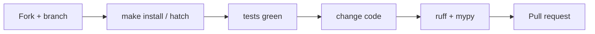

# Copyright (C) 2024-2026 jango_blockchained
#
# This file is part of pynescript.
#
# pynescript is free software: you can redistribute it and/or modify
# it under the terms of the GNU Affero General Public License as published by
# the Free Software Foundation, either version 3 of the License, or
# (at your option) any later version.
#
# pynescript is distributed in the hope that it will be useful,
# but WITHOUT ANY WARRANTY; without even the implied warranty of
# MERCHANTABILITY or FITNESS FOR A PARTICULAR PURPOSE.  See the
# GNU Affero General Public License for more details.
#
# You should have received a copy of the GNU Affero General Public License
# along with pynescript.  If not, see <https://www.gnu.org/licenses/>.
#
# SPDX-License-Identifier: AGPL-3.0-or-later

---
title: "Contributing"
description: "Hard constraints, workflow, and style rules for contributors and agents working on PYNE."
---

# Contributing

## Abstract

Contributions to PYNE are welcome when they respect the repo’s **mechanical invariants**: generated code boundaries, src-layout packaging, dual console scripts, test corpus costs, and encryption secrets. This page distills `CONTRIBUTING.md` and `AGENTS.md` into an operational contract for humans and agents.

## Conceptual model



## Interface surface

### Baseline workflow

1. Fork and branch from `main`
2. Install: `make install` or hatch envs
3. Run tests: `make test` / `hatch run test:test`
4. Implement with tests (prefer TDD for non-trivial behavior)
5. Lint/format: `make lint` / `make fmt` or `hatch run lint:style` + `lint:typing`
6. Open a PR with rationale + test evidence

Official short form also lives in root `CONTRIBUTING.md` (points at Sphinx docs historically).

### Everyday commands

| Goal | Command |
| --- | --- |
| Editable install + LSP | `make install` |
| Full tests | `make test` |
| LSP only | `make test-lsp` |
| Backend only | `make test-backend` |
| Lint / format | `make lint` / `make fmt` |
| Fast build sanity | `make build-check` |
| API | `make run` |
| LSP process | `make run-lsp` |

## Hard constraints

### Grammar & generated code

- **Edit only** `src/pynescript/ast/grammar/antlr4/resource/*.g4` for grammar work
- **Never hand-edit** `…/antlr4/generated/` or `…/asdl/generated/`
- Regenerate via hatch `lint:gen-parser` / project scripts; see grammar guides under `.opencode/context/`

### No stale backups

Do not recreate removed backups such as `builder.py.bak` or `evaluator/builtins/technical_refactored.py`. Live `builder.py` and `technical.py` are sole sources of truth.

### Future annotations

Every new Python file must start with:

```python
from __future__ import annotations
```

Enforced by ruff isort `required-imports`.

### Console scripts

| Script | Role |
| --- | --- |
| `pynescript` | Click CLI |
| `pynescript-lsp` | Language Server (pygls) |

Do not conflate entrypoints in docs, packaging, or process managers.

### Test corpus fixture

`tests/conftest.py` parametrizes `pinescript_filepath` over **every** `tests/data/builtin_scripts/*.pine`. A new test using that fixture may run hundreds of cases. Narrow with `--example-scripts-dir=...` when iterating.

`tests/data/library/` is reference material, not auto-parametrized.

### Builtin metadata

`builtin_metadata.json` is **generated from code**. After adding builtins:

```bash
python scripts/generate_builtin_metadata.py
```

Do not hand-maintain the catalog long-term.

### Secrets & crypto

- `scripts/build/.metadata.key` is **gitignored**
- CI must supply stable `CRYPTO_KEY` from `METADATA_KEY` / `_METADATA_KEY` for reproducible `.enc` blobs
- Never commit Fernet keys or API admin tokens

## Internals (where to change what)

| Want to… | Look at |
| --- | --- |
| Parse / unparse | `src/pynescript/ast/helper.py` |
| Add builtin | `src/pynescript/ast/evaluator/builtins/<ns>.py` + metadata generator |
| LSP feature | `src/pynescript/langserver/features/` + `server.py` |
| CLI subcommand | `src/pynescript/__main__.py` |
| Grammar | `resource/*.g4` then regenerate |
| Pro API route | `backend/api/preview.py`, `backend/app.py` |
| TS port | `pine-worker/` |

## Style

- **Ruff** line length 120; broad rule set in `pyproject.toml`
- **Black** target `py310` (via toolchain config)
- **Mypy** strict-ish; exemptions for generated grammar, `evaluator.builtins.*`, tests
- Voice for docs: academic nerdy-cool per `docs/WRITING.md` — no empty marketing adjectives

## pine-worker contributions

- Bun for install/test/typecheck
- Python remains oracle; update parity fixtures via generator
- Converter stubs are starting points only

## Failure modes for contributors

| Mistake | Fallout |
| --- | --- |
| Editing generated ANTLR/ASDL | Overwritten / review hell |
| Skipping corpus cost awareness | 10-minute “unit” tests |
| Hand-editing metadata JSON | Drift from dispatch |
| Committing `.metadata.key` | Secret leak; rotate immediately |
| PR without lint | CI red on ruff/mypy |

## See also

- [Local development](/pyne/docs/devops/local-dev)
- [CI](/pyne/docs/devops/ci)
- [pine-worker](/pyne/docs/pine-worker)
- [Roadmap](/pyne/docs/reference/roadmap)
- Root `AGENTS.md`, `CONTRIBUTING.md`, `CODE_OF_CONDUCT.md`
