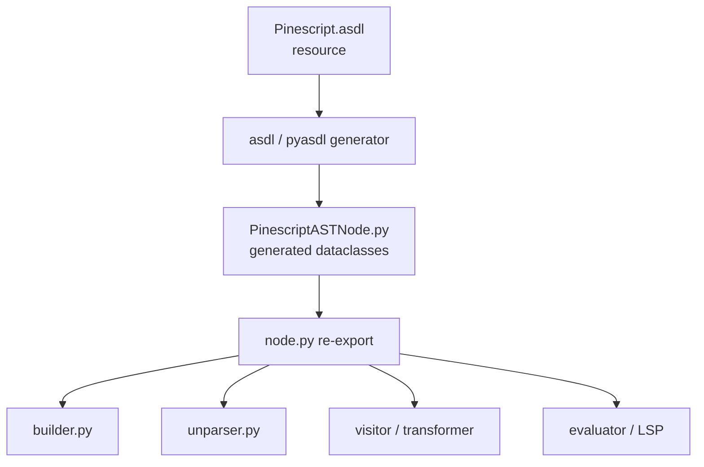

# Copyright (C) 2024-2026 jango_blockchained
#
# This file is part of pynescript.
#
# pynescript is free software: you can redistribute it and/or modify
# it under the terms of the GNU Affero General Public License as published by
# the Free Software Foundation, either version 3 of the License, or
# (at your option) any later version.
#
# pynescript is distributed in the hope that it will be useful,
# but WITHOUT ANY WARRANTY; without even the implied warranty of
# MERCHANTABILITY or FITNESS FOR A PARTICULAR PURPOSE.  See the
# GNU Affero General Public License for more details.
#
# You should have received a copy of the GNU Affero General Public License
# along with pynescript.  If not, see <https://www.gnu.org/licenses/>.
#
# SPDX-License-Identifier: AGPL-3.0-or-later

---
title: "ASDL Schema"
description: "Algebraic AST definition in Pinescript.asdl, generated dataclasses, and how schema changes flow into the pipeline."
---

# ASDL Schema

The abstract syntax tree is not free-form dicts. It is an **algebraic data type** declared in ASDL and materialized as Python dataclasses.

## Abstract

`src/pynescript/ast/grammar/asdl/resource/Pinescript.asdl` defines the `Pinescript` module: roots (`Script`, `Expression`), statements, expressions (including control structures that are also expressions), operators, params, args, cases, and comments. Codegen writes `grammar/asdl/generated/PinescriptASTNode.py`. `src/pynescript/ast/node.py` re-exports that module so the rest of the codebase imports `from pynescript.ast import node as ast` (or `from pynescript.ast.node import Script`).

ASDL is the contract between **builder** (produces nodes), **evaluator/LSP** (consume nodes), and **unparser** (serializes nodes). Changing a field without regenerating and updating all three is a schema break.

## Conceptual model



Each product sum type becomes a Python class hierarchy under `AST` with:

- `_fields` — logical children (walked by `iter_fields` / visitors)
- `_attributes` — location metadata (`lineno`, `col_offset`, `end_lineno`, `end_col_offset`) where declared

## Interface surface

### Module roots (`mod`)

| Constructor | Fields | Use |
| --- | --- | --- |
| `Script` | `stmt* body`, `string* annotations` | Full file (`mode="exec"`) |
| `Expression` | `expr body` | Single expression (`mode="eval"`) |

### Statements (`stmt`)

| Constructor | Notable fields |
| --- | --- |
| `FunctionDef` | `name`, `param* args`, `body`, `method?`, `export?`, `annotations` |
| `TypeDef` | UDT `type Name` body (fields + methods as stmts) |
| `EnumDef` | `enum Name` members |
| `Assign` | `target`, optional `value`/`type`/`mode` (`Var`/`VarIp`), `export?`, `annotations` |
| `ReAssign` | `:=` reassignment |
| `AugAssign` | `+=` … ops |
| `Import` | `namespace/name/version`, optional `alias` |
| `Expr` | Expression statement |
| `Break` / `Continue` | Loop control |

All `stmt` and most other attributed products carry location attributes.

### Expressions (`expr`)

Operators and primaries:

- `BoolOp`, `BinOp`, `UnaryOp`, `Conditional` (`? :`), `Compare`
- `Call`, `Constant`, `Attribute`, `Subscript`, `Name`, `Tuple`
- **Structures as expressions:** `ForTo`, `ForIn`, `While`, `If`, `Switch` — same shapes can appear as values (Pine’s expression-oriented control flow)
- `Qualify` — `const`/`input`/`simple`/`series` applied to a type/expression
- `Specialize` — generic specialization form (`value` + `args`)

### Auxiliaries

| Product | Role |
| --- | --- |
| `decl_mode` | `Var` \| `VarIp` |
| `type_qual` | `Const` \| `Input` \| `Simple` \| `Series` |
| `expr_context` | `Load` \| `Store` |
| `param` | Function/method parameter |
| `arg` | Call argument (optional keyword `name`) |
| `case` | Switch arm (`pattern?`, `body`) |
| `cmnt` / `Comment` | Comment with `value` and `kind` (annotation classification) |

Operators are empty product constructors (`Add`, `And`, `Eq`, …) used as tags — the unparser maps class names back to tokens.

### Importing nodes

```python
from pynescript.ast import node as ast

script = ast.Script(body=[
    ast.Expr(value=ast.Call(
        func=ast.Name(id="plot", ctx=ast.Load()),
        args=[ast.Arg(value=ast.Name(id="close", ctx=ast.Load()))],
    ))
])
```

Prefer constructing via `parse()` unless synthesizing trees for tests.

## Internals

### Paths

| Path | Edit? |
| --- | --- |
| `src/pynescript/ast/grammar/asdl/resource/Pinescript.asdl` | **Yes** — schema source of truth |
| `src/pynescript/ast/grammar/asdl/generated/PinescriptASTNode.py` | **No** — regenerated |
| `src/pynescript/ast/grammar/asdl/tool/generate.py` | Generator entry |
| `src/pynescript/ast/node.py` | Thin re-export (`from .grammar.asdl.generated import *`) |

### Generated class shape

Excerpt of generated form (do not edit this file; shown for orientation):

```python
@_dataclasses.dataclass
class Script(mod):
    body: list[stmt] = field(default_factory=list)
    annotations: list[string] = field(default_factory=list)
    _fields: ClassVar[list[str]] = ["body", "annotations"]
```

`stmt` base injects location `_attributes`. Hashability is forced to `object.__hash__` so nodes can live in sets/maps by identity when needed.

### Regeneration

When the schema changes:

```bash
# Project convention (pyasdl / asdl tool — see asdl/tool/generate.py)
pyasdl src/pynescript/ast/grammar/asdl/resource/Pinescript.asdl \
  -o src/pynescript/ast/grammar/asdl/generated
```

Then update, in the same change set:

1. `builder.py` construction sites
2. `unparser.py` `visit_*` methods
3. Evaluator expression/statement handlers
4. Any isinstance checks in LSP features

### Dual nature of structures

ASDL places `If`, `ForTo`, `ForIn`, `While`, `Switch` under `expr`, while the builder often wraps structure-as-statement under `Expr(value=…)`. Annotation collection (`StatementCollector`) treats assign/reassign/augassign/expr that hold structure values specially so nested statements remain visible for `//@…` pairing.

## Invariants

1. **Schema first.** New language constructs need an ASDL constructor (or a clear encoding into an existing one) before evaluator semantics.
2. **Fields vs attributes.** Visitors walk `_fields` only. Location is metadata; missing locations are fillable via `fix_missing_locations`.
3. **Optional flags as `int?`.** `method` and `export` are integer flags (truthy when set), not booleans — match builder assignments (`export = 1`).
4. **Generated file is not a style playground.** Formatting/lint of `PinescriptASTNode.py` is overwritten on regen.

## Worked examples

### Map ASDL to a short script

```pine
//@version=6
f(x) => x + 1
a = f(close)
```

Approximate tree:

```text
Script(
  annotations=["//@version=6", ...],
  body=[
    FunctionDef(name="f", args=[Param(name="x")], body=[Expr(BinOp(...))]),
    Assign(target=Name("a", Store), value=Call(...)),
  ],
)
```

### Dump fields programmatically

```python
from pynescript.ast.helper import parse, iter_fields

tree = parse("x = 1")
for name, value in iter_fields(tree):
    print(name, type(value).__name__)
```

## Failure modes

| Failure | Cause |
| --- | --- |
| `AttributeError` on new field | Schema regenerated but consumer not updated |
| Builder constructs wrong product | ASDL and grammar out of sync |
| Unparser omits new node | Missing `visit_NewNode` → `generic_visit` may emit nothing useful |
| Hand-edit of generated nodes lost | Edited `generated/` instead of `.asdl` |

## See also

- [Builder](/pyne/docs/core/builder)
- [Visitor / transformer](/pyne/docs/core/visitor-transformer)
- [Unparser](/pyne/docs/core/unparser)
- [Grammar (ANTLR4)](/pyne/docs/core/grammar-antlr4)
