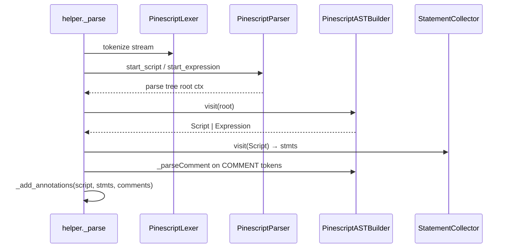

# Copyright (C) 2024-2026 jango_blockchained
#
# This file is part of pynescript.
#
# pynescript is free software: you can redistribute it and/or modify
# it under the terms of the GNU Affero General Public License as published by
# the Free Software Foundation, either version 3 of the License, or
# (at your option) any later version.
#
# pynescript is distributed in the hope that it will be useful,
# but WITHOUT ANY WARRANTY; without even the implied warranty of
# MERCHANTABILITY or FITNESS FOR A PARTICULAR PURPOSE.  See the
# GNU Affero General Public License for more details.
#
# You should have received a copy of the GNU Affero General Public License
# along with pynescript.  If not, see <https://www.gnu.org/licenses/>.
#
# SPDX-License-Identifier: AGPL-3.0-or-later

---
title: "AST Builder"
description: "PinescriptASTBuilder: ANTLR parse-tree visitor that constructs ASDL nodes, locations, and comment kinds."
---

# AST Builder

The builder is the semantic boundary between ANTLR’s concrete parse tree and PYNE’s ASDL abstract tree.

## Abstract

`src/pynescript/ast/builder.py` defines three cooperating mixins:

1. **`PinescriptASTLocator`** — maps `ParserRuleContext.start/stop` tokens to `lineno` / `col_offset` / `end_*`.
2. **`PinescriptCommentParser`** — classifies `//…` text into annotation kinds (`@=S`, `@0F`, `#`, plain `//`, …).
3. **`PinescriptASTBuilder`** — subclasses generated `PinescriptParserVisitor`, implements `visit_*` for every meaningful rule, returns ASDL nodes.

`helper._parse` constructs a builder, runs `builder.visit(rule_context)`, then (in exec mode) uses `StatementCollector` + comment tokens to attach annotations. The builder itself does not walk the default token channel for comments; that is a post-pass.

## Conceptual model



## Interface surface

You rarely instantiate the builder directly; `parse()` does. For tools that already hold a parse tree:

```python
from pynescript.ast.builder import PinescriptASTBuilder
from pynescript.ast.grammar.antlr4.parser import PinescriptParser
# ... construct parser, parse to ctx ...
node = PinescriptASTBuilder().visit(ctx)
```

### Locator API

The live path writes attributes **directly**. Do not describe `_setLocations` as a dict apply — that was an older micro-opt leftover.

| Method | Role |
| --- | --- |
| `_setLocations(node, ctx)` | **Hot path.** Sets `node.lineno` / `col_offset` / `end_*` from `ctx.start` / `ctx.stop` (no intermediate dict). |
| `_getLocations(ctx)` | Unused helper that still **returns** a four-key dict. Not called by visit methods. |

End column calculation accounts for embedded newlines in the stop token text. The builder instance is **stateless**; `helper._SHARED_BUILDER` reuses one object for every parse.

### Comment kinds

`_parseComment` returns `(kind, parts)`:

| Pattern | Kind prefix | Suffix | Example |
| --- | --- | --- | --- |
| `//@version = 5` | `@=` | `S` (script) | version assignment |
| `//@description …` / `//@strategy_alert_message …` | `@0` | `S` | script description / alert |
| `//@function` / `//@returns` | `@0` | `F` | function docs |
| `//@type` | `@0` | `T` | type docs |
| `//@variable` | `@0` | `V` | variable docs |
| `//@param name …` | `@1` | `F` | param docs |
| `//@field name …` | `@1` | `T` | field docs |
| `//# region` / `endregion` | `#` | — | editor regions |
| other `//` | `//` | — | ordinary comment |

`helper._add_annotations` filters by suffix when attaching to nodes.

### Store context

`_set_store_ctx` walks assignment targets (`Name`, nested `Tuple`) and sets `ctx = Store()` so load/store distinction is available to later passes (Python-ast style).

### Representative visit methods

| Rule visitor | Emits |
| --- | --- |
| `visitStart_script` | `Script(body)` |
| `visitStart_expression` | `Expression(body)` |
| `visitFunction_declaration` / `visitMethod_declaration` | `FunctionDef` (`method=1` for methods; optional `returns=` type spec) |
| `visitType_declaration` | `TypeDef` |
| `visitEnum_declaration` | `EnumDef` |
| `visitVariable_declaration` | `Assign` shell (`target`/`type`/`mode`); parent fills `value` |
| `visitSimple_name_initialization` / `visitCompound_name_initialization` | `Assign` (`export=1` if `EXPORT`) |
| `visitSimple_reassignment` / `visitCompound_reassignment` | `ReAssign` (`:=`, or `=` on attr/subscript) |
| `visit*_*_augassignment` | `AugAssign` |
| `visitIf_structure` / `visitFor_*` / `visitWhile_*` / `visitSwitch_*` / `visitOnce_structure` | Structure expressions (`once` is statement-only) |
| `visit*_*_expression` (disjunction → … → primary) | Operator trees with correct associativity |
| `visitLiteral_*` | `Constant` (numbers via `ast.literal_eval`, strings, bools, colors) |
| `visitPrimary_expression_call` | `Call` + `Arg` list (positional/keyword) |

Expression climbing follows the grammar’s layered rules (`conditional` → `disjunction` → `conjunction` → **bitwise or/xor/and** → equality → inequality → **shift** → additive → multiplicative → unary (`~`/`not`/`+/-`) → primary).

`returns` is visited from `ctx.type_specification()` and must not be evaluated as a value by later engines.

## Internals

### Path

- Implementation: `src/pynescript/ast/builder.py`
- Visitor base: `src/pynescript/ast/grammar/antlr4/visitor.py` → generated `PinescriptParserVisitor`
- Node types: `src/pynescript/ast/node.py`
- Annotation pairing: `src/pynescript/ast/collector.py` + `helper._add_annotations`

### Statement list flattening

`visitStatements` flattens each statement visitor’s result: some rules return a **list** (simple multi-statement lines joined by commas), so the body is always a flat `list[stmt]`.

### Export flag

When `EXPORT` is present on library declarations or name initialization, the builder sets `export = 1` on the corresponding node (integer flag per ASDL `int?`).

### Assign vs `ReAssign`

`visitVariable_declaration` always builds `Assign` (optional `type` / `var`/`varip` mode). `=` after a bare or typed name is initialization. `visitSimple_reassignment` emits `ReAssign` for `obj.f =` / `a[i] =` / `name :=` — never for `name =`. See [Grammar](/pyne/docs/core/grammar-antlr4).

### Field / enum members

Field definitions become `Assign`-like statements inside `TypeDef.body` (with optional `VarIp` mode). Enum members become assignment-shaped stmts under `EnumDef.body`. The unparser special-cases method members of types when pretty-printing.

## Invariants

1. **Every constructed stmt/expr that has a source span should receive `_setLocations`** (direct attribute writes) so LSP diagnostics and `get_source_segment` work.
2. **Visitor method names must track generated rule names.** Renaming a parser rule without updating the builder is a silent `generic_visit` fallback (wrong or empty trees).
3. **Do not edit `builder.py.bak`.** Live builder is `builder.py` only (stale backups are forbidden under project policy).
4. **Grammar and builder co-evolve.** A resource-only grammar change that adds rules is incomplete until `visit_*` exists.

## Worked examples

### What `x = close + 1` becomes

Rough structure after build:

```text
Assign(
  target=Name(id="x", ctx=Store()),
  value=BinOp(
    left=Name(id="close", ctx=Load()),
    op=Add(),
    right=Constant(value=1),
  ),
)
```

### Export const initialization

Grammar: `EXPORT? variable_declaration EQUAL structure_expression`

Builder sets `assign.export = 1` when `ctx.EXPORT()` is present — required for library export of typed constants.

### Typed UDF (`FunctionDef.returns`)

```pine
int ilog2(int n) =>
    // ...
```

`visitFunction_declaration` stores the leading `type_specification` on `FunctionDef.returns` (here a `Name(id="int")`). Methods do the same with `method=1`. The unparser prints it back as a leading type.

### Debugging a missing visitor

```python
from pynescript.ast.helper import parse, dump
print(dump(parse(your_snippet), indent=2))
```

If a subtree is `None` or a raw unexpected type, find the rule in `PinescriptParser.g4` and the matching `visitRule_name` in `builder.py`.

## Failure modes

| Symptom | Cause |
| --- | --- |
| `AttributeError: '…Context' object has no attribute '…'` | Full parser regen changed accessors; builder outdated |
| Locations all zero / missing | Forgot `_setLocations` on new visit method |
| Annotations not attached | Comment kind suffix wrong, or statement not yielded by `StatementCollector` |
| Tuples not assignable | Store context not propagated through `Tuple.elts` |
| Structure expression lost | Wrong rule branch between statement vs expression path |

## See also

- [Grammar (ANTLR4)](/pyne/docs/core/grammar-antlr4)
- [ASDL schema](/pyne/docs/core/asdl-schema)
- [Helper API](/pyne/docs/core/helper-api)
- [Error model](/pyne/docs/core/error-model)
