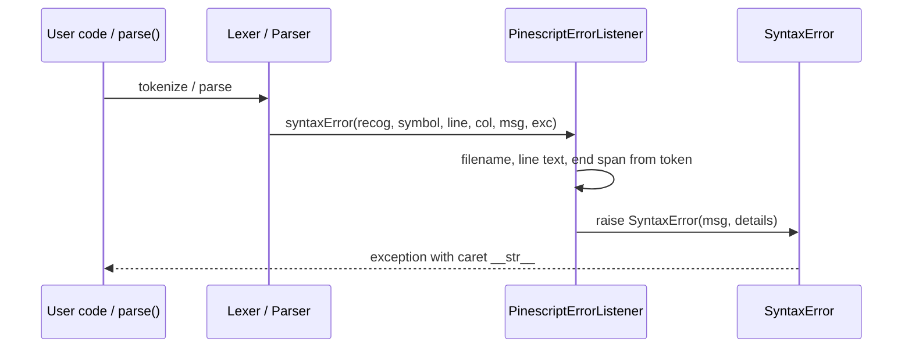

# Copyright (C) 2024-2026 jango_blockchained
#
# This file is part of pynescript.
#
# pynescript is free software: you can redistribute it and/or modify
# it under the terms of the GNU Affero General Public License as published by
# the Free Software Foundation, either version 3 of the License, or
# (at your option) any later version.
#
# pynescript is distributed in the hope that it will be useful,
# but WITHOUT ANY WARRANTY; without even the implied warranty of
# MERCHANTABILITY or FITNESS FOR A PARTICULAR PURPOSE.  See the
# GNU Affero General Public License for more details.
#
# You should have received a copy of the GNU Affero General Public License
# along with pynescript.  If not, see <https://www.gnu.org/licenses/>.
#
# SPDX-License-Identifier: AGPL-3.0-or-later

---
title: "Error Model"
description: "SyntaxError, IndentationError, SyntaxErrorDetails, and PinescriptErrorListener bridge from ANTLR to diagnostics."
---

# Error Model

Parse failures in PYNE are not bare ANTLR console messages. They are structured exceptions with file, line, column, source excerpt, and a caret — suitable for CLI, tests, and LSP adapters.

## Abstract

Two layers cooperate:

1. **`src/pynescript/ast/error.py`** — `SyntaxErrorDetails`, `SyntaxError`, `IndentationError`.
2. **`src/pynescript/ast/grammar/antlr4/error_listener.py`** — `PinescriptErrorListener` implements ANTLR’s `ErrorListener.syntaxError`, builds details from the recognizer + offending token, and **raises** the project `SyntaxError`.

`helper._parse` installs this singleton listener on both lexer and parser after removing default listeners. Indentation problems raised from `PinescriptLexerBase` use the same exception hierarchy (`IndentationError` subclass).

Note: these names intentionally shadow Python builtins (`SyntaxError`, `IndentationError`) inside the package — import carefully:

```python
from pynescript.ast.error import SyntaxError as PineSyntaxError
```

## Conceptual model



## Interface surface

### `SyntaxErrorDetails` (NamedTuple)

| Field | Type | Meaning |
| --- | --- | --- |
| `filename` | `str` | Path or `<unknown>` |
| `lineno` | `int` | 1-based line |
| `offset` | `int` | 0-based column |
| `text` | `str` | Source line (or excerpt) |
| `end_lineno` | `int \| None` | Multi-line span end |
| `end_offset` | `int \| None` | End column |

### `SyntaxError(Exception)`

```python
class SyntaxError(Exception):
    def __init__(self, message: str, *details): ...
```

`details` may be:

- a single `SyntaxErrorDetails` instance, or
- positional components matching the NamedTuple fields.

Attributes: `message`, `details`.

`__str__` renders:

```text
{message}
  File "{filename}", line {lineno}
    {stripped_line}
    {spaces}^
```

Offset is adjusted when the displayed line is `lstrip()`’d so the caret still points at the logical column.

### `IndentationError(SyntaxError)`

Empty subclass for indent-stack failures from the lexer base (wrong nest, inconsistent levels). Catch either specifically or via the base `SyntaxError`.

### `PinescriptErrorListener`

```python
from pynescript.ast.grammar.antlr4.error_listener import PinescriptErrorListener

listener = PinescriptErrorListener.INSTANCE  # singleton
lexer.removeErrorListeners()
lexer.addErrorListener(listener)
parser.removeErrorListeners()
parser.addErrorListener(listener)
```

| Method | Role |
| --- | --- |
| `syntaxError(...)` | Build details; raise `SyntaxError` |
| `_getFilenameFrom(recognizer)` | Walk Parser → TokenStream → Lexer → InputStream/FileStream |
| `_getInputTextFrom(recognizer, lineno)` | Full buffer or single line |
| `_splitLines` | Portable newline split (`\r\n`/`\n`/`\r`) |

If the ANTLR exception `e` is already a project `SyntaxError`, its `details` are updated; otherwise the new error’s `__cause__` is set to `e`.

## Internals

### Paths

| Path | Role |
| --- | --- |
| `src/pynescript/ast/error.py` | Exception types |
| `src/pynescript/ast/grammar/antlr4/error_listener.py` | ANTLR bridge |
| `src/pynescript/ast/grammar/antlr4/resource/PinescriptLexerBase.py` | May raise `IndentationError` / `SyntaxError` during tokenization |
| `src/pynescript/ast/helper.py` | Wires listener; maps filename onto streams |

### Filename resolution order (InputStream)

1. `getSourceName()` if present
2. `sourceName` attribute
3. `input_stream.name` (set by helper to the user filename)
4. `"<unknown>"`

`FileStream` uses `fileName`.

### End span from offending token

```text
symbol_len = stop - start + 1
end_lineno = token.line + newlines_in_text
end_offset = adjusted if multiline else column + symbol_len
```

Mirrors the builder’s location math so diagnostics and AST spans speak the same coordinate system.

### Relationship to linter `E001`

`PineLinter._check_syntax` catches **any** `Exception` from `parse` and wraps it as `LintWarning(code="E001", severity="error")`, losing structured details. For rich carets, catch `pynescript.ast.error.SyntaxError` at the call site instead of only reading linter output.

### LSP / tooling

Adapters typically map:

| Exception field | LSP `Diagnostic` |
| --- | --- |
| `lineno` / `offset` | `Range.start` |
| `end_lineno` / `end_offset` | `Range.end` |
| `message` | `message` |
| IndentationError | same, possibly different `code` |

## Invariants

1. **Default ANTLR listeners must stay removed** on the parse path — otherwise errors print twice and may not raise.
2. **Singleton listener is stateless** enough to share (`INSTANCE`); thread-local needs would require new instances.
3. **Raising aborts parse immediately** — no error recovery producing a partial tree through the public helper.
4. **Package `SyntaxError` ≠ builtin** — `except SyntaxError` without import may catch the wrong class.

## Worked examples

### Catching a parse error

```python
from pynescript.ast.helper import parse
from pynescript.ast.error import SyntaxError as PineSyntaxError

try:
    parse("f( =>\n", filename="bad.pine")
except PineSyntaxError as e:
    print(e)  # caret form
    print(e.details.lineno, e.details.offset)
    print(e.details.filename)
```

### Distinguishing indentation

```python
from pynescript.ast.error import IndentationError as PineIndentError
from pynescript.ast.error import SyntaxError as PineSyntaxError

try:
    parse("if true\nplot(1)\n")  # missing indent under if — may indent-error depending on tokens
except PineIndentError as e:
    print("indent", e.message)
except PineSyntaxError as e:
    print("syntax", e.message)
```

### Manual construction (tests)

```python
from pynescript.ast.error import SyntaxError, SyntaxErrorDetails

details = SyntaxErrorDetails("t.pine", 3, 4, "    plot(\n", 3, 9)
err = SyntaxError("missing RPAR", details)
assert "t.pine" in str(err)
assert "^" in str(err)
```

## Failure modes

| Failure | Cause |
| --- | --- |
| `TypeError: unexpected type of input` | Listener received a recognizer/stream combo it does not support |
| Caret misaligned | Tabs vs spaces; display strips leading WS while offset counts raw |
| Filename always `<unknown>` | Stream name not set (bypassed helper) |
| Exception swallowed as generic `E001` | Only used linter path |
| `except SyntaxError` misses Pine errors | Caught builtin only |
| Partial trees | Not available via `parse()` after error — redesign would need recovery listeners |

## See also

- [Helper API](/pyne/docs/core/helper-api)
- [Grammar (ANTLR4)](/pyne/docs/core/grammar-antlr4)
- [Linter](/pyne/docs/core/linter)
- [LSP diagnostics](/pyne/docs/lsp/features/diagnostics)
- [Language core hub](/pyne/docs/core)
