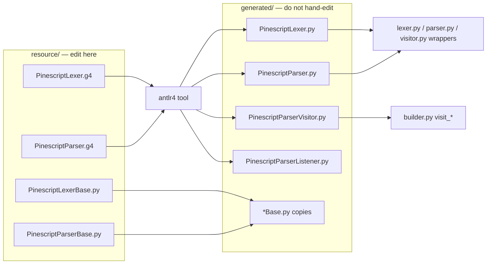

# Copyright (C) 2024-2026 jango_blockchained
#
# This file is part of pynescript.
#
# pynescript is free software: you can redistribute it and/or modify
# it under the terms of the GNU Affero General Public License as published by
# the Free Software Foundation, either version 3 of the License, or
# (at your option) any later version.
#
# pynescript is distributed in the hope that it will be useful,
# but WITHOUT ANY WARRANTY; without even the implied warranty of
# MERCHANTABILITY or FITNESS FOR A PARTICULAR PURPOSE.  See the
# GNU Affero General Public License for more details.
#
# You should have received a copy of the GNU Affero General Public License
# along with pynescript.  If not, see <https://www.gnu.org/licenses/>.
#
# SPDX-License-Identifier: AGPL-3.0-or-later

---
title: "Grammar (ANTLR4)"
description: "Resource .g4 grammars, generated artifacts, INDENT/DEDENT, regeneration, and the never-edit-generated rule."
---

# Grammar (ANTLR4)

Concrete syntax for Pine Script in PYNE is defined by a split lexer/parser ANTLR4 grammar plus hand-written base classes that inject Python-like indentation tokens.

## Abstract

Two grammars live under `src/pynescript/ast/grammar/antlr4/resource/`:

- `PinescriptLexer.g4` — keywords, operators, literals (including v6 triple-quoted strings), comments, hidden whitespace.
- `PinescriptParser.g4` — statements, expressions, type/enum/function/method declarations, control structures.

Python runtime classes under `generated/` are **outputs** of `antlr4 -Dlanguage=Python3`. They are committed so end users never need a JDK. **Never edit files under `generated/`** — changes evaporate on the next regeneration and fight the build pipeline.

Hand-written bases (copied into `generated/` by the generate tool):

- `resource/PinescriptLexerBase.py` — INDENT/DEDENT, newline elision, multiline string handling.
- `resource/PinescriptParserBase.py` — parser superClass hooks.

## Conceptual model



## Interface surface

Application code should not import `generated` symbols directly when a wrapper exists:

```python
from pynescript.ast.grammar.antlr4.lexer import PinescriptLexer
from pynescript.ast.grammar.antlr4.parser import PinescriptParser
from pynescript.ast.grammar.antlr4.visitor import PinescriptParserVisitor
from pynescript.ast.grammar.antlr4.error_listener import PinescriptErrorListener
```

The public parse path is higher level — [Helper API](/pyne/docs/core/helper-api) — which constructs lexer, token stream, parser, and strips default console error listeners in favor of `PinescriptErrorListener`.

### Entry rules (`PinescriptParser.g4`)

| Rule | Purpose |
| --- | --- |
| `start` → `start_script` | Full script (`statements? EOF`) |
| `start_expression` | Single expression + optional NEWLINE + EOF |
| `start_comments` | Comment stream only |

### Lexer structural facts

| Token / channel | Behavior |
| --- | --- |
| `INDENT` / `DEDENT` | Imaginary tokens emitted by `PinescriptLexerBase` (declared in `tokens { }`) |
| `COMMENT` | `//` line comments → `COMMENT_CHANNEL` (not the default channel) |
| `WS` | Spaces/tabs/form-feed → `HIDDEN` |
| `ERROR_TOKEN` | Catch-all `.` for recovery/reporting |
| `TRIPLE_DQ_STRING` / `TRIPLE_SQ_STRING` | v6 multiline strings, typed as `STRING` |

Keywords include `var`, `varip`, `method`, `export`, `enum`, `type`, qualifiers `const`/`input`/`simple`/`series`, and control forms `if`/`for`/`while`/`switch`.

### Parser structural facts

- **Compound vs simple statements.** Functions, methods, types, enums, and structure-valued assignments are compound; imports, break/continue, expression statements, and simple assignments terminate with `NEWLINE`.
- **Structures are dual-use.** `if`/`for`/`while`/`switch` appear both as statements and as **expressions** (`structure_expression`) — the classic Pine “if returns a value” form.
- **Local blocks.** Either indented (`NEWLINE INDENT statements DEDENT`) or inline single statement.
- **Library export.** `EXPORT?` prefixes function/method/type/enum and June-2025 `export const T name = …` compound initializers.

## Internals

### Paths

| Path | Edit? | Role |
| --- | --- | --- |
| `src/pynescript/ast/grammar/antlr4/resource/PinescriptLexer.g4` | **Yes** | Lexer grammar |
| `src/pynescript/ast/grammar/antlr4/resource/PinescriptParser.g4` | **Yes** | Parser grammar |
| `src/pynescript/ast/grammar/antlr4/resource/PinescriptLexerBase.py` | **Yes** | Indentation machine |
| `src/pynescript/ast/grammar/antlr4/resource/PinescriptParserBase.py` | **Yes** | Parser base |
| `src/pynescript/ast/grammar/antlr4/generated/**` | **No** | ANTLR output + copied bases |
| `src/pynescript/ast/grammar/antlr4/tool/generate.py` | Tool | Runs `antlr4`, copies `*.py` bases |
| `src/pynescript/ast/grammar/antlr4/error_listener.py` | Hand | Maps ANTLR errors → `ast.error.SyntaxError` |

### LexerBase responsibilities

`PinescriptLexerBase` is not optional sugar; it is part of the language definition:

- Ignore leading / collapse consecutive newlines; ensure trailing newline.
- Suppress newlines inside open `()` / `[]`, after operators, and for soft wrap lines whose indent width is not a multiple of four.
- Push `INDENT`/`DEDENT` with tab length and indent length = 4.
- Special-case multiline string tokens so wrap indentation inside strings is not mis-tokenized as structure.

Indent mistakes surface as `pynescript.ast.error.IndentationError` (subclass of the project `SyntaxError`).

### Regeneration

```bash
# Preferred hatch env (pulls antlr4-cli)
hatch run lint:gen-parser

# Or: python -m pynescript.ast.grammar.antlr4.tool.generate
# which invokes: $(python)/antlr4 -o generated -lib resource -listener -visitor -Dlanguage=Python3 resource/*.g4
# then copies resource/*.py into generated/
```

Requires a working `antlr4` CLI (often `antlr4-cli` on `PATH`, sometimes under `~/.local/bin` or next to `sys.executable`). Generated modules are excluded from mypy/ruff strictness in `pyproject.toml` — do not “lint-fix” them by hand.

### Downstream after grammar change

1. Regenerate (or selectively refresh lexer — see case study).
2. Add/adjust `visit_*` methods in `src/pynescript/ast/builder.py` for new or renamed rules.
3. If the **shape** of the language changed (new statement/expression kind), update `Pinescript.asdl` and regenerate ASDL nodes — [ASDL schema](/pyne/docs/core/asdl-schema).
4. Smoke-test with `parse` / `unparse` on a minimal first-party snippet before broader regression.

## Invariants

1. **Never hand-edit `generated/`.** Patches belong in `resource/*.g4` or `resource/*Base.py`.
2. **Visitor contract.** Generated `PinescriptParserVisitor` method names follow ANTLR rule names; the builder subclass must track renames.
3. **Comments are off the default channel.** Annotation logic in `helper._collect_comment_nodes` iterates `token_stream.tokens` for `COMMENT` type after `fill()`.
4. **Indent unit is four spaces.** Soft-wrap lines that are not multiples of four are newline-elided, not nested blocks.

## Worked examples

### Minimal grammar-level mental model

```text
//@version=5
indicator("x")
if close > open
    plot(1)
else
    plot(0)
```

Lexer emits NEWLINE, INDENT, DEDENT around the `if` bodies. Parser builds `if_structure` → builder yields `ast.If` with `body` / `orelse` statement lists.

### v6 triple-quoted strings

Resource lexer rules (illustrative — see live `PinescriptLexer.g4`):

```g4
TRIPLE_DQ_STRING : '"""' ( ~'"' | '"' ~'"' | '""' ~'"' )* '"""' -> type(STRING) ;
TRIPLE_SQ_STRING : '\'\'\'' ( ~'\'' | '\'' ~'\'' | '\'\'' ~'\'' )* '\'\'\'' -> type(STRING) ;
```

**ANTLR quoting pitfall:** putting `"'''"` or `'"""'` as fragment literals can produce tool errors (`quote came as a complete surprise`). Factor starters when needed:

```g4
fragment TRIPLE_SQ_START: '\'' '\'' '\'';
```

Content and source indentation inside the triple quotes are preserved literally (no automatic dedent).

### Case study: targeted lexer refresh (2026-07)

Full regeneration once produced a `PinescriptParser.py` whose context accessors diverged from what the hand-written builder expected (e.g. missing `template_spec_suffix()`), breaking even trivial parses. The practical recovery:

1. Edit **only** `resource/` grammar.
2. Generate the lexer in a clean temp directory (avoids nested `src/` mirror paths).
3. Copy **only** `PinescriptLexer.py` (+ refreshed `LexerBase.py`) into `generated/`.
4. Leave committed `PinescriptParser.py` and visitors untouched unless prepared to patch the builder in the same change.
5. Verify immediately:

```python
from pynescript.ast.helper import parse, unparse
ast = parse('indicator("x")\ns = """\nfoo\n  bar\n"""\n')
assert "foo" in unparse(ast)
```

## Failure modes

| Failure | Cause | Mitigation |
| --- | --- | --- |
| `mismatched input` after `"""` | Old lexer ATN without triple rules | Refresh generated lexer from resource |
| Full regen breaks builder | Parser context API drift | Selective copy; or update all `visit_*` together |
| `antlr4` not found | CLI not on PATH | Use hatch env or full path to `antlr4-cli` |
| Nested `generated/src/pynescript/...` junk | Running antlr with wrong `-o` cwd | Generate from clean temp + explicit `-o` |
| IndentationError mid-file | Mixed tabs/spaces or wrong nest | Align to 4-space blocks; check soft-wrap rules |
| Silent loss of hand patches | Edited `generated/` | Revert; re-apply in `resource/` |

## See also

- [ASDL schema](/pyne/docs/core/asdl-schema)
- [Builder](/pyne/docs/core/builder)
- [Error model](/pyne/docs/core/error-model)
- [Helper API](/pyne/docs/core/helper-api)
- [Missing features](/pyne/docs/reference/missing-features)
