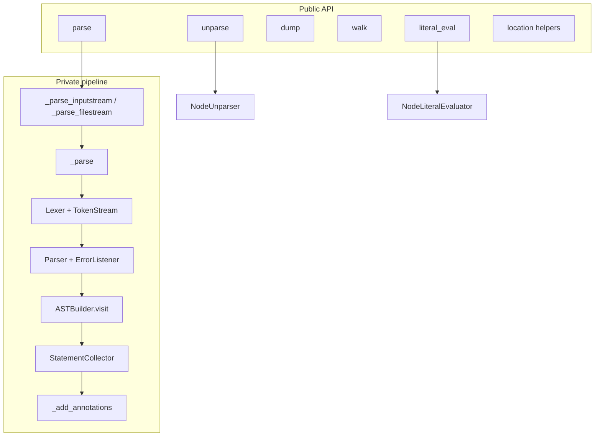

# Copyright (C) 2024-2026 jango_blockchained
#
# This file is part of pynescript.
#
# pynescript is free software: you can redistribute it and/or modify
# it under the terms of the GNU Affero General Public License as published by
# the Free Software Foundation, either version 3 of the License, or
# (at your option) any later version.
#
# pynescript is distributed in the hope that it will be useful,
# but WITHOUT ANY WARRANTY; without even the implied warranty of
# MERCHANTABILITY or FITNESS FOR A PARTICULAR PURPOSE.  See the
# GNU Affero General Public License for more details.
#
# You should have received a copy of the GNU Affero General Public License
# along with pynescript.  If not, see <https://www.gnu.org/licenses/>.
#
# SPDX-License-Identifier: AGPL-3.0-or-later

---
title: "Helper API"
description: "parse, unparse, dump, walk, literal_eval, and location utilities — the public AST surface."
---

# Helper API

`src/pynescript/ast/helper.py` is the stable library face of the language core. It orchestrates ANTLR, the builder, annotations, and the unparser behind functions deliberately similar to CPython’s `ast` module.

## Abstract

Call `parse` to obtain an ASDL tree; `dump` / `walk` / `iter_*` to inspect it; `unparse` to regenerate source; `literal_eval` for constant-folding-safe evaluation of literal expressions. Location helpers (`copy_location`, `fix_missing_locations`, `get_source_segment`, `increment_lineno`) support tooling that rewrites or reports on trees.

Everything higher in the stack (CLI, LSP, Pro API, workers) ultimately routes through this module for front-end work.

## Conceptual model



## Interface surface

### `parse(source, filename="<unknown>", mode="exec") -> AST`

| Parameter | Meaning |
| --- | --- |
| `source` | Full script or expression text |
| `filename` | Error reporting name; resolved to absolute path if the file exists |
| `mode` | `"exec"` → `start_script` → `Script`; `"eval"` → `start_expression` → `Expression` |

Raises:

- `ValueError` — invalid mode
- `pynescript.ast.error.SyntaxError` — lexer/parser failure (via `PinescriptErrorListener`)

Side effects during exec mode:

1. Temporarily raises `sys.getrecursionlimit` to at least 5000.
2. Collects COMMENT tokens and attaches annotations to eligible statements.

### `unparse(node) -> str`

Delegates to `NodeUnparser().visit(node)`. See [Unparser](/pyne/docs/core/unparser).

### `dump(node, *, annotate_fields=True, include_attributes=False, indent=None) -> str`

Recursive pretty-print of node trees. With `indent` (int spaces or string), multi-line layout is used for non-trivial nodes.

### `literal_eval(node_or_string, context=None, data_feed=None, data_provider=None) -> Any`

- Strings are `parse(..., mode="eval")` first.
- Unwraps `Expression.body`.
- Uses `NodeLiteralEvaluator` — **not** full script evaluation. Non-literal graphs raise.

### Tree navigation

| Function | Behavior |
| --- | --- |
| `iter_fields(node)` | Yields `(name, value)` for set `_fields` |
| `iter_child_nodes(node)` | Direct AST children (incl. list items) |
| `walk(node)` | BFS over the full subtree |

### Location utilities

| Function | Behavior |
| --- | --- |
| `copy_location(new, old)` | Copy lineno/col/end_* when both define the attribute |
| `fix_missing_locations(node)` | Fill gaps from parent defaults starting at `(1, 0)` |
| `increment_lineno(node, n=1)` | Shift all line numbers |
| `get_source_segment(source, node, *, padded=False)` | Slice original source by node span; `None` if incomplete ends |

### `__all__` export list

`copy_location`, `dump`, `fix_missing_locations`, `get_source_segment`, `increment_lineno`, `iter_child_nodes`, `iter_fields`, `literal_eval`, `parse`, `unparse`, `walk`.

## Internals

### Path

`src/pynescript/ast/helper.py` — all public helpers above.

Related:

- `src/pynescript/ast/collector.py` — `StatementCollector` for annotation pairing
- `src/pynescript/ast/unparser.py` — unparse backend
- `src/pynescript/ast/evaluator` — `NodeLiteralEvaluator` (literal_eval only)

### Annotation algorithm (`_add_annotations`)

1. Merge comments and statements; sort by `(lineno, col_offset)`.
2. Group consecutive comments vs statements.
3. Keep only kinds starting with `@`.
4. Script-level: first group members with kind ending in `S` → `script.annotations`.
5. Pair remaining comment groups with following statements; attach `F`/`T`/`V` filters to `FunctionDef` / `TypeDef` / `Assign`.

Comment **nodes** are not left in `Script.body`; only string annotation lists are stored on targets.

### Stream helpers

| Internal | Role |
| --- | --- |
| `_parse_inputstream` | `InputStream(source)` + `stream.name = filename` |
| `_parse_filestream` | `FileStream` for on-disk scripts |
| `_get_absolute_path` | Resolve existing paths; leave `<unknown>` alone |

## Invariants

1. **`mode` is a closed set.** Only `exec` and `eval`.
2. **Default listeners are removed.** Console ANTLR spam is replaced by raising project `SyntaxError`.
3. **`dump` requires an `AST` instance.** Non-nodes raise `TypeError`.
4. **Round-trip tests should use `parse` + `unparse`**, not raw builder access, so annotation behavior matches production.

## Worked examples

### Inspect a tree

```python
from pynescript.ast.helper import parse, dump, walk

tree = parse("""
//@version=6
indicator("demo")
plot(close)
""")
print(dump(tree, indent=2))
print(sum(1 for _ in walk(tree)), "nodes")
```

### Source segment

```python
from pynescript.ast.helper import parse, get_source_segment

src = "a = 1\nb = a + 2\n"
tree = parse(src)
assign_b = tree.body[1]
print(get_source_segment(src, assign_b))  # "b = a + 2\n" or similar span
```

### Literal evaluation

```python
from pynescript.ast.helper import literal_eval

assert literal_eval("2 * 3 + 4") == 10
assert literal_eval("'hi'") == "hi"
```

## Failure modes

| Failure | Notes |
| --- | --- |
| Deeply nested ternaries hit recursion | Mitigated by temporary limit ≥ 5000; pathological depth can still fail |
| `get_source_segment` returns `None` | Missing `end_lineno` / `end_col_offset` |
| `literal_eval` raises | Non-literal AST (names, calls beyond allowed set) |
| Filename `<unknown>` in errors | Expected when parsing pure strings without a path |
| Annotations missing | Comment not `@…` form, or not immediately preceding eligible stmt |

## See also

- [Builder](/pyne/docs/core/builder)
- [Unparser](/pyne/docs/core/unparser)
- [Visitor / transformer](/pyne/docs/core/visitor-transformer)
- [Error model](/pyne/docs/core/error-model)
