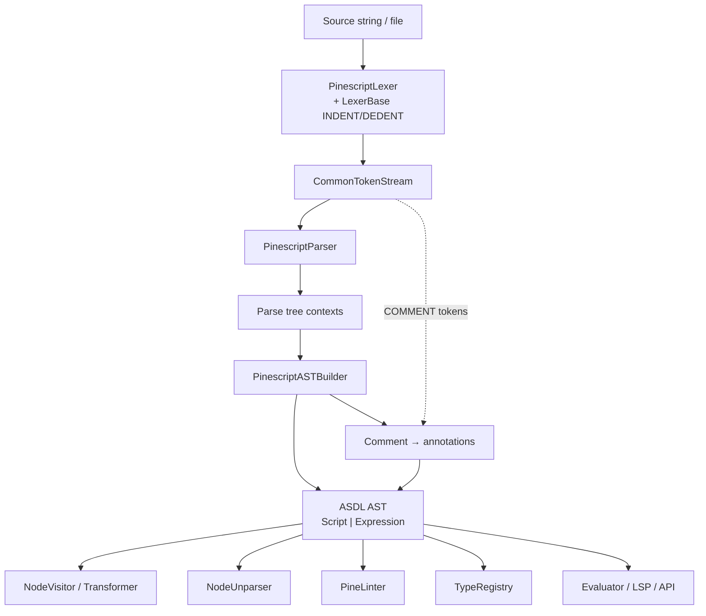

# Copyright (C) 2024-2026 jango_blockchained
#
# This file is part of pynescript.
#
# pynescript is free software: you can redistribute it and/or modify
# it under the terms of the GNU Affero General Public License as published by
# the Free Software Foundation, either version 3 of the License, or
# (at your option) any later version.
#
# pynescript is distributed in the hope that it will be useful,
# but WITHOUT ANY WARRANTY; without even the implied warranty of
# MERCHANTABILITY or FITNESS FOR A PARTICULAR PURPOSE.  See the
# GNU Affero General Public License for more details.
#
# You should have received a copy of the GNU Affero General Public License
# along with pynescript.  If not, see <https://www.gnu.org/licenses/>.
#
# SPDX-License-Identifier: AGPL-3.0-or-later

---
title: "Language Core"
description: "ANTLR4 grammar, ASDL AST, builder, visitors, unparser, type system, linter, and error model for PYNE."
---

# Language Core

The language core is the front half of the evaluate contract: source text becomes a typed tree; the tree can be walked, rewritten, dumped, and unparsed without ever entering the bar loop.

## Abstract

PYNE treats Pine Script as a **formal pipeline**, not a host plugin. Lexing and parsing are ANTLR4-driven. The concrete syntax tree is lowered by a hand-written visitor (`PinescriptASTBuilder`) into ASDL-generated dataclasses. Public helpers in `helper.py` mirror Python’s `ast` module: `parse`, `unparse`, `dump`, `walk`, `literal_eval`. Static tools (linter, type registry, LSP) consume the same tree. Evaluation is out of scope here — see [Runtime](/pyne/docs/runtime).

**Hard rule:** edit grammar only under `resource/`. Paths under `generated/` are regenerated artifacts and must not be hand-edited.

## Conceptual model



| Stage | Role | Primary path |
| --- | --- | --- |
| Grammar | Concrete syntax | `src/pynescript/ast/grammar/antlr4/resource/*.g4` |
| ASDL | Algebraic node shape | `src/pynescript/ast/grammar/asdl/resource/Pinescript.asdl` |
| Builder | CST → AST | `src/pynescript/ast/builder.py` |
| Helper | Public parse/unparse API | `src/pynescript/ast/helper.py` |
| Nodes | Re-export generated types | `src/pynescript/ast/node.py` |

## Interface surface

Consumers almost always enter through `pynescript.ast.helper`:

```python
from pynescript.ast.helper import parse, unparse, dump, walk, literal_eval

tree = parse('//@version=5\nindicator("x")\nplot(close)')
print(dump(tree, indent=2))
print(unparse(tree))
```

Modes:

| `mode` | Entry rule | Root node |
| --- | --- | --- |
| `"exec"` (default) | `start_script` | `Script` |
| `"eval"` | `start_expression` | `Expression` |

Full page inventory:

| Page | Topic |
| --- | --- |
| [Grammar (ANTLR4)](/pyne/docs/core/grammar-antlr4) | Resource vs generated; regen; v6 triple strings |
| [ASDL schema](/pyne/docs/core/asdl-schema) | Algebraic AST; codegen |
| [Builder](/pyne/docs/core/builder) | CST visitor → ASDL nodes |
| [Helper API](/pyne/docs/core/helper-api) | `parse`, `dump`, `walk`, locations |
| [Unparser](/pyne/docs/core/unparser) | Precedence-aware source regen |
| [Visitor / transformer](/pyne/docs/core/visitor-transformer) | Read vs rewrite |
| [Type system](/pyne/docs/core/type-system) | Qualifiers, UDT registry |
| [Linter](/pyne/docs/core/linter) | Static rules, codes |
| [Error model](/pyne/docs/core/error-model) | `SyntaxError`, indent, listener |

## Internals

```
src/pynescript/ast/
  helper.py              # public pipeline orchestration
  builder.py             # PinescriptASTBuilder
  unparser.py            # NodeUnparser + Precedence
  visitor.py             # NodeVisitor
  transformer.py         # NodeTransformer
  collector.py           # StatementCollector (annotation pairing)
  linter.py              # PineLinter
  type_system.py         # Type*, TypeRegistry, MethodResolver
  error.py               # SyntaxError / IndentationError
  node.py                # from grammar.asdl.generated import *
  grammar/
    antlr4/
      resource/          # EDIT HERE: .g4 + *Base.py
      generated/         # NEVER HAND-EDIT
      error_listener.py
      tool/generate.py
    asdl/
      resource/          # EDIT HERE: Pinescript.asdl
      generated/         # NEVER HAND-EDIT
      tool/generate.py
```

Thin wrappers `grammar/antlr4/lexer.py`, `parser.py`, `visitor.py` re-export generated classes so application code imports stable paths.

## Invariants

1. **Resource is source of truth.** Lexer/parser `.g4` and `Pinescript.asdl` define syntax and node shape; generated Python is a build product (committed so install does not require Java).
2. **Round-trip is a test oracle.** For the supported surface, `unparse(parse(src))` should re-parse and preserve semantics (not byte-identical formatting).
3. **Locations are first-class.** Statements and expressions carry `lineno`, `col_offset`, optional `end_*` for diagnostics and LSP.
4. **Annotations are not free-floating.** Comment tokens on `COMMENT_CHANNEL` are reified as `Comment` nodes and attached to `Script` / `FunctionDef` / `TypeDef` / `Assign` via kind suffixes (`S`, `F`, `T`, `V`).
5. **Recursion budget.** Deep ternary chains raise the Python recursion limit temporarily during parse (cap ≥ 5000).

## Worked examples

Minimal script:

```python
from pynescript.ast.helper import parse, dump

src = """
//@version=5
indicator("demo")
x = ta.sma(close, 14)
plot(x)
"""
tree = parse(src)
assert tree.__class__.__name__ == "Script"
assert any("version" in a for a in (tree.annotations or []))
print(dump(tree, include_attributes=True, indent=2))
```

Expression-only eval mode:

```python
from pynescript.ast.helper import parse, literal_eval

expr = parse("1 + 2 * 3", mode="eval")
assert literal_eval(expr) == 7
```

## Failure modes

| Symptom | Likely cause | Where to look |
| --- | --- | --- |
| `SyntaxError` with caret | Lexer/parser reject | [Error model](/pyne/docs/core/error-model) |
| `IndentationError` | Bad INDENT/DEDENT from LexerBase | `PinescriptLexerBase.py` |
| Missing `visit_*` after grammar change | Builder not updated for new rule | [Builder](/pyne/docs/core/builder) |
| Hand-edit of `generated/` lost on regen | Violated resource-only rule | [Grammar](/pyne/docs/core/grammar-antlr4) |
| Full regen breaks `builder.py` | Parser context accessors changed | Prefer targeted lexer refresh (v6 case study) |

## See also

- [Grammar (ANTLR4)](/pyne/docs/core/grammar-antlr4)
- [Helper API](/pyne/docs/core/helper-api)
- [Runtime](/pyne/docs/runtime)
- [LSP](/pyne/docs/lsp)
- [Compatibility](/pyne/docs/reference/compatibility)
