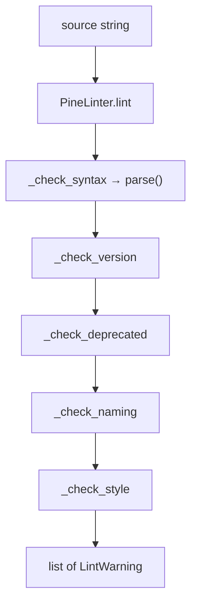

# Linter

The core linter is a lightweight static checker that sits on the parse pipeline plus regex rules. It is not a full dataflow analyzer; it is the first automated gate for “does this even look like modern Pine?”

## Abstract

`src/pynescript/ast/linter.py` exports:

- `LintWarning` — dataclass (`code`, `message`, `line`, `column`, `severity`)
- `PineLinter` — stateful runner accumulating warnings
- `lint_script(source, filename)` / `lint_file(filepath)` — convenience entry points

Rules run in fixed order: **syntax → version → deprecated patterns → naming → style**. Syntax failures become severity `"error"` with code `E001`; other rules are mostly `"warning"`.

## Conceptual model



## Interface surface

```python
from pynescript.ast.linter import lint_script, PineLinter, LintWarning

warnings = lint_script("""
indicator("x")
plot(close)
""")
for w in warnings:
    print(w)  # warning: [W001] Missing @version ... at line 1
```

### `LintWarning`

| Field | Type | Meaning |
| --- | --- | --- |
| `code` | `str` | Stable id (`E001`, `W001`, `C002`, …) |
| `message` | `str` | Human-readable explanation |
| `line` | `int \| None` | 1-based when known |
| `column` | `int \| None` | Reserved / optional |
| `severity` | `str` | `"warning"` (default) or `"error"` |

`__str__` format: `{severity}: [{code}] {message} at {location}`.

### `PineLinter.lint(source, filename="<input>") -> list[LintWarning]`

Resets `self.warnings`, runs all checks, returns the list (also stored on the instance).

### File helper

```python
from pynescript.ast.linter import lint_file

issues = lint_file("strategies/mean_reversion.pine")
```

Reads UTF-8 text then delegates to `lint_script`.

## Rule catalog

### Syntax

| Code | Severity | Condition |
| --- | --- | --- |
| `E001` | error | `parse(source, filename)` raises any exception; message includes exception text |

Does not attempt recovery; one syntax error check per run.

### Version

| Code | Condition |
| --- | --- |
| `W001` | No `//@version = N` (flexible whitespace) match |
| `W002` | Version integer `< 5` (deprecated; suggest v5/v6) |

Pattern: `//\s*@version\s*=\s*(\d+)`.

### Deprecated patterns (`_check_deprecated`)

| Code | Pattern (simplified) | Advice |
| --- | --- | --- |
| `W101` | `security('EXCHANGE:SYM'…)` style | Prefer `request.security()` with explicit params |
| `W102` | `plot(… style=plot.style_histogram` | Consider `plotcandle` |
| `W103` | `var int name = na` | Prefer `0` for type safety |

Matches set `line` from prefix newline count. Case-insensitive search.

### Naming (`_check_naming`)

| Code | Condition |
| --- | --- |
| `C001` | LHS of `name = ta.…` starts with lowercase — message suggests camelCase via `_to_camel` |

Heuristic only: line-local regex `(\w+)\s*=\s*ta\.`.

### Style (`_check_style`)

| Code | Condition |
| --- | --- |
| `C002` | Line length (rstrip) > 120 |
| `C003` | Line matches `^\s+if\s+` — flagged as “single-line if without braces” heuristic |
| `C004` | File does not end with newline |

## Internals

### Path

`src/pynescript/ast/linter.py`

Dependencies:

- `pynescript.ast.parse` (re-exported path via `from pynescript.ast import parse`)
- Standard library `re`, `dataclasses`

### Design stance

The linter intentionally uses **regex over AST** for several rules so it still partially works when parse fails (version/deprecations/style still run after a failed syntax check — note: `_check_syntax` records `E001` but does not abort the pipeline). That means:

- False positives/negatives on fancy formatting are possible.
- Deep semantic issues (wrong series type, undefined names) belong to evaluator/LSP diagnostics, not these codes.

### Integration points

CLI, editor save hooks, and CI can call `lint_script` without spinning up the full evaluator. LSP diagnostics may layer additional semantic checks beyond this module.

## Invariants

1. **`lint()` always clears prior warnings** on that instance before running.
2. **Codes are stable public strings** — treat renames as breaking for tooling.
3. **Syntax errors are not fatal to the function** — you get `E001` plus any later regex hits.
4. **No mutation of source** — pure analysis.

## Worked examples

### Clean modern script

```python
from pynescript.ast.linter import lint_script

src = """//@version=5
indicator("ok")
length = 14
basis = ta.sma(close, length)
plot(basis)
"""
assert lint_script(src) == []  # may still flag C001 if naming heuristic fires
```

Note: `basis = ta.sma(...)` triggers `C001` under the current rule (lowercase LHS). Prefer documenting that heuristic when teaching style.

### Missing version

```python
ws = lint_script('indicator("x")\nplot(close)\n')
assert any(w.code == "W001" for w in ws)
```

### Programmatic filter

```python
errors = [w for w in lint_script(src) if w.severity == "error"]
if errors:
    raise SystemExit(1)
```

## Failure modes

| Issue | Explanation |
| --- | --- |
| `C003` on legitimate indented `if` blocks | Regex is coarse; multi-line `if` with body still matches `^\s+if\s+` |
| `C001` noise | Many valid snake_case or lower identifiers |
| `E001` opaque message | Exception string from parse; see [Error model](/pyne/docs/core/error-model) for caret formatting when catching `SyntaxError` directly |
| Encoding errors in `lint_file` | Non-UTF-8 files raise at read time |
| False security deprecation | Pattern looks for quoted `EXCHANGE:SYM` form only |

## See also

- [Helper API](/pyne/docs/core/helper-api) — underlying `parse`
- [Error model](/pyne/docs/core/error-model)
- [LSP diagnostics](/pyne/docs/lsp/features/diagnostics)
- [End-user troubleshooting](/pyne/docs/enduser/guides/troubleshooting)
