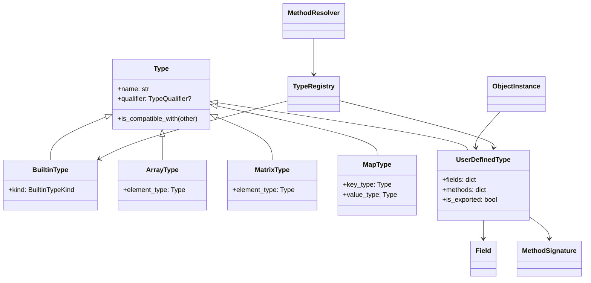

# Type System

PYNE’s type layer models Pine’s *qualified* types and user-defined types (UDTs) as Python objects usable by analysis and evaluation — not as a full independent typechecker IR (yet), but as the shared vocabulary for “what kind of value is this?”

## Abstract

`src/pynescript/ast/type_system.py` defines:

- **Qualifiers** — `const`, `simple`, `series`, `input` (`TypeQualifier`)
- **Builtin kinds** — `int`, `float`, `bool`, `string`, `color`, `na`, `enum`
- **Composite types** — `array<T>`, `matrix<T>`, `map<K,V>`
- **UDTs** — `UserDefinedType` with `Field`s and `MethodSignature`s
- **Runtime instances** — `ObjectInstance` for UDT values
- **Registry / resolution** — `TypeRegistry`, `MethodResolver` (`.new`, `.copy`, user methods)

ASDL already has `Qualify` / `Specialize` expression forms and `type_qual` constructors; the type system module is the **semantic** counterpart used when evaluating UDT construction and when tools reason about types.

## Conceptual model



## Interface surface

### Qualifiers

```python
from pynescript.ast.type_system import TypeQualifier

TypeQualifier.CONST   # compile-time constant
TypeQualifier.SIMPLE  # bar-invariant
TypeQualifier.SERIES  # per-bar series
TypeQualifier.INPUT   # input.* style parameter
```

`Type.__str__` renders `"series float"` when a qualifier is set.

### Builtins and factories

```python
from pynescript.ast.type_system import (
    BuiltinTypeKind,
    int_type,
    float_type,
    bool_type,
    string_type,
    color_type,
    TypeQualifier,
)

t = float_type(TypeQualifier.SERIES)  # "series float"
```

| Factory | Kind |
| --- | --- |
| `int_type` | `INT` |
| `float_type` | `FLOAT` |
| `bool_type` | `BOOL` |
| `string_type` | `STRING` |
| `color_type` | `COLOR` |

### Collections

```python
from pynescript.ast.type_system import ArrayType, MatrixType, MapType, int_type, string_type

ArrayType(int_type())                 # array<int>
MatrixType(float_type())              # matrix<float>
MapType(string_type(), int_type())    # map<string, int>
```

### UDTs

```python
from pynescript.ast.type_system import UserDefinedType, Field, MethodSignature, float_type, int_type

point = UserDefinedType("point")
point.add_field(Field("x", float_type(), default_value=0.0))
point.add_field(Field("y", float_type(), default_value=0.0, varip=False))
point.add_method(MethodSignature("length", [], return_type=float_type()))
```

`Field` supports optional `default_value` and `varip` (mirrors `varip` fields in type declarations).

### `TypeRegistry`

```python
from pynescript.ast.type_system import TypeRegistry

reg = TypeRegistry()
reg.register_type(point)
assert reg.is_builtin_type("float")
assert reg.is_user_defined_type("point")
assert reg.get_type("float") is not None
```

Builtins are seeded in `_init_builtin_types` (`int`, `float`, `bool`, `string`, `color`, `na`, `enum`).

### `ObjectInstance` + `MethodResolver`

```python
from pynescript.ast.type_system import ObjectInstance, MethodResolver

inst = ObjectInstance(point)
inst.set_field("x", 1.5)
resolver = MethodResolver(reg)
# .new / .copy handled specially
copy = resolver.resolve_method(inst, "copy", [])
```

| Method name | Behavior |
| --- | --- |
| `new` | Construct instance; positional args fill fields in declaration order |
| `copy` | Shallow copy of field dict |
| other | Lookup `UserDefinedType.methods`; missing → `AttributeError` |

Unknown field get/set on `ObjectInstance` raises `AttributeError` with type name context.

### Relation to ASDL `type_qual`

| ASDL | `TypeQualifier` |
| --- | --- |
| `Const` | `CONST` |
| `Input` | `INPUT` |
| `Simple` | `SIMPLE` |
| `Series` | `SERIES` |

Builder produces `Qualify(qualifier=…, value=…)` for annotated types in the AST; the type system module is used when those need runtime/type-registry meaning (especially UDTs in builtins/evaluator).

## Internals

### Path

`src/pynescript/ast/type_system.py` — sole definition site for the classes above.

Consumers (outside this doc’s page set, for orientation):

- Evaluator UDT / collection code (`evaluator/builtins/`, `matrix_evaluator`, etc.)
- Future/static analysis hooks (LSP hover may grow toward this model)

### Compatibility

`Type.is_compatible_with` is currently shallow: `BuiltinType` compares by equality; the base method returns `False` for other pairs. Treat richer subtyping (series/simple lattice, numeric promotion) as **not fully encoded** here — bar-loop semantics still own much of the coercion behavior.

### `na` and `enum`

Registered as builtin kinds for name lookup. Enum *definitions* in scripts appear as AST `EnumDef`; linking enum members into `BuiltinTypeKind.ENUM` instances is evaluator-side work.

## Invariants

1. **Registry lookup prefers builtins** over UDTs of the same name.
2. **Field presence is schema-true.** Setting an undeclared field is an error (no open bags).
3. **`.new` does not type-check arguments** against field types in the resolver — it assigns positionally.
4. **`varip` is metadata on `Field`**, not a separate type qualifier enum member.

## Worked examples

### Model a simple UDT from Pine

```pine
type candle
    float o
    float h
    float l
    float c
```

```python
from pynescript.ast.type_system import UserDefinedType, Field, float_type, TypeRegistry, MethodResolver, ObjectInstance

candle = UserDefinedType("candle")
for name in "o h l c".split():
    candle.add_field(Field(name, float_type()))
reg = TypeRegistry()
reg.register_type(candle)
c = MethodResolver(reg).resolve_method(ObjectInstance(candle), "new", [1, 2, 0.5, 1.5])
assert c.get_field("h") == 2
```

### Qualified series float

```python
from pynescript.ast.type_system import float_type, TypeQualifier
assert str(float_type(TypeQualifier.SERIES)) == "series float"
```

## Failure modes

| Failure | Cause |
| --- | --- |
| `AttributeError: Field '…' not found` | Typo or outdated UDT schema |
| `AttributeError: Method '…' not found` | Method never `add_method`’d; not `new`/`copy` |
| Silent type confusion | `is_compatible_with` too weak — do not rely on it alone for safety |
| Name shadowing | UDT registered with a builtin name is unreachable via `get_type` |

## See also

- [ASDL schema](/pyne/docs/core/asdl-schema) — `Qualify`, `TypeDef`, `EnumDef`
- [Runtime](/pyne/docs/runtime) — bar-loop use of values
- [Builder](/pyne/docs/core/builder) — parsing type declarations
- [Linter](/pyne/docs/core/linter) — style-level checks (not full typing)
