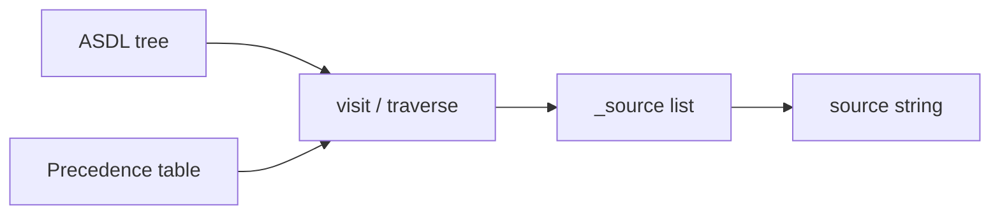

# Copyright (C) 2024-2026 jango_blockchained
#
# This file is part of pynescript.
#
# pynescript is free software: you can redistribute it and/or modify
# it under the terms of the GNU Affero General Public License as published by
# the Free Software Foundation, either version 3 of the License, or
# (at your option) any later version.
#
# pynescript is distributed in the hope that it will be useful,
# but WITHOUT ANY WARRANTY; without even the implied warranty of
# MERCHANTABILITY or FITNESS FOR A PARTICULAR PURPOSE.  See the
# GNU Affero General Public License for more details.
#
# You should have received a copy of the GNU Affero General Public License
# along with pynescript.  If not, see <https://www.gnu.org/licenses/>.
#
# SPDX-License-Identifier: AGPL-3.0-or-later

---
title: "Unparser"
description: "NodeUnparser: precedence-aware AST → Pine Script source regeneration."
---

# Unparser

The unparser is the inverse of the builder: ASDL nodes become source text with correct operator parenthesization and Pine idioms (`=>`, `:=`, `var`/`varip`, `export`, method vs function).

## Abstract

`src/pynescript/ast/unparser.py` implements `NodeUnparser(NodeVisitor)` and a `Precedence` enum. `helper.unparse(node)` calls `unparse_node`, which reuses a **thread-local** `NodeUnparser` (warm type-visitor cache; `visit` still resets the buffer each call). Output is **semantically faithful**, not a pretty-printer of original trivia: whitespace is normalized; comments that never became annotations are not reconstructed; annotation strings that *were* attached are re-emitted.

Round-trip tests (`parse → unparse → parse`) are the primary oracle for grammar/builder/unparser coherence.

## Conceptual model



Parenthesization: higher `Precedence` values bind **tighter** (`TEST` loosest, `ATOM` tightest). A node is wrapped in `()` when the precedence **stored on it** (the parent context) is **strictly greater** than the node’s own operator level. Equal levels do not wrap (left-associative chains).

## Interface surface

```python
from pynescript.ast.helper import parse, unparse

src = """
//@version=6
f(x) => x * 2
plot(f(close))
"""
print(unparse(parse(src)))
```

### `Precedence` (low → high binding)

Matches `IntEnum` order in `unparser.py`:

| Level | Operators / forms |
| --- | --- |
| `TEST` | ternary `? :` (weakest) |
| `OR` | `or` |
| `AND` | `and` |
| `BITOR` | `\|` |
| `BITXOR` | `^` |
| `BITAND` | `&` |
| `EQ` | `==` `!=` |
| `INEQ` / `CMP` | `<` `>` `<=` `>=` |
| `SHIFT` | `<<` `>>` |
| `EXPR` | reserved slot (unused by current op tables) |
| `ARITH` | `+` `-` |
| `TERM` | `*` `/` `%` |
| `FACTOR` / `NOT` | unary `+` `-` `not` `~` |
| `ATOM` | names, literals, calls, subscripts |

`Precedence.next()` steps one level tighter for right-hand associativity control. Bitwise tokens are emitted from `visit_BinOp` / `visit_UnaryOp` maps (`BitAnd`/`BitOr`/`BitXor`/`LShift`/`RShift`/`Invert`), not standalone `visit_BitAnd` methods.

### Buffer helpers (internal but useful when subclassing)

| Method | Role |
| --- | --- |
| `write(*text)` | Append fragments |
| `fill(text="")` | Newline + indent + text |
| `block()` | Indent context manager |
| `delimit(start, end)` | Wrap sub-output |
| `require_parens(prec, node)` | Conditional parentheses |
| `items_view` / `interleave` | Comma-separated lists |
| `buffered()` | Capture substring generation |

### Node coverage (high level)

| Node | Emission sketch |
| --- | --- |
| `Script` | annotations then body |
| `FunctionDef` | optional `export`/`method`, optional `returns` type spec, `name(args) => body` (inline single `Expr` or indented block) |
| `TypeDef` | `type Name` with fields then methods |
| `EnumDef` | `enum Name` body |
| `Assign` | annotations, `export?`, `var`/`varip?`, type?, target `= value` |
| `ReAssign` | `target := value` |
| `AugAssign` | `target op= value` |
| `ForTo` / `ForIn` / `While` / `If` / `Switch` | Pine control syntax; `else if` chain collapse |
| `Import` | `import ns/name/version as alias?` |
| `BinOp` / `BoolOp` / `UnaryOp` / `Compare` / `Conditional` | precedence-aware, including bitwise `|` `^` `&` `<<` `>>` `~` |
| `Call` / `Attribute` / `Subscript` / `Name` / `Constant` / `Tuple` | primaries |

## Internals

### Path

- `src/pynescript/ast/unparser.py` — `Precedence`, `NodeUnparser`, `unparse_node`
- Entry: `helper.unparse` → `unparse_node` → thread-local `NodeUnparser.visit`

### Visit vs traverse

`visit` resets `_source`, `_precedences`, and `_indent`, then calls `traverse`. `traverse` accepts lists (statement bodies) or single nodes, then dispatches via `_type_visitor_cache` (type-object keys, not class-name strings). This split lets statement lists and expression trees share code without double-buffering.

`visit_FunctionDef` emits `returns` (when set) as a leading type spec: `export method int name(args) => …`.

### If / else if chains

`visit_If` detects `orelse == [Expr(If(...))]` and emits `else if` rather than nested `else` + `if` blocks — matching idiomatic Pine.

`visit_Once` emits `once` plus an optional test and an indented body.

### Type body ordering

`visit_TypeDef` partitions body into field statements vs `FunctionDef` with `method` set, emitting fields first then methods.

### Constants

String constants use JSON-style quoting helpers where needed; colors and numbers re-serialize from their Python values. Exact original quote style (single vs double) is not guaranteed.

## Invariants

1. **Precedence tables must stay aligned with the parser’s expression layers** (including bitwise `|` `^` `&` `<<` `>>` between `and` and comparisons). A mismatch causes either redundant parens (benign) or wrong binding after re-parse (severe).
2. **Annotations are part of the round-trip surface** when attached to Script/FunctionDef/TypeDef/Assign.
3. **Unparser does not type-check.** Ill-typed but well-shaped trees still print.
4. **Indent unit is four spaces** (`"    " * self._indent`).

## Worked examples

### Precedence

```python
from pynescript.ast.helper import parse, unparse

# Builder produces BinOp(Add, left=1, right=BinOp(Mult, 2, 3)) or inverse depending on parse
print(unparse(parse("1 + 2 * 3", mode="eval")))
# Expect something that re-parses to the same value: e.g. "1 + 2 * 3"
```

### Function forms

```python
# Single-expression body → f(x) => expr
# Multi-statement body → f(x) =>\n    stmt\n    stmt
# With return type → int f(x) => expr
# Method → method int f(self) => expr
```

### Reassignment vs declaration

```pine
// Assign with mode → var float x = 1.0
// ReAssign → x := 2.0
// AugAssign → x += 1
```

## Failure modes

| Symptom | Cause |
| --- | --- |
| Missing `visit_*` output | Falls through `generic_visit` which only walks children — may emit empty string for leaf-like unhandled nodes |
| Extra parentheses everywhere | Over-conservative precedence |
| Re-parse differs in binding | Under-parenthesized output |
| Lost comments | Only annotation strings are stored; plain `//` comments are dropped after parse |
| Method printed as function | `FunctionDef.method` flag not set by builder |

## See also

- [Helper API](/pyne/docs/core/helper-api)
- [Builder](/pyne/docs/core/builder)
- [ASDL schema](/pyne/docs/core/asdl-schema)
- [Visitor / transformer](/pyne/docs/core/visitor-transformer)
