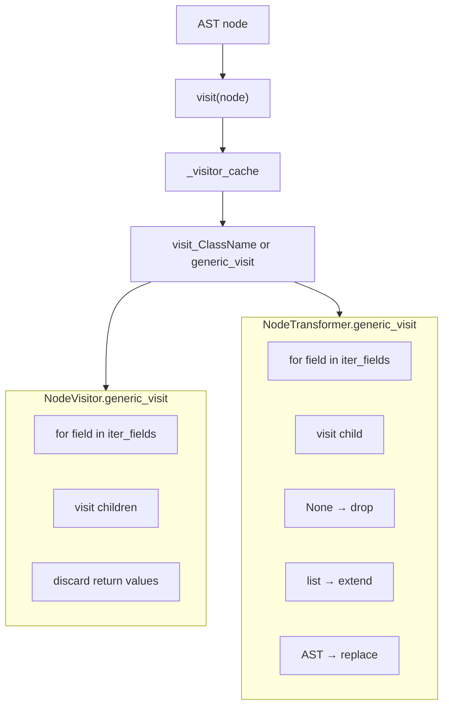

# Copyright (C) 2024-2026 jango_blockchained
#
# This file is part of pynescript.
#
# pynescript is free software: you can redistribute it and/or modify
# it under the terms of the GNU Affero General Public License as published by
# the Free Software Foundation, either version 3 of the License, or
# (at your option) any later version.
#
# pynescript is distributed in the hope that it will be useful,
# but WITHOUT ANY WARRANTY; without even the implied warranty of
# MERCHANTABILITY or FITNESS FOR A PARTICULAR PURPOSE.  See the
# GNU Affero General Public License for more details.
#
# You should have received a copy of the GNU Affero General Public License
# along with pynescript.  If not, see <https://www.gnu.org/licenses/>.
#
# SPDX-License-Identifier: AGPL-3.0-or-later

---
title: "Visitor & Transformer"
description: "NodeVisitor and NodeTransformer: read-only traversal vs in-place AST rewrite with caching dispatch."
---

# Visitor & Transformer

Tree walks in PYNE follow the same dual pattern as CPython’s `ast` module: a visitor for analysis, a transformer for structural rewrite.

## Abstract

- **`NodeVisitor`** (`src/pynescript/ast/visitor.py`) — dispatch `visit_<ClassName>`, default `generic_visit` walks children via `iter_fields`. Method lookups are cached per visitor instance.
- **`NodeTransformer`** (`src/pynescript/ast/transformer.py`) — same dispatch, but `generic_visit` **replaces** list items and fields according to return values (`None` removes, list splices, AST replaces).

Specialized visitors elsewhere:

| Class | Path | Role |
| --- | --- | --- |
| `PinescriptASTBuilder` | `builder.py` | CST visitor (ANTLR), not `NodeVisitor` |
| `NodeUnparser` | `unparser.py` | Source emission |
| `StatementCollector` | `collector.py` | Yield statements for annotations |
| Evaluator classes | `evaluator/*.py` | Runtime interpretation |

## Conceptual model



## Interface surface

### `NodeVisitor`

```python
from pynescript.ast.visitor import NodeVisitor
from pynescript.ast.helper import parse

class CallCounter(NodeVisitor):
    def __init__(self):
        super().__init__()
        self.count = 0

    def visit_Call(self, node):
        self.count += 1
        self.generic_visit(node)

tree = parse("plot(ta.sma(close, 14))")
c = CallCounter()
c.visit(tree)
assert c.count >= 2
```

| Method | Contract |
| --- | --- |
| `visit(node)` | Resolve `visit_<type(node).__name__>` with cache; fallback `generic_visit` |
| `generic_visit(node)` | Recurse into AST fields and lists of AST |

Returns are whatever the override returns (analysis often returns `None`).

### `NodeTransformer`

```python
from pynescript.ast import node as ast
from pynescript.ast.transformer import NodeTransformer
from pynescript.ast.helper import parse, unparse

class RenameClose(NodeTransformer):
    def visit_Name(self, node: ast.Name):
        if node.id == "close":
            return ast.Name(id="open", ctx=node.ctx)
        return node

tree = parse("plot(close)")
tree = RenameClose().visit(tree)
assert "open" in unparse(tree)
```

Return value semantics when transforming a **list parent** (e.g. `body`):

| Return | Effect |
| --- | --- |
| `None` | Remove this element |
| `AST` | Replace element |
| non-AST iterable | Splice multiple nodes in place of one |
| same node | Keep |

For a **single AST field**, `None` deletes the attribute (`delattr`); otherwise `setattr` replaces.

### `StatementCollector`

Generator-style visitor used only for annotation attachment:

- Yields `FunctionDef`, `TypeDef`, `EnumDef`, `Assign`, `ReAssign`, `AugAssign`, `Import`, `Expr`, `Break`, `Continue`.
- Descends into nested structures and into structure-valued assignments.
- Does **not** yield the structure nodes themselves as statements when they appear only as values — it yields their inner bodies.

```python
from pynescript.ast.collector import StatementCollector
from pynescript.ast.helper import parse

stmts = list(StatementCollector().visit(parse("f() => 1\nx = 2")))
```

## Internals

### Paths

| File | Symbols |
| --- | --- |
| `src/pynescript/ast/visitor.py` | `NodeVisitor` |
| `src/pynescript/ast/transformer.py` | `NodeTransformer` |
| `src/pynescript/ast/collector.py` | `StatementCollector`, `Structure` tuple |
| `src/pynescript/ast/helper.py` | `iter_fields`, `iter_child_nodes`, `walk` |

### Dispatch cache

```text
node_class = type(node).__name__
visitor = cache.get(node_class) or getattr(self, "visit_" + node_class, generic_visit)
```

Subclass instances that dynamically add methods after first visit of a type will not see them unless the cache is cleared — prefer defining methods on the class body.

### In-place lists

Transformers mutate list fields with `old_value[:] = new_values` rather than rebinding, so aliased references to the same list see updates.

## Invariants

1. **Always call `super().__init__()`** on subclasses so `_visitor_cache` exists.
2. **Transformers should return the node** from overrides that use `generic_visit` (the default returns `node` after rewriting children).
3. **Do not assume identity stability** after a transformer pass if you replaced roots.
4. **`walk` is not a visitor** — it is a pure BFS helper without dispatch.

## Worked examples

### Strip all `Expr` statements that call `plot`

```python
from pynescript.ast import node as ast
from pynescript.ast.transformer import NodeTransformer
from pynescript.ast.helper import parse, unparse

class DropPlots(NodeTransformer):
    def visit_Expr(self, node):
        if isinstance(node.value, ast.Call):
            func = node.value.func
            if isinstance(func, ast.Name) and func.id == "plot":
                return None
        return self.generic_visit(node)

tree = DropPlots().visit(parse("x = 1\nplot(x)\n"))
print(unparse(tree))
```

### Collect all string constants

```python
from pynescript.ast.visitor import NodeVisitor
from pynescript.ast.helper import parse

class Strings(NodeVisitor):
    def __init__(self):
        super().__init__()
        self.found = []

    def visit_Constant(self, node):
        if isinstance(node.value, str):
            self.found.append(node.value)

s = Strings()
s.visit(parse('indicator("hello")'))
```

## Failure modes

| Failure | Cause |
| --- | --- |
| `AttributeError: _visitor_cache` | Forgot `super().__init__()` |
| Transformer silently no-ops | Override returns nothing (`None`) unintentionally → node deleted |
| Infinite recursion | `visit_X` calls `self.visit(node)` on same node without change |
| Partial rewrite | Overrode `visit_*` without `generic_visit` — children untouched |
| Collector misses nested assign | Structure not in `Structure` tuple and not assigned as value |

## See also

- [Helper API](/pyne/docs/core/helper-api)
- [Unparser](/pyne/docs/core/unparser)
- [Builder](/pyne/docs/core/builder)
- [ASDL schema](/pyne/docs/core/asdl-schema)
