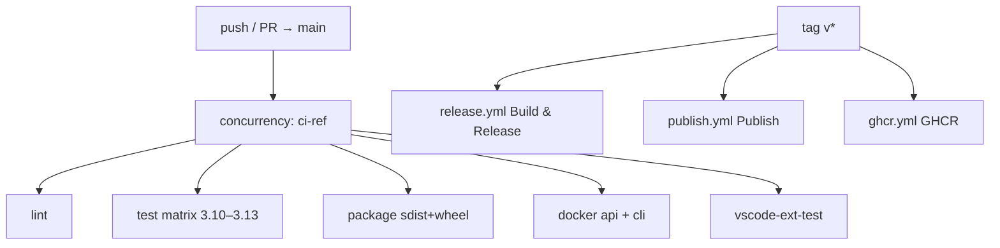

# Copyright (C) 2024-2026 jango_blockchained
#
# This file is part of pynescript.
#
# pynescript is free software: you can redistribute it and/or modify
# it under the terms of the GNU Affero General Public License as published by
# the Free Software Foundation, either version 3 of the License, or
# (at your option) any later version.
#
# pynescript is distributed in the hope that it will be useful,
# but WITHOUT ANY WARRANTY; without even the implied warranty of
# MERCHANTABILITY or FITNESS FOR A PARTICULAR PURPOSE.  See the
# GNU Affero General Public License for more details.
#
# You should have received a copy of the GNU Affero General Public License
# along with pynescript.  If not, see <https://www.gnu.org/licenses/>.
#
# SPDX-License-Identifier: AGPL-3.0-or-later

---
title: "Continuous integration"
description: "GitHub Actions for lint, Python 3.10–3.13 tests, package build, Docker api+cli smoke, and VS Code extension."
---

# Continuous integration

## Abstract

CI is the **public invariant check** for the **pyne** repo after AXIS extraction.
Workflows live under [`.github/workflows/`](https://github.com/hoox-sh/pyne/tree/main/.github/workflows).
AXIS PWA/e2e CI lives in the sister [axis](https://github.com/hoox-sh/axis) repo — **not** here.

| Workflow file | `name:` | Role |
| --- | --- | --- |
| `ci.yml` | **CI** | Lint, test matrix, package, Docker api+cli, VSIX |
| `release.yml` | **Build & Release** | Tag `v*` + dispatch: wheels, CLI/LSP Nuitka binaries, CLI image tarball, VSIX, GitHub Release |
| `publish.yml` | **Publish** | Tag `v*` + dispatch: PyPI `hoox-pyne` (token or OIDC) |
| `ghcr.yml` | **GHCR** | Tag `v*` + dispatch: `ghcr.io/hoox-sh/pyne/{api,cli,lsp}` multi-arch |
| `docs-versions.yml` | **Docs versions** | Daily: refresh PyPI / npm / Open VSX / GitHub release stamps. Commits only on change. No docs pageload. |

## Conceptual model



## Interface surface

### Triggers

| Workflow | On | Purpose |
| --- | --- | --- |
| `CI` | push/PR to `main` | Required confidence |
| `Build & Release` | tags `v*` + dispatch | Binaries + VSIX + GitHub Release |
| `Publish` | tags `v*` + dispatch (`dry_run` default true) | PyPI `hoox-pyne` |
| `GHCR` | tags `v*` + dispatch | Public images `api` / `cli` / `lsp` |

### `ci.yml` jobs (current)

| Job | Runtime | What it asserts |
| --- | --- | --- |
| **lint** | Python 3.13 | Ruff E/F/W gate on `src/` `tests/` (+ auth middleware); mypy non-blocking |
| **test** | Matrix 3.10–3.13 | `.[lsp,pro,compile]` + backend deps; core (`test_linter` / `test_evaluator` / `test_cli`); runtime (parity, strategy, series, incremental TA, package Runtime); LSP (`test_langserver` + `test_lsp_features`); backend; Codecov on 3.13 |
| **package** | 3.13 | `python -m build` + twine; wheel smoke (`pynescript --help`); artifact |
| **docker** | buildx | Build **api** + **cli** targets; API health + admin fail-closed; CLI `--help` / `info` / `check` (`--network=none`) |
| **vscode-ext-test** | Node 22 | `npm ci` → compile → `vsce package` → VSIX artifact |

Concurrency: `group: ci-${{ github.ref }}`, `cancel-in-progress: true`. Default permissions: `contents: read`.

### Not in this repo’s CI

- AXIS PWA / Playwright (axis repo — no `axis-nightly.yml` here)
- GHCR push (separate `ghcr.yml`, tag-triggered)
- Cloudflare Worker deploy
- Full `tests/` corpus parametrized suite (run locally: `make test`)

## Internals

| Path | Role |
| --- | --- |
| `.github/workflows/ci.yml` | PR/main fan-out (`name: CI`) |
| `.github/workflows/release.yml` | Multi-artifact tag release (`name: Build & Release`) |
| `.github/workflows/publish.yml` | PyPI (token preferred) (`name: Publish`) |
| `.github/workflows/ghcr.yml` | Multi-arch image push (`name: GHCR`) |
| `tests/test_cli.py` | CLI unit suite (CI-critical) |

### Secrets

| Secret | Used by | Notes |
| --- | --- | --- |
| `PYPI_API_TOKEN` | `publish.yml` | Personal PyPI account (`jango-blockchained`) |
| `METADATA_KEY` / `CRYPTO_KEY` | `release.yml` LSP encrypt | Fernet metadata |
| `VSCE_PAT` | optional Marketplace | VSIX still attaches without it |
| `GITHUB_TOKEN` | release upload | default |

## Invariants

1. **Fail-fast is off** on the Python matrix.
2. **Codecov only on 3.13**.
3. **CLI Docker image is non-root** — smoke mounts must be world-readable (`chmod` on mktemp).
4. **Corpus parametrized tests are intentionally skipped** in CI for time; local `make test` is broader.
5. **Package smoke** installs the wheel and runs `pynescript --help`.

## Worked examples

```bash
# Lint as CI (correctness gate)
ruff check src/ tests/ backend/middleware/auth.py --select E,F,W --ignore E501,E741,F841,W293,E402

# Core unit slice
pip install -e ".[lsp,pro,compile]"
python -m pytest tests/test_linter.py tests/test_evaluator.py tests/test_cli.py -q

# Docker CLI smoke
docker buildx bake cli
docker run --rm --network=none pynescript-cli:latest info
```

## Failure modes

| Symptom | Cause | Fix |
| --- | --- | --- |
| Docker CLI PermissionError on smoke.pine | mktemp 0700 + non-root user | CI chmods 755/644 (already fixed) |
| Wheel missing `pynescript` | wrong package name | install `hoox-pyne` / built wheel |
| Ruff F821 on main | incomplete imports | fix before push; gate is E,F,W |

## See also

- [Release](/pyne/docs/devops/release)
- [PyPI publish](/pyne/docs/devops/pypi-publish)
- [Docker](/pyne/docs/devops/docker)
