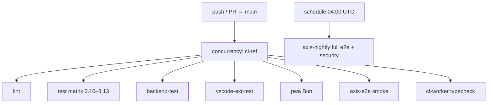

# Continuous integration

## Abstract

CI is the **public invariant check** for the monorepo-like layout. A single PR can touch the Python evaluator, the Flask API, the VS Code extension, the AXIS PWA, and a Cloudflare Worker typecheck — the workflow graph is deliberately fan-out with concurrency cancellation on newer pushes to the same ref.

Primary definition: [`.github/workflows/ci.yml`](https://github.com/jango-blockchained/pynescript/blob/main/.github/workflows/ci.yml). Nightly AXIS expansion lives in `axis-nightly.yml`. Release builds are separate (`release.yml`).

## Conceptual model



## Interface surface

### Triggers

| Workflow | On | Purpose |
| --- | --- | --- |
| `ci.yml` | push/PR to `main` | Required-path confidence |
| `axis-nightly.yml` | cron `0 4 * * *` + `workflow_dispatch` | Full Playwright + security + coverage gate |
| `release.yml` | tags `v*` + dispatch | LSP binaries + VSIX + GitHub Release |

### `ci.yml` jobs

| Job | Runtime | What it asserts |
| --- | --- | --- |
| **lint** | Python 3.13 | `ruff check src/ tests/`; `mypy src/ --ignore-missing-imports` |
| **test** | Matrix 3.10–3.13 | Editable `.[lsp]`; LSP unit/e2e tests; backend tests; Codecov upload on 3.13 only |
| **backend-test** | 3.13 | Explicit Flask/numpy/matplotlib install + `test_backend.py` |
| **vscode-ext-test** | Node 22 | `npm ci` → compile → `vsce package` → upload VSIX artifact (7-day) |
| **pwa** | Bun 1.3 | Root + worker install, dual `tsc`, frontend coverage gate + security tests; upload lcov |
| **axis-e2e** | Bun 1.3 | Playwright Chromium smoke (`test:e2e:smoke`) |
| **cf-worker** | Bun 1.3 | `frontend/worker` typecheck only |

Concurrency:

```yaml
concurrency:
  group: ci-${{ github.ref }}
  cancel-in-progress: true
```

### Nightly (`axis-nightly.yml`)

- Full e2e suite (`bun run test:e2e`) with report artifact on failure
- Coverage gate + security tests (stricter than PR smoke)

## Internals

| Path | Role |
| --- | --- |
| `.github/workflows/ci.yml` | PR/main fan-out |
| `.github/workflows/axis-nightly.yml` | Scheduled AXIS depth |
| `.github/workflows/release.yml` | Tag release (see [Release](/pyne/docs/devops/release)) |
| `frontend/scripts/check-coverage.mjs` | Coverage gate helper for AXIS |
| `codecov` action | Optional; `fail_ci_if_error: false` |

### Secrets referenced in CI surface

| Secret | Used by | Notes |
| --- | --- | --- |
| `VSCE_PAT` | VSIX package / publish | Extension packaging |
| `METADATA_KEY` | Release / Cloud Build encrypt | Stable Fernet key for metadata |
| `GITHUB_TOKEN` | Release upload | Default Actions token |

`{/* TODO: verify */}` — CI `test` job currently does not run the full `tests/` corpus on every matrix cell; it prioritizes LSP + backend. Local `make test` is broader.

## Invariants & edge cases

1. **Fail-fast is off** on the Python matrix — one version failure does not hide others.
2. **Codecov only on 3.13** to avoid noisy multi-upload; coverage XML path depends on pytest-cov configuration in the job.
3. **PWA install is resilient:** `bun install --frozen-lockfile || bun install` — lockfile drift should still be fixed, not papered forever.
4. **VSIX artifacts are not the Marketplace.** Packaging on every PR proves buildability; publish is release-gated.
5. **Worker typecheck ≠ deploy.** `cf-worker` job does not call `wrangler deploy`.

## Worked examples

### Reproduce lint locally as CI does

```bash
pip install ruff flake8 mypy types-python-dateutil antlr4-python3-runtime
ruff check src/ tests/ --output-format=github
mypy src/ --ignore-missing-imports
```

### Reproduce Python job slice

```bash
pip install -e ".[lsp]"
pip install pytest pytest-cov pytest-xdist pytest-asyncio
python -m pytest tests/test_langserver.py tests/test_lsp_features.py -v --tb=short
python -m pytest tests/test_backend.py -v --tb=short
```

### Reproduce PWA job

```bash
bun install --frozen-lockfile
cd frontend/worker && bun install --frozen-lockfile && bunx tsc --noEmit
cd ../.. && bunx tsc -p tsconfig.json
cd frontend && bun install && bun run test:coverage:gate && bun run test:security
```

## Failure modes

| Symptom | Likely cause | Fix |
| --- | --- | --- |
| Matrix red only on 3.10 | Version-specific typing / API | Guard with `sys.version_info` or drop unsupported API |
| Playwright smoke flake | Timing / missing deps | Install chromium with deps; re-run; check nightly for full suite |
| VSIX job fails on `vsce` | Node/engine mismatch | Pin Node 22 as workflow does |
| Coverage gate red | New untested AXIS paths | Add unit tests or adjust gate intentionally |
| Cancelled mid-run | Newer push to same branch | Expected concurrency behavior |

## See also

- [Release](/pyne/docs/devops/release)
- [Local development](/pyne/docs/devops/local-dev)
- [Observability](/pyne/docs/devops/observability)
- [Security](/pyne/docs/devops/security)
