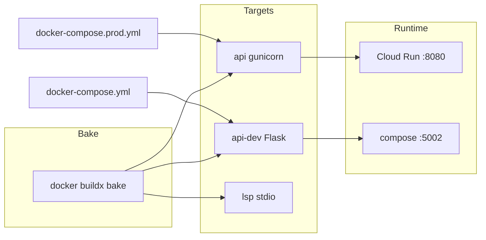

# Copyright (C) 2024-2026 jango_blockchained
#
# This file is part of pynescript.
#
# pynescript is free software: you can redistribute it and/or modify
# it under the terms of the GNU Affero General Public License as published by
# the Free Software Foundation, either version 3 of the License, or
# (at your option) any later version.
#
# pynescript is distributed in the hope that it will be useful,
# but WITHOUT ANY WARRANTY; without even the implied warranty of
# MERCHANTABILITY or FITNESS FOR A PARTICULAR PURPOSE.  See the
# GNU Affero General Public License for more details.
#
# You should have received a copy of the GNU Affero General Public License
# along with pynescript.  If not, see <https://www.gnu.org/licenses/>.
#
# SPDX-License-Identifier: AGPL-3.0-or-later

---
title: "Docker"
description: "Buildx multi-target images, Compose profiles, and Cloud Run production contract for the PYNE Pro API."
---

# Docker

## Abstract

Containers package the **Pro API** (Flask + evaluator) for reproducible local runs and Cloud Run deploys. A single multi-stage `Dockerfile` exposes named targets; **Docker Buildx Bake** (`docker-bake.hcl`) drives local loads and multi-platform release builds. Compose wires volume mounts and optional Redis/LSP profiles for desk development, with a production overlay for gunicorn.

## Conceptual model



## Interface surface

### Dockerfile targets

| Target | Process model | Audience |
| --- | --- | --- |
| `api` | `entrypoint-api.sh` → gunicorn (`0.0.0.0:$PORT`) | Production / Cloud Run / compose prod |
| `api-dev` | `python -m backend.app` with `HOST=0.0.0.0` | Local compose (source mounts) |
| `lsp` | `python -m pynescript.langserver` (stdio) | Compose profile `lsp` |

All targets: Python 3.12-slim, non-root `appuser` (uid 1000), `API_KEY_STORE=/data/api_keys.json`, `MPLBACKEND=Agg`, healthcheck via `curl` (HTTP targets).

### Buildx Bake (`docker-bake.hcl`)

```bash
# Local load (host platform)
docker buildx bake api                 # production image → pynescript-api:latest
docker buildx bake                     # default group: api + api-dev
docker buildx bake all                 # api + api-dev + lsp

# Multi-platform (amd64 + arm64). Set REGISTRY to push:
REGISTRY=gcr.io/$PROJECT/pynescript TAG=$COMMIT_SHA docker buildx bake release
```

Make wrappers:

```bash
make docker-build       # bake api
make docker-build-all   # bake all targets
make docker-buildx      # bake release (multi-platform)
```

One-time multi-platform builder (if needed):

```bash
docker buildx create --use --name pynescript
```

### Compose

```bash
cp .env.example .env   # optional overrides

make docker-up         # api-dev on host :5002
make docker-up-full    # + redis profile (api + redis)
make docker-prod       # requires ADMIN_TOKEN; gunicorn, no source mounts
make docker-smoke      # curl http://127.0.0.1:5002/
make docker-down

# stdio LSP (not a long-running compose service)
docker compose --profile lsp run --rm lsp
```

| Service | Profile | Notes |
| --- | --- | --- |
| `api` | default | Port `${API_PORT:-5002}:8080`, ro mounts of `src/` + `backend/`, volume `api_data` → `/data` |
| `redis` | `redis` | redis:7-alpine, AOF, `${REDIS_PORT:-6379}` |
| `lsp` | `lsp` | stdio; use `docker compose run --rm lsp` (not detached `up`) |

Network name: `pynescript-dev`.

Production overlay (`docker-compose.prod.yml`): target `api`, **`volumes: !override`** so only `api_data:/data` remains (dev source binds are dropped), SQLite key store on `/data`, mem/cpu caps, requires `ADMIN_TOKEN`.

### Environment variables

| Variable | Default | Meaning |
| --- | --- | --- |
| `PORT` | `8080` | Listen port inside the container |
| `HOST` | `0.0.0.0` | Bind address (dev Flask runner) |
| `API_PORT` | `5002` | Host port published to container `8080` |
| `FLASK_ENV` | `production` / `development` | App mode by target |
| `STORE_BACKEND` | `json` (prod overlay: `sqlite`) | `json` \| `sqlite` \| `redis` |
| `API_KEY_STORE` | `/data/api_keys.json` | JSON key store path (`STORE_BACKEND=json`) |
| `API_KEY_STORE_SQLITE` | `/data/api_keys.db` | SQLite path (`STORE_BACKEND=sqlite`) |
| `ALLOWED_ORIGINS` | see `.env.example` | CORS allow-list |
| `ADMIN_TOKEN` | unset | Required for `POST /auth/create_key` (`X-Admin-Token`) and prod compose |
| `REDIS_URL` | empty in prod; compose dev default `redis://redis:6379/0` | Required when `STORE_BACKEND=redis` |
| `GUNICORN_WORKERS` / `GUNICORN_THREADS` / `GUNICORN_TIMEOUT` | `2` / `4` / `60` | Prod entrypoint knobs |
| `GUNICORN_BIND` | `0.0.0.0:${PORT}` | Optional gunicorn bind override |

### Cloud Build image tags

From `cloudbuild.yaml` (builds **`--target api`**):

```
gcr.io/$PROJECT_ID/pynescript/pynescript-pro-api:$COMMIT_SHA
gcr.io/$PROJECT_ID/pynescript/pynescript-pro-api:latest
```

## Internals

### Build stages

1. **base** — slim image, `curl` + freetype/png for matplotlib Agg, `appuser`, `/data`
2. **builder** — `build-essential`, pip cache mounts, install `backend/requirements.txt` then `pip install ".[lsp]"` into `/install` (requires `pyproject.toml`, `README.md`, `LICENSE`, `NOTICE`, `src/`, `backend/`)
3. **runtime** — copy prefix + sources, `PYTHONPATH=/app/src:/app` so compose mounts override site-packages
4. **api / api-dev / lsp** — final CMDs and healthchecks

### `.dockerignore`

Keeps context small by excluding `tests/` (corpus), `docs/`, `brand/`, node modules, compiler `*.nbc`/`*.nbi` caches, venvs, and IDE cruft.

### Compose healthchecks

API: `curl -fsS http://127.0.0.1:8080/`. Redis: `redis-cli ping`.

## Invariants & edge cases

1. **Host port 5002 vs container 8080.** AXIS local docs assume API on 5002 via compose; Cloud Run uses 8080.
2. **Read-only mounts in compose** mean dependency changes need image rebuild; source edits are visible via `PYTHONPATH` precedence.
3. **Production target is immutable** — no live mounts; use the prod overlay or Cloud Run.
4. **Non-root `appuser`** cannot write arbitrary paths; keep `API_KEY_STORE` under `/data`.
5. **Cloud Build always builds `--target api`** (gunicorn). Do not point it at `api-dev`.
6. **LSP is stdio** — not an HTTP service; use `docker compose run --rm lsp` rather than expecting a published port.

## Worked examples

### Production-like local API (bake)

```bash
docker buildx bake api
docker run --rm -p 8080:8080 \
  -e FLASK_ENV=production \
  -e ALLOWED_ORIGINS=http://localhost:8081 \
  pynescript-api:latest
curl -s http://127.0.0.1:8080/ | jq .
```

### Compose with Redis

```bash
docker compose --profile redis up --build
```

### Optional LSP container

```bash
docker compose --profile lsp run --rm lsp
```

### Production overlay

```bash
export ADMIN_TOKEN=change-me
docker compose -f docker-compose.yml -f docker-compose.prod.yml up --build -d
```

## Failure modes

| Symptom | Cause | Fix |
| --- | --- | --- |
| Healthcheck fails | process not listening / curl missing | Use image targets from this Dockerfile; check `docker compose logs api` |
| Connection refused on host port | Flask bound to `127.0.0.1` | Dev target sets `HOST=0.0.0.0`; do not override to localhost |
| Permission denied writing keys | Running as `appuser` outside `/data` | Set `API_KEY_STORE=/data/...` and mount `api_data` |
| Import errors after mount | PYTHONPATH / stale site-packages | `PYTHONPATH=/app/src:/app`; rebuild after dependency changes |
| OOM under load | Small memory cap | Raise `API_MEM_LIMIT` / Cloud Run memory; reduce concurrency |
| CORS failures from PWA | Origin not allowed | Set `ALLOWED_ORIGINS` |
| Huge build context | Missing `.dockerignore` | Ensure `.dockerignore` is present (corpus/docs excluded) |

## See also

- [GCP](/pyne/docs/devops/gcp)
- [Security](/pyne/docs/devops/security)
- [Pro API lifecycle](/pyne/docs/api/app-lifecycle)
- [Local development](/pyne/docs/devops/local-dev)
