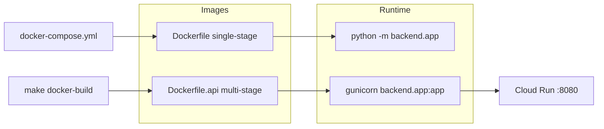

# Copyright (C) 2024-2026 jango_blockchained
#
# This file is part of pynescript.
#
# pynescript is free software: you can redistribute it and/or modify
# it under the terms of the GNU Affero General Public License as published by
# the Free Software Foundation, either version 3 of the License, or
# (at your option) any later version.
#
# pynescript is distributed in the hope that it will be useful,
# but WITHOUT ANY WARRANTY; without even the implied warranty of
# MERCHANTABILITY or FITNESS FOR A PARTICULAR PURPOSE.  See the
# GNU Affero General Public License for more details.
#
# You should have received a copy of the GNU Affero General Public License
# along with pynescript.  If not, see <https://www.gnu.org/licenses/>.
#
# SPDX-License-Identifier: AGPL-3.0-or-later

---
title: "Docker"
description: "Dev and production container images for the PYNE Pro API, compose profiles, and Cloud Run image contract."
---

# Docker

## Abstract

Containers package the **Pro API** (Flask + evaluator) for reproducible local runs and Cloud Run deploys. Two Dockerfiles express different trade-offs: a simple single-stage image for development, and a multi-stage production image with non-root user, gunicorn, and healthchecks.

Compose wires volume mounts and optional Redis/LSP profiles for desk development.

## Conceptual model



## Interface surface

### Dockerfiles

| File | Audience | Process model |
| --- | --- | --- |
| `Dockerfile` | Local / compose | `CMD ["python", "-m", "backend.app"]`, Python 3.12-slim, exposes 8080 |
| `Dockerfile.api` | Production / `make docker-build` | Multi-stage; `USER appuser`; gunicorn 2 workers × 4 threads; healthcheck `curl` |

### Make / compose

```bash
make docker-build   # docker build -f Dockerfile.api -t pynescript-api .
make docker-run     # docker compose up api --build
```

`docker-compose.yml` services:

| Service | Profile | Notes |
| --- | --- | --- |
| `api` | default | Port `5002:8080`, `FLASK_ENV=development`, ro mounts of `src/` + `backend/` |
| `redis` | `with-redis` | redis:7-alpine on 6379 |
| `lsp` | `with-lsp` | Same image, `python -m pynescript.langserver` |

Network name: `pynescript-dev`.

### Cloud Build image tags

From `cloudbuild.yaml`:

```
gcr.io/$PROJECT_ID/pynescript/pynescript-pro-api:$COMMIT_SHA
gcr.io/$PROJECT_ID/pynescript/pynescript-pro-api:latest
```

## Internals

### Production stages (`Dockerfile.api`)

1. **Builder:** install `build-essential`, `pip install --prefix=/install -r backend/requirements.txt`
2. **Runtime:** copy install prefix, copy `backend/` + `src/`, `pip install .`, drop privileges to `appuser`
3. **Env:** `PORT=8080`, `FLASK_ENV=production`
4. **Healthcheck:** HTTP GET `/` every 30s
5. **CMD:**

```text
gunicorn --bind :8080 --workers 2 --threads 4 --timeout 60 backend.app:app
```

### Dev image (`Dockerfile`)

Copies `backend/requirements.txt`, `pyproject.toml`, README/LICENSE, installs requirements, copies `src` + `backend`, `pip install .`, exposes 8080.

### Compose healthchecks

API: `curl -f http://localhost:8080/` (inside container). Redis: `redis-cli ping`.

## Invariants & edge cases

1. **Host port 5002 vs container 8080.** AXIS local docs assume API on 5002 when using compose; Cloud Run uses 8080.
2. **Read-only mounts in compose** mean image reinstall is required for dependency changes; source edits hot-reload only if the process reloads Python modules.
3. **Production image installs the package non-editable** — good for immutability, bad for live code mount (use compose + `Dockerfile` for that).
4. **Non-root `appuser`** cannot write arbitrary paths; configure `API_KEY_STORE` to a writable volume if using file-backed keys.
5. **Cloud Build currently builds context `.` with default Dockerfile** in `cloudbuild.yaml` — confirm which Dockerfile is intended for production deploys when changing images. `{/* TODO: verify */}` if Cloud Build should pin `-f Dockerfile.api`.

## Worked examples

### Production-like local API

```bash
docker build -f Dockerfile.api -t pynescript-api .
docker run --rm -p 8080:8080 \
  -e FLASK_ENV=production \
  -e ALLOWED_ORIGINS=http://localhost:8081 \
  pynescript-api
curl -s http://127.0.0.1:8080/ | jq .
```

### Compose with Redis

```bash
docker compose --profile with-redis up --build
```

### Optional LSP container

```bash
docker compose --profile with-lsp up lsp
```

## Failure modes

| Symptom | Cause | Fix |
| --- | --- | --- |
| Healthcheck fails | curl missing in image | Production Dockerfile installs curl; slim custom images may not |
| Permission denied writing keys | Running as `appuser` | Mount writable volume; set `API_KEY_STORE` |
| Import errors after mount | PYTHONPATH / non-editable install | Prefer compose dev Dockerfile + `pip install -e` patterns |
| OOM under load | Single small instance | Raise Cloud Run memory; reduce concurrency |
| CORS failures from PWA | Origin not allowed | Set `ALLOWED_ORIGINS` |

## See also

- [GCP](/pyne/docs/devops/gcp)
- [Security](/pyne/docs/devops/security)
- [Pro API lifecycle](/pyne/docs/api/app-lifecycle)
- [Local development](/pyne/docs/devops/local-dev)
