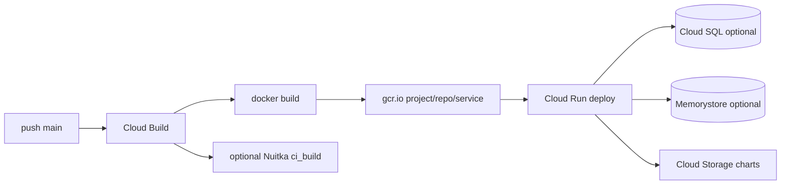

# GCP & Cloud Run

## Abstract

Production-shaped hosting for the Pro API targets **Google Cloud Run**, fed by **Cloud Build** (`cloudbuild.yaml`). The pipeline builds a container, pushes multi-tags to Container Registry, deploys a managed service, and can optionally compile the LSP binary in the same build graph.

This page codifies the as-checked-in config and the cost envelope from `docs/gcp_cost_estimate.md` — treat dollar figures as planning estimates, not invoices.

## Conceptual model



## Interface surface

### Substitutions (`cloudbuild.yaml`)

| Substitution | Default | Meaning |
| --- | --- | --- |
| `_SERVICE_NAME` | `pynescript-pro-api` | Cloud Run service |
| `_REGION` | `us-central1` | Deploy region |
| `_REPOSITORY` | `pynescript` | Image path segment |
| `_METADATA_KEY` | (secret/subst) | Fernet key → `CRYPTO_KEY` for LSP stage |

### Build steps

1. **build** — `docker build` with BuildKit; tags `$COMMIT_SHA` + `latest`; cache-from `latest`
2. **push** — `docker push --all-tags`
3. **deploy** — `gcloud run deploy` with managed platform flags
4. **build-lsp** — `python:3.12-slim` image runs `scripts/build/ci_build.py --jobs=4` with `CRYPTO_KEY=${_METADATA_KEY}`

### Cloud Run flags (as configured)

| Flag | Value | Rationale |
| --- | --- | --- |
| `--allow-unauthenticated` | on | Public HTTP API (auth via API keys at app layer) |
| `--min-instances` | 0 | Scale to zero |
| `--max-instances` | 10 | Cap spend / blast radius |
| `--memory` | 512Mi | Evaluator headroom |
| `--cpu` | 1 | Single vCPU per instance |
| `--concurrency` | 10 | Parallel requests per instance |
| `--timeout` | 60s | Aligns with gunicorn timeout |
| `--set-env-vars` | `FLASK_ENV=production` | App mode |

### Machine / budget knobs

```yaml
options:
  machineType: E2_HIGHCPU_8
  logging: CLOUD_LOGGING_ONLY
timeout: 1200s
```

## Internals

| Path | Role |
| --- | --- |
| `cloudbuild.yaml` | Pipeline definition |
| `Dockerfile` / `Dockerfile.api` | Image recipes (confirm which Cloud Build uses) |
| `backend/app.py` | Health `/`, CORS, body size limit |
| `docs/gcp_cost_estimate.md` | Scenario costs (April 2026 draft) |

### Cost envelope (planning)

| Scale | Rough monthly | Notes |
| --- | --- | --- |
| Free / hobby | ~$0 | Within Cloud Run free tier if tiny |
| MVP (~10 pro users) | ~$50 | Cloud Run + micro SQL |
| Growth (~50) | ~$120 | Add Redis caching |
| Scale (~200) | ~$350 | Dominated by evaluator CPU-sec |

Dominant cost driver: **script execution CPU time** (~2–5 CPU-sec per typical backtest over 1k bars). Memory ~200–400MB per concurrent Python worker.

### Free-tier leverage (GCP)

- Cloud Run: 2M requests, 400K CPU-sec, 200K GB-sec / month
- Cloud Build: 120 build-minutes / day
- Artifact Registry / GCS small free slices

## Invariants & edge cases

1. **App-layer auth still required** when Cloud Run allows unauthenticated invoke — see [Security](/pyne/docs/devops/security).
2. **Scale-to-zero cold starts** add latency; min-instances=1 trades money for snappiness.
3. **LSP build step does not deploy the binary** to Cloud Run; it is a release-adjacent compile in the same YAML.
4. **512Mi may be tight** for large OHLCV payloads — watch OOM kills; raise memory before raising concurrency.
5. **Cost estimate doc** also lists Railway / Render / Fly / self-host alternatives if GCP is overkill.

## Worked examples

### Manual deploy sketch (operator)

```bash
gcloud builds submit --config cloudbuild.yaml \
  --substitutions=_METADATA_KEY="$METADATA_KEY"
```

### Smoke health after deploy

```bash
curl -s "https://SERVICE-URL/" 
# expect JSON status healthy, service pynescript-pro-api
```

## Failure modes

| Symptom | Cause | Fix |
| --- | --- | --- |
| Deploy timeout | Nuitka step + docker on 20 min budget | Split LSP compile to release pipeline |
| 429 / queue | max-instances or concurrency | Raise caps carefully; add queue |
| High bill | No cache; chatty clients | Redis TTL; Cloud Tasks for backtests |
| Auth bypass illusion | Unauthenticated Cloud Run | Enforce API keys in Flask |
| Image pull errors | Wrong project / registry perms | IAM on GCR + Cloud Run service agent |

## See also

- [Docker](/pyne/docs/devops/docker)
- [Observability](/pyne/docs/devops/observability)
- [Security](/pyne/docs/devops/security)
- [Pro API](/pyne/docs/api)
