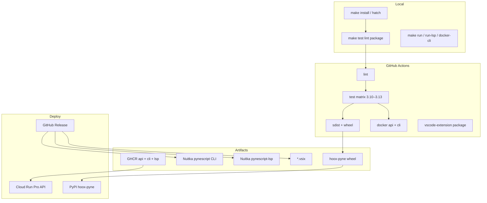

# Copyright (C) 2024-2026 jango_blockchained
#
# This file is part of pynescript.
#
# pynescript is free software: you can redistribute it and/or modify
# it under the terms of the GNU Affero General Public License as published by
# the Free Software Foundation, either version 3 of the License, or
# (at your option) any later version.
#
# pynescript is distributed in the hope that it will be useful,
# but WITHOUT ANY WARRANTY; without even the implied warranty of
# MERCHANTABILITY or FITNESS FOR A PARTICULAR PURPOSE.  See the
# GNU Affero General Public License for more details.
#
# You should have received a copy of the GNU Affero General Public License
# along with pynescript.  If not, see <https://www.gnu.org/licenses/>.
#
# SPDX-License-Identifier: AGPL-3.0-or-later

---
title: "DevOps"
description: "CI matrices, containers, Nuitka LSP binaries, metadata crypto, Cloud Run, and operational invariants for PYNE."
---

# DevOps

## Abstract

PYNE is a **multi-surface product**: pure-Python library + Click CLI (`pyne` / alias `pynescript`), pygls Language Server (`pyne-lsp`), Flask Pro API, VS Code extension (`hoox-sh.pyne` 0.3.14), and Docker targets (`api` / `cli` / `lsp`). Edge workers and the AXIS charting PWA are **sister repos** — not built in this tree.

This tab documents the **operational graph**: local loops, GitHub Actions, release tags, Docker images, Nuitka CLI/LSP binaries, Fernet-encrypted LSP metadata, GCP Cloud Build/Run, observability hooks, and security controls.

## Conceptual model



**Invariant:** CI green on `main` is necessary but not sufficient for a full release. Tag `v*` fires **Build & Release** (binaries + VSIX + GitHub Release), **Publish** (`hoox-pyne` 0.3.14 to PyPI), and **GHCR** (`ghcr.io/hoox-sh/pyne/{api,cli,lsp}`). Cloud Build deploys the API image separately.

## Interface surface

| Concern | Entry | Doc |
| --- | --- | --- |
| Local install & loops | `Makefile`, hatch envs | [Local development](/pyne/docs/devops/local-dev) |
| PR / push CI | `.github/workflows/ci.yml` (`name: CI`) | [CI](/pyne/docs/devops/ci) |
| Versioned CLI + LSP + VSIX | `.github/workflows/release.yml` (`name: Build & Release`) | [Release](/pyne/docs/devops/release) |
| PyPI (`hoox-pyne`) | `.github/workflows/publish.yml` (`name: Publish`) | [PyPI publish](/pyne/docs/devops/pypi-publish) |
| GHCR images | `.github/workflows/ghcr.yml` (`name: GHCR`) | [Docker](/pyne/docs/devops/docker) |
| First ship checklist | personal PyPI + API token | [Publish checklist](/pyne/docs/devops/publish-checklist) |
| Containers | `Dockerfile` targets api/api-dev/lsp/**cli** | [Docker](/pyne/docs/devops/docker) |
| Compiled CLI / LSP | `scripts/build/compile.py --target` | [Nuitka build](/pyne/docs/devops/nuitka-build) |
| Builtin metadata crypto | Fernet key + `.enc` | [Metadata crypto](/pyne/docs/devops/metadata-crypto) |
| Cloud Run | `cloudbuild.yaml` | [GCP](/pyne/docs/devops/gcp) |
| Logs / health | Flask `/`, gunicorn, Cloud Logging | [Observability](/pyne/docs/devops/observability) |
| Auth, CORS, secrets | `backend/middleware/auth.py` | [Security](/pyne/docs/devops/security) |

## Internals (repo map)

| Path | Role |
| --- | --- |
| `Makefile` | Human-facing orthography: install, test, lint, build, docker, worker |
| `pyproject.toml` | Hatch envs (`test`, `lint`, `docs`), optional extras (`lsp`, `data`) |
| `.github/workflows/` | `ci.yml`, `release.yml`, `publish.yml`, `ghcr.yml` |
| `scripts/build/` | Nuitka compile + CI build + Fernet metadata stage |
| `scripts/generate_builtin_metadata.py` | Regenerates LSP `builtin_metadata.json` from live builtins |
| `Dockerfile` / `docker-bake.hcl` | Multi-target Buildx images (api, api-dev, lsp) |
| `docker-compose.yml` | Local API (+ optional Redis / LSP profiles) |
| `cloudbuild.yaml` | Build → GCR push → Cloud Run deploy; optional LSP compile |
| `vscode-extension/` | Node 22 extension package / vsce |

## Invariants & edge cases

1. **Two console scripts, two entrypoints.** Preferred: `pyne` (Click) ≠ `pyne-lsp` (pygls). Aliases: `pynescript` / `pynescript-lsp`. Ops scripts must not conflate them.
2. **Generated artifacts are not hand-edited.** ANTLR/ASDL under `generated/` and `builtin_metadata.json` are code-derived.
3. **Fernet key is gitignored.** Without a stable `CRYPTO_KEY` / `METADATA_KEY` secret, every CI encrypt produces a different `.enc` blob (harmless functionally, bad for reproducibility).
4. **Python matrix vs Nuitka pin.** CI tests 3.10–3.13; Nuitka release currently pins **3.11** (`release.yml` `PYTHON_VERSION`, `nuitka>=2.5.1,<2.8`).
5. **AXIS CI is not in this repo.** Playwright / PWA security gates live in [hoox-sh/axis](https://github.com/hoox-sh/axis). There is no `axis-nightly.yml` here.

## Worked examples

```bash
# Fast local confidence loop
make install
make lint
make test-lsp
make build-check   # import check only, ~30s, no Nuitka compile

# API in Docker — local *dev* stack (api-dev + source mounts)
make docker-up
make docker-smoke

# Production image bake (load local) + optional prod compose overlay
make docker-build
# export ADMIN_TOKEN=… && make docker-prod
```

## Failure modes

| Symptom | Likely cause | Fix |
| --- | --- | --- |
| CI lint red, local green | Different ruff/mypy versions | Match CI install pins in workflow |
| Metadata decrypt fails in binary | Missing key at runtime | Set `PYNESCRIPT_METADATA_KEY` or embed key at build |
| Cloud Run 502 after deploy | Image missing deps / gunicorn bind | Confirm `Dockerfile` target `api` ENTRYPOINT + `PORT` / `GUNICORN_BIND` |
| VSIX empty / missing | `npm ci` / vsce not run | Use `make build-vscode` or release job artifacts |
| Nuitka Anaconda link error | Static libpython missing | `conda install libpython-static` or keep `--static-libpython=no` |

## See also

- [Contributing](/pyne/docs/contributing)
- [LSP architecture](/pyne/docs/lsp/architecture)
- [Pro API contract](/pyne/docs/api/contract)
- [pyne-worker](/pyne/docs/pyne-worker)
- [pyne-agent-worker](/pyne/docs/agent)
