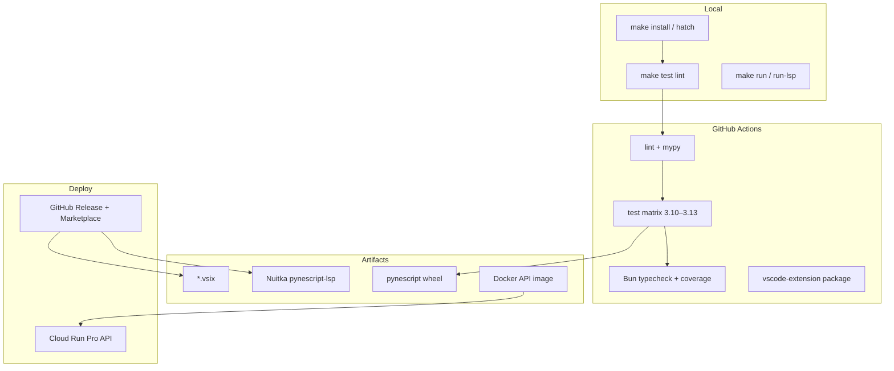

# DevOps

## Abstract

PYNE is not a single binary. It is a **multi-surface product**: a pure-Python library, a Click CLI, a pygls Language Server, a Flask Pro API, a VS Code extension, an AXIS PWA AXIS, and colocated edge workers. DevOps here means keeping those surfaces buildable, testable, and deployable without drifting from the same evaluate contract.

This tab documents the **operational graph**: local loops, GitHub Actions, release tags, Docker images, Nuitka compilation, Fernet-encrypted LSP metadata, GCP Cloud Build/Run, observability hooks, and security controls.

## Conceptual model



**Invariant:** CI green on `main` is necessary but not sufficient for a release. Tag-triggered release workflows build platform LSP binaries and VSIX; Cloud Build deploys the API image on its own pipeline.

## Interface surface

| Concern | Entry | Doc |
| --- | --- | --- |
| Local install & loops | `Makefile`, hatch envs | [Local development](/pyne/docs/devops/local-dev) |
| PR / push CI | `.github/workflows/ci.yml` | [CI](/pyne/docs/devops/ci) |
| Versioned LSP + VSIX | `.github/workflows/release.yml` | [Release](/pyne/docs/devops/release) |
| Pro API containers | `Dockerfile`, `Dockerfile.api`, `docker-compose.yml` | [Docker](/pyne/docs/devops/docker) |
| Compiled LSP | `scripts/build/compile.py`, `ci_build.py` | [Nuitka build](/pyne/docs/devops/nuitka-build) |
| Builtin metadata crypto | Fernet key + `.enc` | [Metadata crypto](/pyne/docs/devops/metadata-crypto) |
| Cloud Run | `cloudbuild.yaml` | [GCP](/pyne/docs/devops/gcp) |
| Logs / health | Flask `/`, gunicorn, Cloud Logging | [Observability](/pyne/docs/devops/observability) |
| Auth, CORS, secrets | `backend/middleware/auth.py` | [Security](/pyne/docs/devops/security) |

## Internals (repo map)

| Path | Role |
| --- | --- |
| `Makefile` | Human-facing orthography: install, test, lint, build, docker, worker |
| `pyproject.toml` | Hatch envs (`test`, `lint`, `docs`), optional extras (`lsp`, `data`) |
| `.github/workflows/` | `ci.yml`, `release.yml`, `axis-nightly.yml` |
| `scripts/build/` | Nuitka compile + CI build + Fernet metadata stage |
| `scripts/generate_builtin_metadata.py` | Regenerates LSP `builtin_metadata.json` from live builtins |
| `Dockerfile` / `Dockerfile.api` | Dev vs multi-stage production API images |
| `docker-compose.yml` | Local API (+ optional Redis / LSP profiles) |
| `cloudbuild.yaml` | Build → GCR push → Cloud Run deploy; optional LSP compile |
| `vscode-extension/` | Node 22 extension package / vsce |

## Invariants & edge cases

1. **Two console scripts, two entrypoints.** `pynescript` (Click) ≠ `pynescript-lsp` (pygls). Ops scripts must not conflate them.
2. **Generated artifacts are not hand-edited.** ANTLR/ASDL under `generated/` and `builtin_metadata.json` are code-derived.
3. **Fernet key is gitignored.** Without a stable `CRYPTO_KEY` / `METADATA_KEY` secret, every CI encrypt produces a different `.enc` blob (harmless functionally, bad for reproducibility).
4. **Python matrix vs local default.** CI tests 3.10–3.13; Nuitka release currently pins 3.12.
5. **AXIS nightly is not PR-blocking.** Full Playwright + security gates run on schedule (`axis-nightly.yml`).

## Worked examples

```bash
# Fast local confidence loop
make install
make lint
make test-lsp
make build-check   # import check only, ~30s, no Nuitka compile

# API in Docker (production Dockerfile)
make docker-build
make docker-run
```

## Failure modes

| Symptom | Likely cause | Fix |
| --- | --- | --- |
| CI lint red, local green | Different ruff/mypy versions | Match CI install pins in workflow |
| Metadata decrypt fails in binary | Missing key at runtime | Set `PYNESCRIPT_METADATA_KEY` or embed key at build |
| Cloud Run 502 after deploy | Image missing deps / gunicorn bind | Confirm `Dockerfile.api` CMD and `PORT=8080` |
| VSIX empty / missing | `npm ci` / vsce not run | Use `make build-vscode` or release job artifacts |
| Nuitka Anaconda link error | Static libpython missing | `conda install libpython-static` or keep `--static-libpython=no` |

## See also

- [Contributing](/pyne/docs/contributing)
- [LSP architecture](/pyne/docs/lsp/architecture)
- [Pro API contract](/pyne/docs/api/contract)
- [pine-worker](/pyne/docs/pine-worker)
