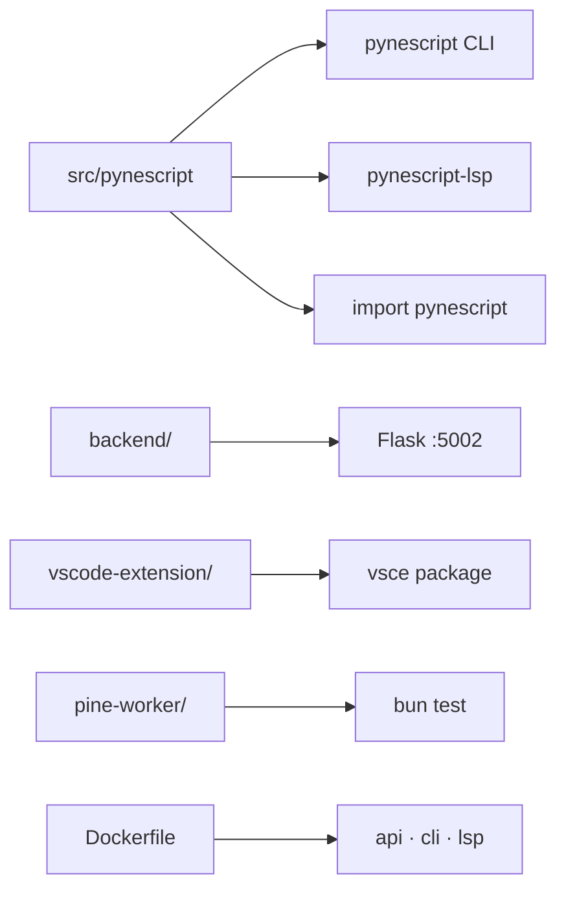

# Copyright (C) 2024-2026 jango_blockchained
#
# This file is part of pynescript.
#
# SPDX-License-Identifier: AGPL-3.0-or-later

---
title: "Local development"
description: "Install, test, lint, package, and run PYNE — Make targets after AXIS extraction."
---

# Local development

## Abstract

A PYNE checkout is a **Python-first workspace**: src-layout package + Flask Pro API,
optional VS Code extension (Node), and colocated `pine-worker` (Bun/TS). The AXIS
charting PWA is a **sister repo** ([axis](https://github.com/jango-blockchained/axis)) — do not recreate `frontend/` here.

## Conceptual model



## Interface surface

### Make targets (primary)

| Target | Effect |
| --- | --- |
| `make install` | `pip install -e ".[lsp,pro]"` |
| `make test` | full `pytest tests/` |
| `make test-cli` | `tests/test_cli.py` |
| `make test-lsp` | langserver + lsp_features |
| `make test-backend` | `tests/test_backend.py` |
| `make lint` / `make fmt` | Ruff on `src/`, `tests/`, `backend/` |
| `make package` | sdist + wheel (`python -m build`) |
| `make build` | Nuitka **LSP** binary |
| `make build-cli` | Nuitka **CLI** binary |
| `make build-check` | import check for lsp+cli (~30s) |
| `make build-vscode` | compile + package VSIX |
| `make run` | Flask Pro API (`:5002` typical) |
| `make run-lsp` | `python -m pynescript.langserver` |
| `make docker-build` | bake **api** |
| `make docker-build-cli` | bake **cli** |
| `make docker-build-all` | api + api-dev + lsp + cli |
| `make docker-buildx` | multi-platform release bake |
| `make docker-cli ARGS="…"` | compose profile cli (ephemeral) |
| `make docker-up` | compose API on `:5002` |
| `make docker-up-full` | + redis profile |
| `make docker-prod` | gunicorn overlay (`ADMIN_TOKEN` required) |
| `make docker-smoke` | curl health on `:5002` |
| `make docker-down` / `docker-logs` | stop / logs |

### Hatch

```bash
hatch run test:test
hatch run test:test-cov
hatch run lint:style
hatch run lint:typing
hatch run lint:gen-parser
```

### Quick desk loop

```bash
python3 -m venv .venv && source .venv/bin/activate
pip install -e ".[lsp,compile,pro]"
pynescript info
pynescript check examples/rsi_strategy.pine
make test-cli
make run   # Pro API
```

### From PyPI (no checkout)

```bash
pip install "hoox-pyne[lsp,compile]"
pynescript --version
```

## Internals

| Path | Why it matters |
| --- | --- |
| `src/pynescript/` | Editable package root |
| `tests/conftest.py` | Optional `--example-scripts-dir` only; no third-party corpus shipped |
| `backend/requirements.txt` | Pro API deps (also covered by `[pro]` extra) |
| `pine-worker/` | Colocated TS port; independent Bun tests |
| `vscode-extension/` | PYNE VS Code extension |
| `Dockerfile` | targets `api`, `api-dev`, `lsp`, **`cli`** |

### Python

- **Requires-Python:** `>=3.10`
- **CI matrix:** 3.10–3.13
- **Recommended:** 3.12+ with venv

### Optional extras

| Extra | Adds |
| --- | --- |
| `lsp` | pygls / lsprotocol → `pynescript-lsp` |
| `compile` | numpy / numba |
| `data` / `datafeed` | ccxt |
| `pro` | Flask + gunicorn + matplotlib + redis + compile |

## Invariants

1. **No `frontend/` in this repo** — AXIS is external.
2. **`from __future__ import annotations`** required on new Python modules.
3. **Grammar edits** only under `resource/`; regenerate via hatch, don’t hand-edit generated parser.
4. **Corpus fixture** runs hundreds of cases — prefer focused unit tests for CI paths.
5. **CLI Docker** runs as uid 1000; bind-mounts must be readable by others.

## Failure modes

| Symptom | Fix |
| --- | --- |
| `No module named pynescript` | activate venv; `pip install -e .` or `hoox-pyne` |
| Pro API ImportError flask | `pip install "hoox-pyne[pro]"` or backend requirements |
| Nuitka missing | `pip install nuitka`; `make build-check` first |
| Docker CLI can’t read file | chmod host path; don’t use 0700-only dirs |

## See also

- [Installation](/pyne/docs/enduser/getting-started/installation)
- [CI](/pyne/docs/devops/ci)
- [Docker](/pyne/docs/devops/docker)
- [Nuitka build](/pyne/docs/devops/nuitka-build)
