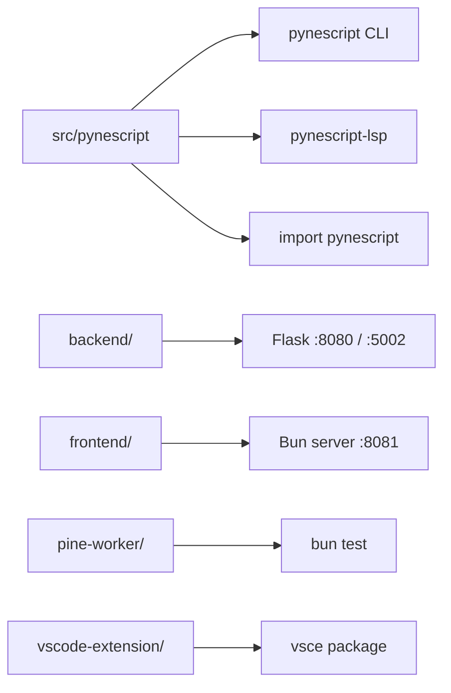

# Copyright (C) 2024-2026 jango_blockchained
#
# This file is part of pynescript.
#
# pynescript is free software: you can redistribute it and/or modify
# it under the terms of the GNU Affero General Public License as published by
# the Free Software Foundation, either version 3 of the License, or
# (at your option) any later version.
#
# pynescript is distributed in the hope that it will be useful,
# but WITHOUT ANY WARRANTY; without even the implied warranty of
# MERCHANTABILITY or FITNESS FOR A PARTICULAR PURPOSE.  See the
# GNU Affero General Public License for more details.
#
# You should have received a copy of the GNU Affero General Public License
# along with pynescript.  If not, see <https://www.gnu.org/licenses/>.
#
# SPDX-License-Identifier: AGPL-3.0-or-later

---
title: "Local development"
description: "Install, test, lint, and run PYNE surfaces on a developer machine — Make, hatch, Bun, and dual-language loops."
---

# Local development

## Abstract

A PYNE checkout is a **polyglot workspace**: Python (src-layout package + Flask backend), TypeScript/Bun (AXIS frontend, Cloudflare worker, `pine-worker`), and Node (VS Code extension). Local DevOps is about choosing the right orthography for the surface you are changing without spinning up the entire mesh.

## Conceptual model



## Interface surface

### Make targets (primary)

| Target | Effect |
| --- | --- |
| `make install` | `pip install -e ".[lsp]"` |
| `make install-bun` | Root + `frontend/worker` Bun deps |
| `make test` | Frontend Bun tests + full `pytest tests/` |
| `make test-lsp` | `test_langserver.py` + `test_lsp_features.py` |
| `make test-backend` | `tests/test_backend.py` |
| `make lint` / `make fmt` | Ruff check / format on `src/`, `tests/`, `backend/` |
| `make typecheck` | Root TS + frontend worker `tsc` |
| `make build` | Nuitka LSP via `scripts/build/compile.py --jobs=4` |
| `make build-check` | Fast import resolution only (~30s) |
| `make build-vscode` | Compile + package VSIX |
| `make run` | `python -m backend.app` |
| `make run-lsp` | `python -m pynescript.langserver` |
| `make run-frontend` | AXIS PWA on `:8081` (expects API on `:5002`) |
| `make docker-build` / `docker-run` | Production API image / compose |

### Hatch equivalents

```bash
hatch run test:test
hatch run test:test-cov
hatch run lint:style
hatch run lint:typing
hatch run lint:gen-parser   # ANTLR regeneration — see grammar guide
```

See also `CONTRIBUTING.md` and `AGENTS.md` for hatch-first workflows.

## Internals

| Path | Why it matters locally |
| --- | --- |
| `src/pynescript/` | Editable package root (src-layout) |
| `tests/conftest.py` | Parametrizes `pinescript_filepath` over every `tests/data/builtin_scripts/*.pine` (~hundreds of cases) |
| `tests/data/library/` | Reference corpus only — not auto-parametrized |
| `backend/requirements.txt` | Extra deps for Pro API (Flask, numpy, matplotlib, …) |
| `pine-worker/` | Colocated TS port; Bun tests independent of Python wheel |

### Python requirements

- **Requires-Python:** `>=3.10` (`pyproject.toml`)
- **CI matrix:** 3.10–3.13
- **Recommended local:** 3.12 or 3.13 with a virtualenv / hatch env

### Optional extras

```bash
pip install -e ".[lsp]"       # pygls + lsprotocol
pip install -e ".[dev-lsp]"   # + pytest-lsp for e2e LSP
pip install -e ".[data]"      # ccxt for data providers
pip install -r backend/requirements.txt
```

## Invariants & edge cases

1. **`from __future__ import annotations` is mandatory** on every new Python file (ruff isort `required-imports`).
2. **Do not edit generated grammar.** Change only `src/pynescript/ast/grammar/antlr4/resource/*.g4`, then regenerate.
3. **No stale backups in `src/`.** Live `builder.py` and `technical.py` are sole sources of truth.
4. **Corpus fixture cost.** Any test using `pinescript_filepath` multiplies across the builtin script corpus. Narrow with `--example-scripts-dir=...` when iterating.
5. **Console scripts are separate.** Installing `.[lsp]` gives both `pynescript` and `pynescript-lsp`; invoking the wrong one is a common first-day footgun.

## Worked examples

### Library + parse round-trip

```bash
make install
python -c "from pynescript.ast.helper import parse, unparse; print(unparse(parse('//@version=6\nindicator(\"x\")\nplot(close)')))"
```

### Pro API + AXIS

```bash
# terminal 1
make run
# terminal 2
make run-frontend
# open http://127.0.0.1:8081 — /run hits backend on :5002 per compose/docs convention
```

### LSP without Nuitka

```bash
make install
make run-lsp
# point editor to stdio server: python -m pynescript.langserver
```

### pine-worker only

```bash
cd pine-worker
bun install
bun test
bun run typecheck
```

## Failure modes

| Symptom | Cause | Mitigation |
| --- | --- | --- |
| `ModuleNotFoundError: pynescript` | Not editable-installed | `make install` |
| Hundreds of unexpected test failures | Editing shared conftest fixture | Isolate unit tests; avoid corpus fixture |
| Frontend  fails calling API | Backend not on expected port | Start `make run`; check CORS / `ALLOWED_ORIGINS` |
| `antlr4` not found | CLI not on PATH | Use hatch `lint:gen-parser` or full path to `antlr4` |
| Ruff `I` import errors | Missing future annotations | Add `from __future__ import annotations` |

## See also

- [CI](/pyne/docs/devops/ci)
- [Docker](/pyne/docs/devops/docker)
- [Nuitka build](/pyne/docs/devops/nuitka-build)
- [Contributing](/pyne/docs/contributing)
- [Installation (end user)](/pyne/docs/enduser/getting-started/installation)
