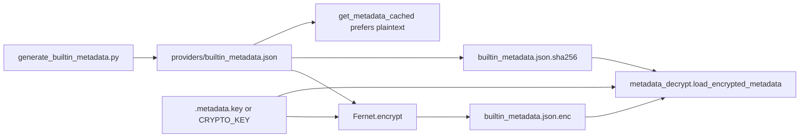

# Copyright (C) 2024-2026 jango_blockchained
#
# This file is part of pynescript.
#
# pynescript is free software: you can redistribute it and/or modify
# it under the terms of the GNU Affero General Public License as published by
# the Free Software Foundation, either version 3 of the License, or
# (at your option) any later version.
#
# pynescript is distributed in the hope that it will be useful,
# but WITHOUT ANY WARRANTY; without even the implied warranty of
# MERCHANTABILITY or FITNESS FOR A PARTICULAR PURPOSE.  See the
# GNU Affero General Public License for more details.
#
# You should have received a copy of the GNU Affero General Public License
# along with pynescript.  If not, see <https://www.gnu.org/licenses/>.
#
# SPDX-License-Identifier: AGPL-3.0-or-later

---
title: "Metadata encryption"
description: "Fernet-encrypted LSP builtin_metadata.json — key lifecycle, CI secrets, integrity hashes, and runtime decrypt."
---

# Metadata encryption

## Abstract

LSP completion, hover, and signature help depend on a large **builtin metadata** document derived from the live evaluator surface. In open development the JSON is plaintext and git-tracked. For **compiled Nuitka binaries**, the build pipeline can ship an encrypted blob so the binary does not leave a trivially scrapable metadata file on disk.

Mechanism: **Fernet** (symmetric, `cryptography` package) + optional SHA256 integrity sidecar.

## Conceptual model



## Interface surface

### Files

| Path | Tracked? | Role |
| --- | --- | --- |
| `src/pynescript/langserver/providers/builtin_metadata.json` | yes | Plaintext for dev / hatch |
| `…/builtin_metadata.json.enc` | often yes | Encrypted payload for binaries |
| `…/builtin_metadata.json.sha256` | yes | Truncated SHA256 of plaintext |
| `scripts/build/.metadata.key` | **no** (gitignored) | Local Fernet key material |
| `scripts/generate_builtin_metadata.py` | yes | Regenerates JSON from code |

### Environment variables

| Variable | Context | Meaning |
| --- | --- | --- |
| `CRYPTO_KEY` | Build scripts / CI / Cloud Build | Key bytes for encrypt stage |
| `PYNESCRIPT_METADATA_KEY` | Runtime decrypt fallback | Env-supplied key if file missing |
| GitHub `secrets.METADATA_KEY` | Actions | Stable secret → `CRYPTO_KEY` |
| Cloud Build `_METADATA_KEY` | `cloudbuild.yaml` substitution | `CRYPTO_KEY=${_METADATA_KEY}` |

### Code entrypoints

- Encrypt stage: `scripts/build/compile.py` (`encrypt_metadata`), `scripts/build/ci_build.py` (`stage_metadata`)
- Decrypt: `src/pynescript/langserver/providers/metadata_decrypt.py`
- Loader preference: plaintext if present, else encrypted (`get_metadata_cached`)

## Internals

### Generation (always code-derived)

```bash
python scripts/generate_builtin_metadata.py
```

Do **not** hand-edit the JSON for permanent feature work — re-run the generator after adding builtins.

### Encrypt (local sketch)

```python
from cryptography.fernet import Fernet
key = Fernet.generate_key()  # or load stable secret
fernet = Fernet(key)
encrypted = fernet.encrypt(plaintext_bytes)
```

Build scripts chmod the key file to `0o600` when writing `.metadata.key`.

### Decrypt integrity check

After Fernet decrypt, if a `.sha256` sidecar exists, the loader compares `sha256(plaintext)[:16]` and raises on mismatch.

### Dev vs binary

| Mode | Behavior |
| --- | --- |
| Editable install / repo checkout | Prefer plaintext JSON |
| Nuitka onefile | Encrypted data dir + key resolution via MEIPASS / env |
| Missing both | `FileNotFoundError` directing to compile script |

## Invariants & edge cases

1. **Stable key ⇒ reproducible `.enc`.** Random key every CI run yields a different ciphertext even if plaintext is identical — not a functional bug, but pollutes diffs and caches.
2. **Plaintext remains in git** for open-source transparency of the *language surface*. Encryption protects the *bundled binary layout*, not the secret of the API catalog.
3. **Truncated hash is integrity, not secrecy.** It detects bitrot / wrong plaintext, not attackers with the key.
4. **Never commit `.metadata.key`.** Rotate if leaked; regenerate `.enc` with the new key for binary builds.
5. **After adding builtins:** regenerate metadata, re-encrypt with the **same** CI key, commit updated JSON (and `.enc` if tracked).

## Worked examples

### Regenerate + local encrypt

```bash
python scripts/generate_builtin_metadata.py
pip install cryptography
python scripts/build/compile.py --check   # stages metadata paths as configured
```

### CI snippet

```yaml
- name: Build LSP binary
  run: python scripts/build/ci_build.py --jobs 4
  env:
    CRYPTO_KEY: ${{ secrets.METADATA_KEY }}
```

### Runtime with env key

```bash
export PYNESCRIPT_METADATA_KEY="$(cat scripts/build/.metadata.key)"
pynescript-lsp
```

## Failure modes

| Symptom | Cause | Fix |
| --- | --- | --- |
| `No metadata decryption key found` | Missing file + env | Supply `PYNESCRIPT_METADATA_KEY` or rebuild with key |
| `Metadata integrity check failed` | Stale hash or wrong ciphertext | Re-encrypt from current plaintext; commit both |
| Completion empty in binary only | Data dir not included in Nuitka | Fix `--include-data-dir` |
| Divergent `.enc` every CI | Unset `CRYPTO_KEY` | Configure `METADATA_KEY` secret |

## See also

- [Nuitka build](/pyne/docs/devops/nuitka-build)
- [LSP builtin metadata](/pyne/docs/lsp/builtin-metadata)
- [Release](/pyne/docs/devops/release)
- [Security](/pyne/docs/devops/security)
