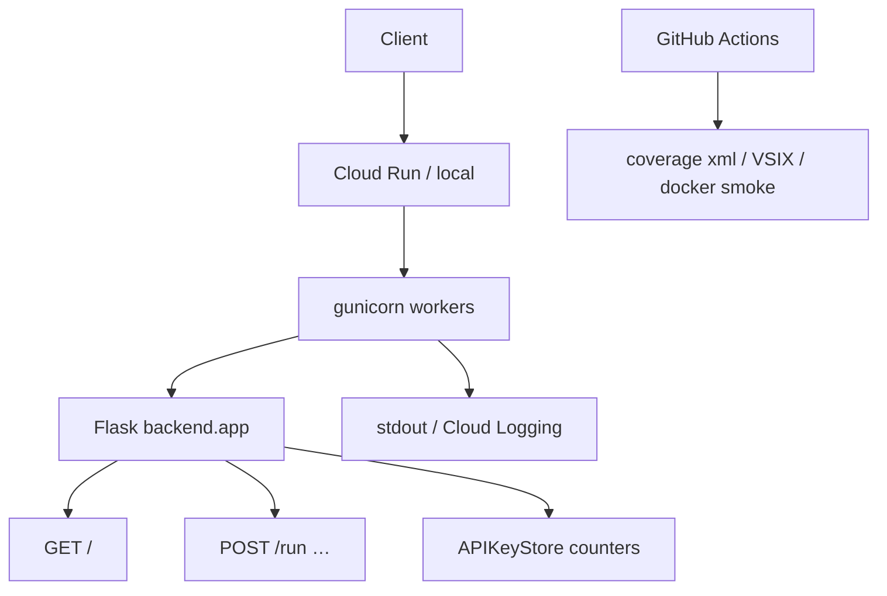

# Copyright (C) 2024-2026 jango_blockchained
#
# This file is part of pynescript.
#
# pynescript is free software: you can redistribute it and/or modify
# it under the terms of the GNU Affero General Public License as published by
# the Free Software Foundation, either version 3 of the License, or
# (at your option) any later version.
#
# pynescript is distributed in the hope that it will be useful,
# but WITHOUT ANY WARRANTY; without even the implied warranty of
# MERCHANTABILITY or FITNESS FOR A PARTICULAR PURPOSE.  See the
# GNU Affero General Public License for more details.
#
# You should have received a copy of the GNU Affero General Public License
# along with pynescript.  If not, see <https://www.gnu.org/licenses/>.
#
# SPDX-License-Identifier: AGPL-3.0-or-later

---
title: "Observability"
description: "Health endpoints, gunicorn process model, Cloud Logging, coverage artifacts, and operational signals for PYNE."
---

# Observability

## Abstract

PYNE’s production surface today optimizes for **simple, hostable signals** rather than a full OpenTelemetry mesh: HTTP health checks, process managers (gunicorn), cloud platform logs, CI artifacts (coverage, Playwright reports), and application-level API key usage counters. Treat this page as the map of *what exists in-repo*, not a claim of enterprise APM parity.

## Conceptual model



## Interface surface

### Health

`backend/app.py` exposes:

```http
GET /
→ { "status": "healthy", "service": "pynescript-pro-api", … }
```

Used by:

- `Dockerfile` target `api` `HEALTHCHECK` (`curl -fsS http://127.0.0.1:8080/`)
- `docker-compose.yml` api healthcheck
- Load balancers / Cloud Run startup-ish probes (platform-dependent)

### Process model (production)

```text
gunicorn --bind :8080 --workers 2 --threads 4 --timeout 120 backend.app:app
# docker/entrypoint-api.sh: GUNICORN_TIMEOUT default 120
# docker-compose.prod.yml: GUNICORN_TIMEOUT default 60
```

| Knob | Effect on signals |
| --- | --- |
| workers | Process isolation; multiplies memory |
| threads | Concurrent requests within worker |
| timeout | Entrypoint default **120s**. Cloud Run `--timeout=60s` is tighter unless you raise the platform flag or lower `GUNICORN_TIMEOUT`. |

### Logs

| Environment | Where logs go |
| --- | --- |
| Local `make run` | Process stdout/stderr |
| Docker | Container logs (`docker logs`, compose) |
| Cloud Build | `logging: CLOUD_LOGGING_ONLY` |
| Cloud Run | Cloud Logging (request + container) |

Application modules use standard library / Flask logging patterns; there is no mandatory structured-log schema enforced repo-wide. `{/* TODO: verify */}` if a future branch introduces OpenTelemetry exporters.

### CI / quality signals

| Signal | Source |
| --- | --- |
| Ruff / mypy | `CI` lint job |
| Pytest results | runtime + LSP + backend steps in `CI` |
| Codecov (optional) | Python 3.13 matrix cell |
| VSIX | `CI` `vscode-ext-test` artifact |
| Docker smoke | `CI` api health + admin 403; CLI `--help` / `info` / `check` |

### Usage metering (app-layer)

`backend/middleware/auth.py` tracks per-key:

- `calls_used` / `calls_limit` / tier
- `last_used` timestamps

These are **business metrics** for rate limits, not Prometheus time series — export them if you need dashboards.

## Internals

| Path | Role |
| --- | --- |
| `backend/app.py` | Health route, CORS, `MAX_CONTENT_LENGTH` |
| `backend/middleware/auth.py` | Key store, rate limit counters |
| `backend/services/backtest.py` | Backtest metrics objects for API responses |
| `Dockerfile` (`api` target) | HEALTHCHECK + gunicorn entrypoint |
| `cloudbuild.yaml` | Cloud Logging-only build logs |
| `logs/` (repo) | Local combined/error log files if generated by tools — not the production contract |

## Invariants & edge cases

1. **Health ≠ readiness of evaluator warm caches.** A 200 on `/` does not mean the first `/run` will be fast (cold import / JIT / numba).
2. **Timeouts double-bind.** Cloud Run 60s vs gunicorn default 120s — the **platform** limit wins on Cloud Run unless you set `GUNICORN_TIMEOUT=60`.
3. **Scale-to-zero hides idle metrics.** No traffic ⇒ no samples; use synthetic uptime checks if SLOs matter.
4. **Coverage artifacts expire** (7–14 days retention on Actions uploads).
5. **Do not scrape secrets from logs.** API keys and admin tokens must never be logged at info level.

## Worked examples

### Local health loop

```bash
make run
curl -s http://127.0.0.1:5002/ | python -m json.tool
```

### Docker health

```bash
docker inspect --format='{{json .State.Health}}' CONTAINER
```

### Tail Cloud Run (gcloud)

```bash
gcloud run services logs read pynescript-pro-api --region us-central1 --limit 50
```

## Failure modes

| Symptom | Cause | Fix |
| --- | --- | --- |
| Health green, `/run` 500 | Exception in evaluator path | Inspect request logs; reproduce with payload |
| Worker kills | Soft timeout | Optimize script / raise timeout consistently |
| Missing CI artifact | Path wrong / tests passed | `if-no-files-found: ignore` hides absence |
| Rate limit false positives | Shared key / limit too low | Adjust tier limits; multi-key |
| Silent deploy failure | Build logging-only + unread | Check Cloud Build history UI |

## See also

- [GCP](/pyne/docs/devops/gcp)
- [Docker](/pyne/docs/devops/docker)
- [Security](/pyne/docs/devops/security)
- [API lifecycle](/pyne/docs/api/app-lifecycle)
