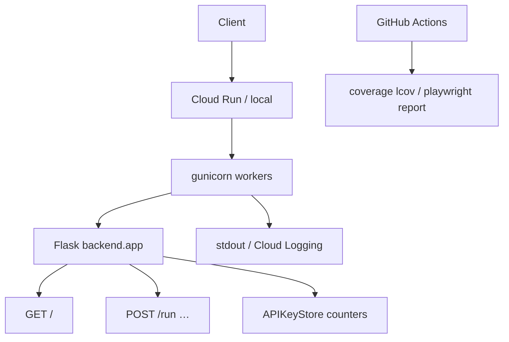

# Observability

## Abstract

PYNE’s production surface today optimizes for **simple, hostable signals** rather than a full OpenTelemetry mesh: HTTP health checks, process managers (gunicorn), cloud platform logs, CI artifacts (coverage, Playwright reports), and application-level API key usage counters. Treat this page as the map of *what exists in-repo*, not a claim of enterprise APM parity.

## Conceptual model



## Interface surface

### Health

`backend/app.py` exposes:

```http
GET /
→ { "status": "healthy", "service": "pynescript-pro-api", … }
```

Used by:

- `Dockerfile.api` `HEALTHCHECK` (`curl -f http://localhost:8080/`)
- `docker-compose.yml` api healthcheck
- Load balancers / Cloud Run startup-ish probes (platform-dependent)

### Process model (production)

```text
gunicorn --bind :8080 --workers 2 --threads 4 --timeout 60 backend.app:app
```

| Knob | Effect on signals |
| --- | --- |
| workers | Process isolation; multiplies memory |
| threads | Concurrent requests within worker |
| timeout 60s | Aligns with Cloud Run `--timeout=60s` — long evals die predictably |

### Logs

| Environment | Where logs go |
| --- | --- |
| Local `make run` | Process stdout/stderr |
| Docker | Container logs (`docker logs`, compose) |
| Cloud Build | `logging: CLOUD_LOGGING_ONLY` |
| Cloud Run | Cloud Logging (request + container) |

Application modules use standard library / Flask logging patterns; there is no mandatory structured-log schema enforced repo-wide. `{/* TODO: verify */}` if a future branch introduces OpenTelemetry exporters.

### CI / quality signals

| Signal | Source |
| --- | --- |
| Ruff / mypy | `ci.yml` lint job |
| Pytest results | LSP + backend jobs |
| Codecov (optional) | Python 3.13 matrix cell |
| AXIS coverage lcov | `axis-coverage-lcov` artifact |
| Playwright report | Uploaded on nightly/e2e failure |
| Security tests | `bun run test:security` (PWA job + nightly) |

### Usage metering (app-layer)

`backend/middleware/auth.py` tracks per-key:

- `calls_used` / `calls_limit` / tier
- `last_used` timestamps

These are **business metrics** for rate limits, not Prometheus time series — export them if you need dashboards.

## Internals

| Path | Role |
| --- | --- |
| `backend/app.py` | Health route, CORS, `MAX_CONTENT_LENGTH` |
| `backend/middleware/auth.py` | Key store, rate limit counters |
| `backend/services/backtest.py` | Backtest metrics objects for API responses |
| `Dockerfile.api` | HEALTHCHECK + gunicorn CMD |
| `cloudbuild.yaml` | Cloud Logging-only build logs |
| `logs/` (repo) | Local combined/error log files if generated by tools — not the production contract |

## Invariants & edge cases

1. **Health ≠ readiness of evaluator warm caches.** A 200 on `/` does not mean the first `/run` will be fast (cold import / JIT / numba).
2. **Timeouts double-bind.** Gunicorn 60s and Cloud Run 60s — the tighter effective limit is still 60s.
3. **Scale-to-zero hides idle metrics.** No traffic ⇒ no samples; use synthetic uptime checks if SLOs matter.
4. **Coverage artifacts expire** (7–14 days retention on Actions uploads).
5. **Do not scrape secrets from logs.** API keys and admin tokens must never be logged at info level.

## Worked examples

### Local health loop

```bash
make run
curl -s localhost:8080/ | python -m json.tool
```

### Docker health

```bash
docker inspect --format='{{json .State.Health}}' CONTAINER
```

### Tail Cloud Run (gcloud)

```bash
gcloud run services logs read pynescript-pro-api --region us-central1 --limit 50
```

## Failure modes

| Symptom | Cause | Fix |
| --- | --- | --- |
| Health green, `/run` 500 | Exception in evaluator path | Inspect request logs; reproduce with payload |
| Worker kills | Soft timeout | Optimize script / raise timeout consistently |
| Missing CI artifact | Path wrong / tests passed | `if-no-files-found: ignore` hides absence |
| Rate limit false positives | Shared key / limit too low | Adjust tier limits; multi-key |
| Silent deploy failure | Build logging-only + unread | Check Cloud Build history UI |

## See also

- [GCP](/pyne/docs/devops/gcp)
- [Docker](/pyne/docs/devops/docker)
- [Security](/pyne/docs/devops/security)
- [API lifecycle](/pyne/docs/api/app-lifecycle)
