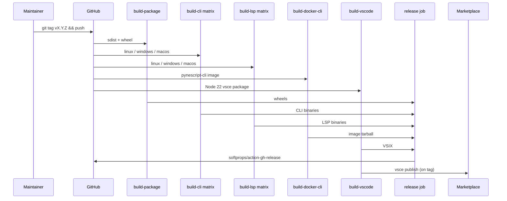

# Copyright (C) 2024-2026 jango_blockchained
#
# This file is part of pynescript.
#
# pynescript is free software: you can redistribute it and/or modify
# it under the terms of the GNU Affero General Public License as published by
# the Free Software Foundation, either version 3 of the License, or
# (at your option) any later version.
#
# pynescript is distributed in the hope that it will be useful,
# but WITHOUT ANY WARRANTY; without even the implied warranty of
# MERCHANTABILITY or FITNESS FOR A PARTICULAR PURPOSE.  See the
# GNU Affero General Public License for more details.
#
# You should have received a copy of the GNU Affero General Public License
# along with pynescript.  If not, see <https://www.gnu.org/licenses/>.
#
# SPDX-License-Identifier: AGPL-3.0-or-later

---
title: "Release"
description: "Tag-driven CLI + LSP multi-platform Nuitka binaries, wheels, Docker CLI image, VSIX packaging, GitHub Releases, and Marketplace publish."
---

# Release

## Abstract

A PYNE release is a **multi-artifact event**, not a single wheel upload. The primary automation (`.github/workflows/release.yml`) builds:

- **PyPI sdist + wheel** (`hoox-pyne`) with CLI smoke
- **CLI** platform-native Nuitka binaries (`pynescript`)
- **LSP** platform-native Nuitka binaries (`pynescript-lsp`)
- **CLI Docker image** tarball (`pynescript-cli-image.tar.gz`)
- **VS Code** VSIX

Assets attach to a GitHub Release; PyPI upload is handled by **Publish** (`publish.yml`). Multi-arch container images are a **separate** workflow (**GHCR** / `ghcr.yml`) — not attached as tarballs except the CLI image save in this workflow. Marketplace / Open VSX publish is optional via `VSCE_PAT` / `OVSX_PAT`.
## Conceptual model



## Interface surface

### Triggers

| Event | Behavior |
| --- | --- |
| Push tag matching `v*` | Full build + create release + marketplace/Open VSX publish |
| `workflow_dispatch` with `version` input | Same jobs; **Create Release** also runs on dispatch (not tag-only) |

### Jobs

| Job | Matrix / OS | Output |
| --- | --- | --- |
| `build-package` | ubuntu-latest | `hoox-pyne-dist` (sdist + wheel) |
| `build-cli` | ubuntu-latest, windows-latest, macos-latest | `pynescript-cli-linux-x86_64`, `…-windows-x86_64.exe`, `…-macos-arm64` |
| `build-lsp` | ubuntu-latest, windows-latest, macos-latest | `pynescript-lsp-linux-x86_64`, `…-windows-x86_64.exe`, `…-macos-arm64` |
| `build-docker-cli` | ubuntu-latest | `pynescript-cli-docker` (gzipped `docker save`) |
| `build-vscode` | ubuntu-latest | `pynescript-vscode-extension` VSIX |
| `release` | needs package + vscode success; tag **or** dispatch | GitHub Release body + staged assets (`name: pyne vX.Y.Z`) |
| `publish-vscode` | needs VSIX; tag **or** dispatch | `vsce publish` if `VSCE_PAT`; `ovsx publish` if `OVSX_PAT` |

### Environment

```yaml
env:
  PYTHON_VERSION: "3.11"   # Nuitka 2.5–2.7 graph; comment in workflow
  NUITKA_JOBS: 4
```

Build steps rely on:

```bash
# LSP
pip install -e ".[lsp]" "nuitka>=2.5.1,<2.8" cryptography
python scripts/build/compile.py --target lsp --no-encrypt --check
python scripts/build/ci_build.py --target lsp --jobs 4
# CRYPTO_KEY from secrets.METADATA_KEY

# CLI
pip install -e . "nuitka>=2.5.1,<2.8"
python scripts/build/compile.py --target cli --check
python scripts/build/ci_build.py --target cli --jobs 4 --skip-metadata --skip-vsix
```

### Local make-side packaging

```bash
make package        # sdist + wheel (python -m build)
make build          # Nuitka LSP
make build-cli      # Nuitka CLI
make build-vscode   # npm install && compile && vsce package
make docker-build-cli
```

Artifacts land under `dist/`, `dist/lsp/`, `dist/cli/`, `dist/vsix/`, and `vscode-extension/*.vsix` depending on script path.

## Internals

| Path | Role |
| --- | --- |
| `.github/workflows/release.yml` | Orchestration |
| `scripts/build/ci_build.py` | CI-oriented Nuitka + metadata encrypt |
| `scripts/build/compile.py` | Local/full compile options (`--onefile`, `--standalone`, `--check`) |
| `vscode-extension/package.json` | Extension version / engines |
| `src/pynescript/__about__.py` | Hatch dynamic version for Python package |

### Release asset contract (from release body)

| Artifact | Install sketch |
| --- | --- |
| `hoox_pyne-*.whl` / `*.tar.gz` | `pip install ./hoox_pyne-*.whl` |
| `pynescript-cli-linux-x86_64` | `chmod +x` → `/usr/local/bin/pynescript` |
| `pynescript-cli-windows-x86_64.exe` | Place on PATH as `pynescript.exe` |
| `pynescript-cli-macos-arm64` | Place on PATH (Apple Silicon runners) |
| `pynescript-cli-image.tar.gz` | `gunzip -c … \| docker load` → `pynescript-cli:latest` |
| `pynescript-lsp-linux-x86_64` | `chmod +x` → `/usr/local/bin/pynescript-lsp` |
| `pynescript-lsp-windows-x86_64.exe` | Place on PATH |
| `pynescript-lsp-macos-arm64` | Place on PATH (Apple Silicon runners) |
| `pyne-vscode-*.vsix` (`hoox-sh.pyne` 0.4.3) | `code --install-extension pyne-vscode-*.vsix` |

## Invariants & edge cases

1. **`CRYPTO_KEY` must be stable across builds** if you care about byte-identical `builtin_metadata.json.enc`. Supply `secrets.METADATA_KEY`.
2. **Tag name is the version source** for the GitHub Release title (`v` prefix stripped).
3. **Marketplace publish needs `VSCE_PAT`.** Without it, packaging may still succeed while publish fails.
4. **Artifact retention is short** (5 days on build jobs) — releases must attach files immediately.
5. **macOS artifact is ARM64** from `macos-latest` — Intel Mac users may need separate builds if required.
6. **Draft vs prerelease:** workflow currently sets `draft: false`, `prerelease: false` for tag releases.

## Worked examples

### Cut a release

```bash
# ensure main is green
git checkout main && git pull
# bump versions in extension / __about__ as needed
git tag -a v0.3.14 -m "v0.3.14"
git push origin v0.3.14
# watch Actions → Build & Release, Publish, GHCR
```

### Smoke-test a downloaded binary

```bash
chmod +x pynescript-cli-linux-x86_64
./pynescript-cli-linux-x86_64 --help
./pynescript-cli-linux-x86_64 check script.pine

chmod +x pynescript-lsp-linux-x86_64
./pynescript-lsp-linux-x86_64 --help
# or wire stdio into an editor client
```

## Failure modes

| Symptom | Cause | Fix |
| --- | --- | --- |
| Binary not found after Nuitka | Path layout drift in `ci_build.py` | Inspect `dist/`; fix finder step |
| Decrypt errors in field | Key mismatch between encrypt and runtime | Align `METADATA_KEY` with embedded key strategy |
| Empty GitHub Release assets | Artifact download path mismatch | Match `files:` globs to download-artifact layout |
| Marketplace 401 | Bad/expired `VSCE_PAT` | Rotate PAT with Marketplace scopes |
| Windows `.exe` not marked executable | Finder uses `-type f -executable` | Fallback non-executable find branch in workflow |

## See also

- [Nuitka build](/pyne/docs/devops/nuitka-build)
- [Metadata crypto](/pyne/docs/devops/metadata-crypto)
- [CI](/pyne/docs/devops/ci)
- [VS Code extension](/pyne/docs/lsp/vscode-extension)
