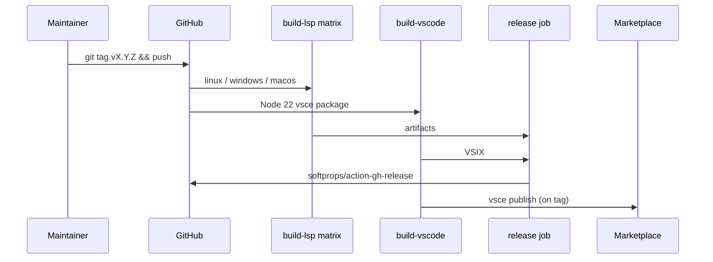

# Copyright (C) 2024-2026 jango_blockchained
#
# This file is part of pynescript.
#
# pynescript is free software: you can redistribute it and/or modify
# it under the terms of the GNU Affero General Public License as published by
# the Free Software Foundation, either version 3 of the License, or
# (at your option) any later version.
#
# pynescript is distributed in the hope that it will be useful,
# but WITHOUT ANY WARRANTY; without even the implied warranty of
# MERCHANTABILITY or FITNESS FOR A PARTICULAR PURPOSE.  See the
# GNU Affero General Public License for more details.
#
# You should have received a copy of the GNU Affero General Public License
# along with pynescript.  If not, see <https://www.gnu.org/licenses/>.
#
# SPDX-License-Identifier: AGPL-3.0-or-later

---
title: "Release"
description: "Tag-driven LSP multi-platform Nuitka binaries, VSIX packaging, GitHub Releases, and Marketplace publish."
---

# Release

## Abstract

A PYNE release is a **multi-artifact event**, not a single wheel upload. The primary automation (`.github/workflows/release.yml`) builds platform-native Language Server binaries with Nuitka, packages the VS Code extension, attaches them to a GitHub Release, and optionally publishes to the VS Code Marketplace.

Library wheels may still be built separately via hatch / PyPI workflows; the documented release pipeline optimizes for **editor distribution** (LSP + VSIX).

## Conceptual model



## Interface surface

### Triggers

| Event | Behavior |
| --- | --- |
| Push tag matching `v*` | Full build + create release + marketplace publish |
| `workflow_dispatch` with `version` input | Manual build path (release job still gated on tag push condition) |

### Jobs

| Job | Matrix / OS | Output |
| --- | --- | --- |
| `build-lsp` | ubuntu-latest, windows-latest, macos-latest | Named artifacts: `pynescript-lsp-linux-x86_64`, `…-windows-x86_64.exe`, `…-macos-arm64` |
| `build-vscode` | ubuntu-latest | `pynescript-vscode-extension` VSIX |
| `release` | needs both; only if tag push | GitHub Release body + asset globs |
| `publish-vscode` | needs VSIX; only if tag push | `vsce publish --pat` |

### Environment

```yaml
env:
  PYTHON_VERSION: "3.12"
  NUITKA_JOBS: 4
```

Build steps rely on:

```bash
pip install nuitka==2.0.* cryptography
python scripts/build/compile.py --no-encrypt --check   # metadata stage
python scripts/build/ci_build.py --jobs 4
# CRYPTO_KEY from secrets.METADATA_KEY
```

### Local make-side packaging

```bash
make build          # scripts/build/compile.py --jobs=4
make build-vscode   # npm install && compile && vsce package
```

Artifacts land under `dist/lsp/`, `dist/vsix/`, and `vscode-extension/*.vsix` depending on script path.

## Internals

| Path | Role |
| --- | --- |
| `.github/workflows/release.yml` | Orchestration |
| `scripts/build/ci_build.py` | CI-oriented Nuitka + metadata encrypt |
| `scripts/build/compile.py` | Local/full compile options (`--onefile`, `--standalone`, `--check`) |
| `vscode-extension/package.json` | Extension version / engines |
| `src/pynescript/__about__.py` | Hatch dynamic version for Python package |

### Release asset contract (from release body)

| Artifact | Install sketch |
| --- | --- |
| `pynescript-lsp-linux-x86_64` | `chmod +x` → `/usr/local/bin/pynescript-lsp` |
| `pynescript-lsp-windows-x86_64.exe` | Place on PATH |
| `pynescript-lsp-macos-arm64` | Place on PATH (Apple Silicon runners) |
| `pynescript-*.vsix` | `code --install-extension pynescript-*.vsix` |

## Invariants & edge cases

1. **`CRYPTO_KEY` must be stable across builds** if you care about byte-identical `builtin_metadata.json.enc`. Supply `secrets.METADATA_KEY`.
2. **Tag name is the version source** for the GitHub Release title (`v` prefix stripped).
3. **Marketplace publish needs `VSCE_PAT`.** Without it, packaging may still succeed while publish fails.
4. **Artifact retention is short** (5 days on build jobs) — releases must attach files immediately.
5. **macOS artifact is ARM64** from `macos-latest` — Intel Mac users may need separate builds if required.
6. **Draft vs prerelease:** workflow currently sets `draft: false`, `prerelease: false` for tag releases.

## Worked examples

### Cut a release

```bash
# ensure main is green
git checkout main && git pull
# bump versions in extension / __about__ as needed
git tag -a v0.3.0 -m "v0.3.0"
git push origin v0.3.0
# watch Actions → Build & Release LSP
```

### Smoke-test a downloaded binary

```bash
chmod +x pynescript-lsp-linux-x86_64
./pynescript-lsp-linux-x86_64 --help
# or wire stdio into an editor client
```

## Failure modes

| Symptom | Cause | Fix |
| --- | --- | --- |
| Binary not found after Nuitka | Path layout drift in `ci_build.py` | Inspect `dist/`; fix finder step |
| Decrypt errors in field | Key mismatch between encrypt and runtime | Align `METADATA_KEY` with embedded key strategy |
| Empty GitHub Release assets | Artifact download path mismatch | Match `files:` globs to download-artifact layout |
| Marketplace 401 | Bad/expired `VSCE_PAT` | Rotate PAT with Marketplace scopes |
| Windows `.exe` not marked executable | Finder uses `-type f -executable` | Fallback non-executable find branch in workflow |

## See also

- [Nuitka build](/pyne/docs/devops/nuitka-build)
- [Metadata crypto](/pyne/docs/devops/metadata-crypto)
- [CI](/pyne/docs/devops/ci)
- [VS Code extension](/pyne/docs/lsp/vscode-extension)
