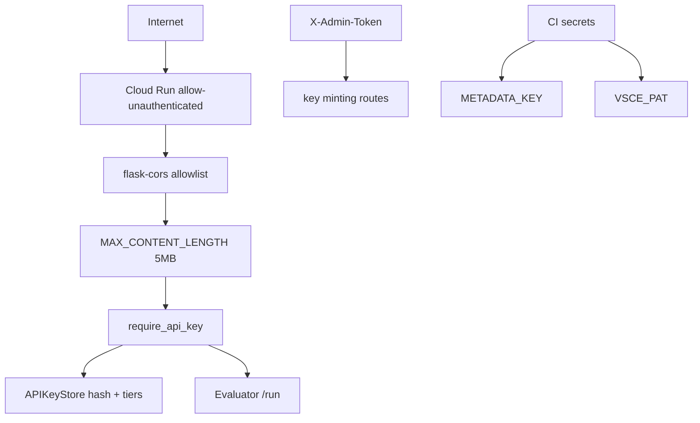

# Copyright (C) 2024-2026 jango_blockchained
#
# This file is part of pynescript.
#
# pynescript is free software: you can redistribute it and/or modify
# it under the terms of the GNU Affero General Public License as published by
# the Free Software Foundation, either version 3 of the License, or
# (at your option) any later version.
#
# pynescript is distributed in the hope that it will be useful,
# but WITHOUT ANY WARRANTY; without even the implied warranty of
# MERCHANTABILITY or FITNESS FOR A PARTICULAR PURPOSE.  See the
# GNU Affero General Public License for more details.
#
# You should have received a copy of the GNU Affero General Public License
# along with pynescript.  If not, see <https://www.gnu.org/licenses/>.
#
# SPDX-License-Identifier: AGPL-3.0-or-later

---
title: "Security"
description: "API keys, CORS, body limits, secrets hygiene, Fernet metadata keys, and threat-aware defaults for PYNE ops."
---

# Security

## Abstract

PYNE security is layered: **transport/hosting** (Cloud Run, containers), **application** (API keys, admin tokens, CORS, body size caps), **build secrets** (Fernet metadata keys, VSCE PAT), and **supply chain** (CI dependency installs, extension packaging). This page documents controls that exist in code and workflows — not a full threat model certification.

## Conceptual model



## Interface surface

### HTTP application controls (`backend/app.py`)

| Control | Default / mechanism |
| --- | --- |
| Body size | `MAX_CONTENT_LENGTH = 5 * 1024 * 1024` (5 MiB) — DoS/OOM mitigation |
| CORS | `ALLOWED_ORIGINS` env (comma-separated); default includes product hosts + localhost regex |
| Methods | GET, POST only via flask-cors config |
| Headers | `Content-Type`, `Authorization`, `X-Admin-Token` |
| Credentials | `supports_credentials=False` |

### API keys (`backend/middleware/auth.py`)

- Keys stored as **hashes**, not raw secrets (store path via `API_KEY_STORE`)
- Tiers: `free`, `hobby` (5k), `pro` (50k), `team` (200k), `enterprise` (∞)
- Rate limit by monthly call counters (`calls_used` / `calls_limit`)
- Decorators: `require_api_key`, `require_admin_token`

### Build / release secrets

| Secret | Purpose |
| --- | --- |
| `METADATA_KEY` / `_METADATA_KEY` | Stable Fernet key for LSP metadata encrypt |
| `VSCE_PAT` | VS Code Marketplace / vsce package |
| `GITHUB_TOKEN` | Release asset upload |
| `PYNESCRIPT_METADATA_KEY` | Runtime decrypt env fallback |

### Container hardening (`Dockerfile` target `api`)

- Multi-stage build (no compiler toolchain in final image)
- Non-root `appuser` (uid 1000)
- Production env flags + gunicorn entrypoint
- Healthcheck without privileged ops
- Intended mutable path `/data` (key store); prod compose uses SQLite there for multi-worker

### Admin minting

- `POST /auth/create_key` requires `ADMIN_TOKEN` env **and** matching `X-Admin-Token` header (constant-time compare)
- Unset `ADMIN_TOKEN` → 403 (fail closed, not open access)

### Key store backends (`STORE_BACKEND`)

| Value | Use |
| --- | --- |
| `json` (default) | Single-process / tests; file may hold raw keys |
| `sqlite` | Multi-worker single host (shared volume); **hash-only** |
| `redis` | Multi-replica; needs `REDIS_URL`; **hash-only** |

## Internals

| Path | Role |
| --- | --- |
| `backend/app.py` | CORS, body limit, blueprint registration |
| `backend/middleware/auth.py` | Key store selection, tiers, decorators, admin gate |
| `backend/middleware/key_store_redis.py` / `key_store_sqlite.py` | Hash-only shared stores |
| `backend/middleware/schemas.py` | Request validation schemas |
| `src/pynescript/langserver/providers/metadata_decrypt.py` | Encrypted metadata load |
| `.github/workflows/*.yml` | Secret consumption |
| `frontend` security tests | `bun run test:security` in CI |

### Audit notes encoded in source

Comments in `app.py` reference a **2026-07-05 audit** (findings S1 body size, S7/S8 CORS). Prefer reading the code over assuming defaults never change.

## Invariants & edge cases

1. **Cloud Run `--allow-unauthenticated` does not mean open data.** It means IAM does not gate invoke; the Flask app must.
2. **Free tier with `calls_limit=0` is special-cased** as unlimited remaining in some helpers — verify tier semantics before production billing.
3. **Localhost CORS regex** permits any port on localhost/127.0.0.1 — fine for desk, wrong for prod `ALLOWED_ORIGINS`.
4. **Fernet protects binary metadata packaging**, not user script confidentiality.
5. **Admin token routes are high privilege** — rotate and store separately from user API keys.
6. **Never log raw API keys.** Hash lookups only.

## Worked examples

### Harden CORS for a single origin

```bash
export ALLOWED_ORIGINS=https://app.example.com
python -m backend.app
```

### Point key store at a volume

```bash
export API_KEY_STORE=/data/api_keys.json
# ensure process user can write /data
```

### Rotate metadata key (ops procedure sketch)

1. Generate new Fernet key; store as secret `METADATA_KEY`
2. Rebuild LSP with `CRYPTO_KEY` set
3. Ship new binary; retire old key after client upgrade window
4. Do not leave dual-key decrypt unless you implement it

## Failure modes

| Symptom | Cause | Fix |
| --- | --- | --- |
| Browser CORS error | Origin not listed | Set `ALLOWED_ORIGINS` |
| 413 Payload Too Large | Body > 5MB | Reduce OHLCV batch; raise limit knowingly |
| 401/403 on `/run` | Missing/invalid key | Check `Authorization` header scheme |
| Rate limited | Tier exhausted | Upgrade tier / wait reset |
| Secret in fork PR logs | Misconfigured workflow echo | Never `echo` secrets; use masked env |
| Root-owned files in volume | Old image ran as root | Align UID with `appuser` |

## See also

- [Auth and keys (API)](/pyne/docs/api/auth-and-keys)
- [Metadata crypto](/pyne/docs/devops/metadata-crypto)
- [Docker](/pyne/docs/devops/docker)
- [GCP](/pyne/docs/devops/gcp)
