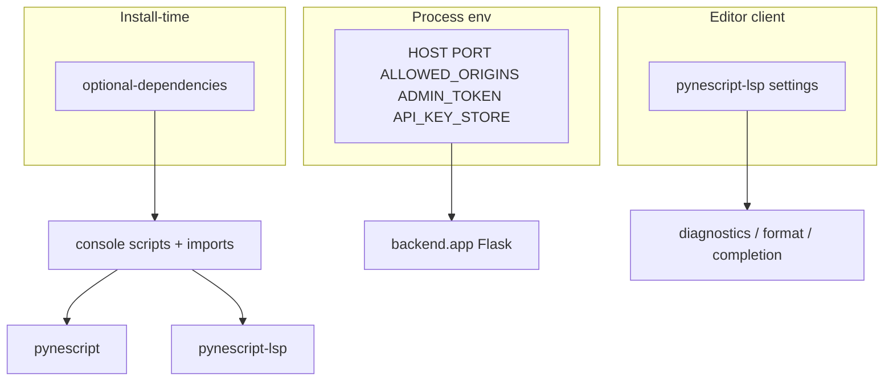

# Configuration

## Abstract

PYNE is mostly **convention-over-config** at the library layer: parse and evaluate take explicit arguments rather than a global config file. Configuration appears at three boundaries: **install extras** (what code is available), **process environment** (Pro API host, CORS, API keys store), and **editor / LSP client settings** (diagnostics, formatting, binary path). This page inventories those knobs for end users.

## Conceptual model



There is no required `pynescript.toml` for core use. {/* TODO: verify if a user config file was added */}

## Interface surface

### Package extras (`pyproject.toml`)

| Extra | Dependencies | Enables |
| --- | --- | --- |
| *(none)* | antlr4-runtime, click, requests, tqdm | CLI + AST + linter + literal_eval |
| `lsp` | pygls, lsprotocol | `pynescript-lsp` |
| `dev-lsp` | pygls, lsprotocol, pytest-lsp | LSP + protocol tests |
| `data` | ccxt | Exchange historical data |
| `datafeed` | ccxt | Same as `data` (alias for realtime feed paths) |

### Console scripts

| Name | Entry point | Notes |
| --- | --- | --- |
| `pynescript` | `pynescript.__main__:cli` | Always with core install |
| `pynescript-lsp` | `pynescript.langserver.__main__:main` | Needs importable pygls |

Invoke without scripts on PATH:

```bash
python -m pynescript --help
python -m pynescript.langserver
```

### CLI flags that act as “config”

Per-invocation only (no persistence):

| Command | Notable options |
| --- | --- |
| `parse-and-dump` | `--encoding`, `--indent`, `--output-file` |
| `parse-and-unparse` | `--encoding`, `--output-file` |
| `lint` | `--encoding`, `--fix`, `--fail-on {errors,warnings,all}` |
| `data` | `--provider`, `--period`, `--interval`, `--api-key`, `--secret`, `--exchange` |
| `download-builtin-scripts` | `--script-dir` (required) |

`--fix` on `lint` is accepted by Click; auto-fix behavior may be incomplete — {/* TODO: verify fix implementation */}.

### Pro API environment variables

Consumed by `backend/app.py` and middleware:

| Variable | Default | Purpose |
| --- | --- | --- |
| `HOST` | `127.0.0.1` | Bind address when running `__main__` |
| `PORT` | `5002` | Bind port |
| `ALLOWED_ORIGINS` | `https://pynescript.ai`, `https://app.pynescript.ai`, localhost regex | CORS allowlist (comma-separated; may include regex strings) |
| `ADMIN_TOKEN` | unset | Required for `POST /auth/create_key`; if unset, create returns 403 |
| `API_KEY_STORE` | `/root/pynescript/data/api_keys.json` | Path for key store (override for local) |

Also relevant:

| Variable | Context |
| --- | --- |
| `MAX_CONTENT_LENGTH` | Hardcoded 5 MiB on Flask app config (not env) — large OHLCV POSTs fail above this |

Local run:

```bash
export HOST=127.0.0.1
export PORT=5002
export ALLOWED_ORIGINS="http://localhost:8081,http://127.0.0.1:8081"
export ADMIN_TOKEN="dev-only-token"
export API_KEY_STORE="$PWD/.data/api_keys.json"
python -m backend.app
# or: make run
```

### Data providers

CLI `pynescript data` / library providers:

| Provider | Auth | Notes |
| --- | --- | --- |
| `mock` | none | Deterministic offline bars (default) |
| `yahoo` | none | Yahoo Finance path |
| `alphavantage` | `--api-key` (falls back to `demo`) | Limited with demo key |
| `ccxt` | optional key/secret; `--exchange` | Requires `[data]` extra |

Pro API `/run` optional fields:

| Field | Values | Role |
| --- | --- | --- |
| `data_source` | `""`, `mock`, `ccxt`, `ccxtpro`, `yahoo`, `alphavantage` | Wires `request.*` resolution |
| `data_options` | object | exchange, api_key, seed, … |
| `mode` | `interpret` (default), `compile` | AST walker vs compiled subset |

### Editor / LSP client settings

VS Code extension keys (from `clients/README.md`):

| Setting | Default | Meaning |
| --- | --- | --- |
| `pynescript.lsp.enabled` | true | Toggle server |
| `pynescript.lsp.command` | `pynescript-lsp` | Binary path |
| `pynescript.formatting.enabled` | true | Format document |
| `pynescript.diagnostics.enabled` | true | Lint squiggles |
| `pynescript.completion.snippets` | true | Snippet completions |

Neovim (`clients/neovim.lua`):

```lua
settings = {
  pinescript = {
    formatting = { enabled = true },
    diagnostics = { enabled = true },
    completion = { snippets = true },
  },
}
```

Zed: `language_servers.pynescript.command` / `arguments: ["--stdio"]` — see [Editors](/pyne/docs/enduser/guides/editors).

### AXIS / frontend coupling (optional)

When running SuperChart Lite PWA against local Flask:

| Make target | Port (typical) |
| --- | --- |
| `make run` | API `:5002` |
| `make run-frontend` | PWA `:8081` |
| `make worker-dev` | CF Worker `:8787` |

CORS must allow the PWA origin via `ALLOWED_ORIGINS`.

## Internals (repo paths)

| Path | Config surface |
| --- | --- |
| `pyproject.toml` | extras, scripts, Python requires |
| `src/pynescript/__main__.py` | CLI options |
| `backend/app.py` | Flask, CORS, HOST/PORT, body size |
| `backend/middleware/auth.py` | `API_KEY_STORE`, key tiers |
| `backend/middleware/schemas.py` | Request field defaults (`mode`, `symbol`, …) |
| `clients/*.json|lua|el` | Editor LSP wiring |
| `vscode-extension/` | Extension contribution points |

## Invariants & edge cases

- **Unknown JSON fields on Pro API are rejected** (`UNKNOWN_FIELDS`) — schemas are strict.
- **CORS defaults exclude arbitrary production domains** — set `ALLOWED_ORIGINS` deliberately.
- **Key store default path is production-oriented** (`/root/...`) — always override locally.
- **Lint `--fail-on`** only affects process exit code; it does not change which rules run.
- **Recursion limit** during parse is raised to at least 5000 temporarily inside `helper._parse` for deep nests; not user-configurable.

## Worked examples

### Desk-only machine

```bash
python -m venv .venv && source .venv/bin/activate
pip install pynescript
# no env vars required
pynescript lint strategy.pine --fail-on errors
```

### Editor workstation

```bash
pip install "pynescript[lsp]"
# ensure which pynescript-lsp
# paste clients/neovim.lua or clients/zed.json as documented
```

### Local API + AXIS

```bash
pip install -e ".[lsp]"
pip install -r backend/requirements.txt
export API_KEY_STORE="$PWD/.data/api_keys.json"
export ALLOWED_ORIGINS="http://localhost:8081"
make run
# other terminal:
make run-frontend
```

### Scripted Alpha Vantage fetch

```bash
export AV_KEY=your_key
pynescript data EUR/USD --provider alphavantage --api-key "$AV_KEY" --period 3mo
```

## Failure modes

| Symptom | Config fix |
| --- | --- |
| Browser CORS error on `/run` | Add origin to `ALLOWED_ORIGINS` |
| `create_key` always 403 | Set `ADMIN_TOKEN` and send `X-Admin-Token` |
| API keys vanish / permission error | Point `API_KEY_STORE` to writable path |
| Payload too large | Split bars or stay under 5 MiB body limit |
| Editor “server failed to start” | Fix `pynescript.lsp.command` PATH; install `[lsp]` |
| `ccxt` import errors | Install `[data]` extra |

## See also

- [Installation](/pyne/docs/enduser/getting-started/installation)
- [Pro API usage](/pyne/docs/enduser/guides/pro-api-usage)
- [Editors](/pyne/docs/enduser/guides/editors)
- [CLI commands](/pyne/docs/enduser/reference/cli-commands)
- [API auth (systems)](/pyne/docs/api/auth-and-keys)
- [AXIS docs](/axis/docs)
