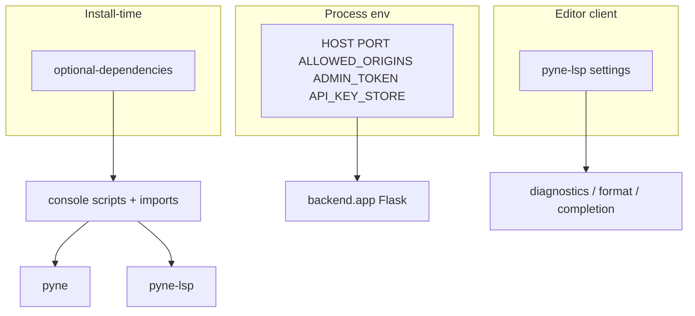

# Copyright (C) 2024-2026 jango_blockchained
#
# This file is part of pynescript.
#
# pynescript is free software: you can redistribute it and/or modify
# it under the terms of the GNU Affero General Public License as published by
# the Free Software Foundation, either version 3 of the License, or
# (at your option) any later version.
#
# pynescript is distributed in the hope that it will be useful,
# but WITHOUT ANY WARRANTY; without even the implied warranty of
# MERCHANTABILITY or FITNESS FOR A PARTICULAR PURPOSE.  See the
# GNU Affero General Public License for more details.
#
# You should have received a copy of the GNU Affero General Public License
# along with pynescript.  If not, see <https://www.gnu.org/licenses/>.
#
# SPDX-License-Identifier: AGPL-3.0-or-later

---
title: "Configuration"
description: "Package extras, console scripts, Pro API environment variables, data providers, and editor LSP settings for PYNE."
---

# Configuration

## Abstract

PYNE is mostly **convention-over-config** at the library layer: parse and evaluate take explicit arguments rather than a global config file. Configuration appears at three boundaries: **install extras** (what code is available), **process environment** (Pro API host, CORS, API keys store), and **editor / LSP client settings** (diagnostics, formatting, binary path). This page inventories those knobs for end users.

## Conceptual model



There is no `pynescript.toml` (or similar) for core use. Parse, evaluate, and CLI flags are per-invocation.

## Interface surface

### Package extras (`pyproject.toml`)

| Extra | Dependencies | Enables |
| --- | --- | --- |
| *(none)* | antlr4-runtime, click, requests, tqdm | CLI + AST + linter + literal_eval + `pynescript.runtime` |
| `lsp` | pygls, lsprotocol | `pyne-lsp` (alias `pynescript-lsp`) |
| `dev-lsp` | pygls, lsprotocol, pytest-lsp | LSP + protocol tests |
| `data` | ccxt | Exchange historical data |
| `datafeed` | ccxt | Same as `data` (alias for realtime feed paths) |
| `compile` | numpy, numba | Compile / run / prewarm Numba path |
| `pro` | Flask stack (+ redis optional) | Self-hosted Pro API |

### Console scripts

| Name | Entry point | Notes |
| --- | --- | --- |
| `pyne` | `pynescript.__main__:cli` | Preferred desk CLI |
| `pyne-lsp` | `pynescript.langserver.__main__:main` | Preferred language server |
| `pynescript` | same as `pyne` | Legacy alias |
| `pynescript-lsp` | same as `pyne-lsp` | Legacy alias |

Invoke without scripts on PATH:

```bash
python -m pynescript --help
python -m pynescript.langserver
```

### CLI flags that act as “config”

Per-invocation only (no persistence):

| Command | Notable options |
| --- | --- |
| `check` | `--encoding`, `-q/--quiet`, `--ext` (directory walk) |
| `format` / `fmt` | `-w/--write`, `--check`, `-o/--output-file` |
| `parse-and-dump` | `--encoding`, `--indent`, `--output-file` |
| `parse-and-unparse` | `--encoding`, `--output-file` |
| `lint` | `--encoding`, `--fail-on {errors,warnings,all,never}`, `--json`, `-q` |
| `compile` | `--emit`, `-o`, `--time/--no-time` |
| `prewarm` | `--force`, `--json` |
| `run` | `--bars` (default 50), `--json`, `-q` — **compile-only** synthetic OHLCV |
| `data` | `--provider`, `--period`, `--interval`, `--api-key`, `--secret`, `--exchange`, `--format` |

`lint` has **no** `--fix`. Structural rewrite is `pyne format -w` (parse → unparse).

### Pro API environment variables

Consumed by `backend/app.py` and middleware:

| Variable | Default | Purpose |
| --- | --- | --- |
| `HOST` | `127.0.0.1` | Bind address when running `__main__` |
| `PORT` | `5002` | Bind port |
| `ALLOWED_ORIGINS` | `https://pynescript.ai`, `https://app.pynescript.ai`, plus localhost regex | CORS allowlist (comma-separated; regex allowed). Code also appends localhost, private-LAN, and product-origin (`hoox.sh` / `pynescript.ai` / `pynescript.online`) regexes unless `*` |
| `ADMIN_TOKEN` | unset | Required for `POST /auth/create_key`; if unset, create returns 403 |
| `API_KEY_STORE` | `/root/pynescript/data/api_keys.json` | Path for key store (override for local) |
| `ALERT_WEBHOOK_URL` | unset | Default L2 alert webhook for `/run` when body omits `webhook_url` |
| `ALERT_WEBHOOK_TIMEOUT` | `10` | Webhook HTTP timeout (seconds) |

Also relevant:

| Variable | Context |
| --- | --- |
| `MAX_CONTENT_LENGTH` | Hardcoded 5 MiB on Flask app config (not env) — large OHLCV POSTs fail above this |

### Runtime / evaluate environment variables

Used by `pynescript.runtime.Runtime` (`src/pynescript/runtime/host.py`) and the compiler host. `backend.runtime` is a compat re-export only.

| Variable | Default | Purpose |
| --- | --- | --- |
| `PYNE_RUNTIME_MODE` | `interpret` | Default when `Runtime.run(..., mode=None)` omits mode (**Pro API schema default is still `auto`**; `pyne run` ignores this — compile-only) |
| `PYNE_SERIES_CAP` | **on** | Trim append-only host series lists; set `0` / `false` / `off` to disable (oracle / debug) |
| `PYNE_SERIES_MAX` | unset | Absolute series history depth (overrides default 256 + `max_bars_back`) |
| `PYNE_TA_INCREMENTAL` | **on** | Bar-mode incremental `ta.*` hot path; set `0` to force full recompute |
| `PYNE_SERIES_RING` | **off** | Chronological tail view; skip dual list write. Keep off unless you need the ring path |
| `PYNE_PARSE_CACHE` | **on** | Process-local LRU of successful `parse()` trees; set `0` to disable |
| `PYNE_PARSE_CACHE_MAX` | `128` | Max parse-cache entries |
| `PYNE_COMPILE_DISK_CACHE` | often `1` in deploy | Persist compiled IR across processes |
| `PYNE_COMPILE_CACHE_DIR` | XDG cache / Docker `/data/compile-cache` | Disk IR location |
| `PYNE_COMPILE_PREWARM` | deploy-dependent | Host cold-start prewarm of Numba builtins |

See [Series & history](/pyne/docs/runtime/series-and-history), [Technical builtins](/pyne/docs/runtime/builtins/technical), and [Compiler overview](/pyne/docs/runtime/compiler/overview).

Local run:

```bash
export HOST=127.0.0.1
export PORT=5002
export ALLOWED_ORIGINS="http://localhost:8081,http://127.0.0.1:8081"
export ADMIN_TOKEN="dev-only-token"
export API_KEY_STORE="$PWD/.data/api_keys.json"
python -m backend.app
# or: make run
```

### Data providers

CLI `pynescript data` / library providers:

| Provider | Auth | Notes |
| --- | --- | --- |
| `mock` | none | Deterministic offline bars (default) |
| `yahoo` | none | Yahoo Finance path |
| `alphavantage` | `--api-key` (falls back to `demo`) | Limited with demo key |
| `ccxt` | optional key/secret; `--exchange` | Requires `[data]` extra |

Pro API `/run` optional fields:

| Field | Values | Role |
| --- | --- | --- |
| `data_source` | `""`, `mock`, `ccxt`, `ccxtpro`, `yahoo`, `alphavantage` | Wires `request.*` resolution |
| `data_options` | object | exchange, api_key, seed, … |
| `mode` | `auto` (default), `interpret`, `compile` | Prefer warm compile + fallback; strict compile; full interpret |
| `inputs` | object | `input.*` overrides by title (forces interpret under `auto`) |
| `libraries` | list | `[{namespace, name, version, source}]` — max 32; also on `/run/batch`; interpret / `auto` fallback |
| `timeout_seconds` | number | Optional interpret wall-clock budget; omit / `null` / `≤ 0` → no timeout |
| `profiler` | bool | Per-line timings; forces interpret |
| `webhook_url` | string | Per-request L2 alert webhook (overrides `ALERT_WEBHOOK_URL`) |
| `forward_alerts` / `alert_last_bar` / `alert_batch` | bool | Webhook delivery controls (see [Alerts](/pyne/docs/runtime/alerts)) |

`timeout_seconds` is accepted on `Runtime.run`, `POST /run`, and `POST /run/batch`. Extra keys that are not in the schema still → `UNKNOWN_FIELDS`.

Operators can also `POST /compile/prewarm` or run `pyne prewarm` (and `pyne prewarm script.pine …`) to warm Numba builtins / script IR caches before interactive traffic. Requires `pip install "hoox-pyne[compile]"` for full Numba warm-up.

Free-tier Pro API guards (unauthenticated `/run`) are **off by default**. Set `FREE_TIER_LIMITS=1` to enable `FREE_MAX_BARS`, `FREE_MAX_SCRIPT_CHARS`, `FREE_MAX_CONCURRENT`, `FREE_RATE_LIMIT` / `FREE_RATE_WINDOW_SEC` — see [Pro API usage](/pyne/docs/enduser/guides/pro-api-usage).

### Editor / LSP client settings

VS Code extension keys (from `clients/README.md`):

| Setting | Default | Meaning |
| --- | --- | --- |
| `pynescript.lsp.enabled` | `true` | Toggle server |
| `pynescript.lsp.command` | `auto` | `auto` tries `pyne-lsp` → `pynescript-lsp` → `python3 -m pynescript.langserver`; or an absolute path |
| `pynescript.lsp.python` | `python3` | Interpreter when command is `auto` and no binary is on PATH |
| `pynescript.lsp.args` | `[]` | Extra args to the language server |
| `pynescript.formatting.enabled` | `true` | Format document |
| `pynescript.diagnostics.enabled` | `true` | Lint squiggles |
| `pynescript.completion.snippets` | `true` | Snippet completions |

Extension id: **`hoox-sh.pyne`**.

Neovim (`clients/neovim.lua`):

```lua
settings = {
  pinescript = {
    formatting = { enabled = true },
    diagnostics = { enabled = true },
    completion = { snippets = true },
  },
}
```

Zed: `language_servers.pynescript.command` / `arguments: ["--stdio"]` — see [Editors](/pyne/docs/enduser/guides/editors).

### AXIS / frontend coupling (optional)

When running SuperChart Lite PWA against local Flask:

| Make target | Port (typical) |
| --- | --- |
| `make run` | API `:5002` |
| `make run-frontend` | PWA `:8081` |
| `make worker-dev` | CF Worker `:8787` |

CORS must allow the PWA origin via `ALLOWED_ORIGINS`.

## Internals (repo paths)

| Path | Config surface |
| --- | --- |
| `pyproject.toml` | extras, scripts, Python requires |
| `src/pynescript/__main__.py` | CLI options |
| `src/pynescript/runtime/host.py` | `Runtime.run` (`mode`, `libraries`, `timeout_seconds`, `inputs`) |
| `backend/app.py` | Flask, CORS, HOST/PORT, body size |
| `backend/middleware/auth.py` | `API_KEY_STORE`, key tiers |
| `backend/middleware/schemas.py` | Request field defaults (`mode`, `symbol`, …) |
| `clients/*.json|lua|el` | Editor LSP wiring |
| `vscode-extension/` | Extension contribution points |

## Invariants & edge cases

- **Unknown JSON fields on Pro API are rejected** (`UNKNOWN_FIELDS`) — schemas are strict.
- **CORS defaults exclude arbitrary production domains** — set `ALLOWED_ORIGINS` deliberately.
- **Key store default path is production-oriented** (`/root/...`) — always override locally.
- **Lint `--fail-on`** only affects process exit code; it does not change which rules run.
- **Recursion limit** during parse is raised to at least 5000 temporarily inside `helper._parse` for deep nests; not user-configurable.

## Worked examples

### Desk-only machine

```bash
python -m venv .venv && source .venv/bin/activate
pip install hoox-pyne
# no env vars required
pyne lint strategy.pine --fail-on errors
```

### Editor workstation

```bash
pip install "hoox-pyne[lsp]"
# ensure which pyne-lsp  (alias: pynescript-lsp)
# paste clients/neovim.lua or clients/zed.json as documented
```

### Local API + AXIS

```bash
pip install -e ".[lsp]"
pip install -r backend/requirements.txt
export API_KEY_STORE="$PWD/.data/api_keys.json"
export ALLOWED_ORIGINS="http://localhost:8081"
make run
# other terminal:
make run-frontend
```

### Scripted Alpha Vantage fetch

```bash
export AV_KEY=your_key
pynescript data EUR/USD --provider alphavantage --api-key "$AV_KEY" --period 3mo
```

## Failure modes

| Symptom | Config fix |
| --- | --- |
| Browser CORS error on `/run` | Add origin to `ALLOWED_ORIGINS` |
| `create_key` always 403 | Set `ADMIN_TOKEN` and send `X-Admin-Token` |
| API keys vanish / permission error | Point `API_KEY_STORE` to writable path |
| Payload too large | Split bars or stay under 5 MiB body limit |
| Editor “server failed to start” | Fix `pynescript.lsp.command` PATH; install `[lsp]` |
| `ccxt` import errors | Install `[data]` extra |

## See also

- [Installation](/pyne/docs/enduser/getting-started/installation)
- [Pro API usage](/pyne/docs/enduser/guides/pro-api-usage)
- [Editors](/pyne/docs/enduser/guides/editors)
- [CLI commands](/pyne/docs/enduser/reference/cli-commands)
- [Runtime modes](/pyne/docs/enduser/reference/modes)
- [API auth (systems)](/pyne/docs/api/auth-and-keys)
- [AXIS docs](/axis/docs)
