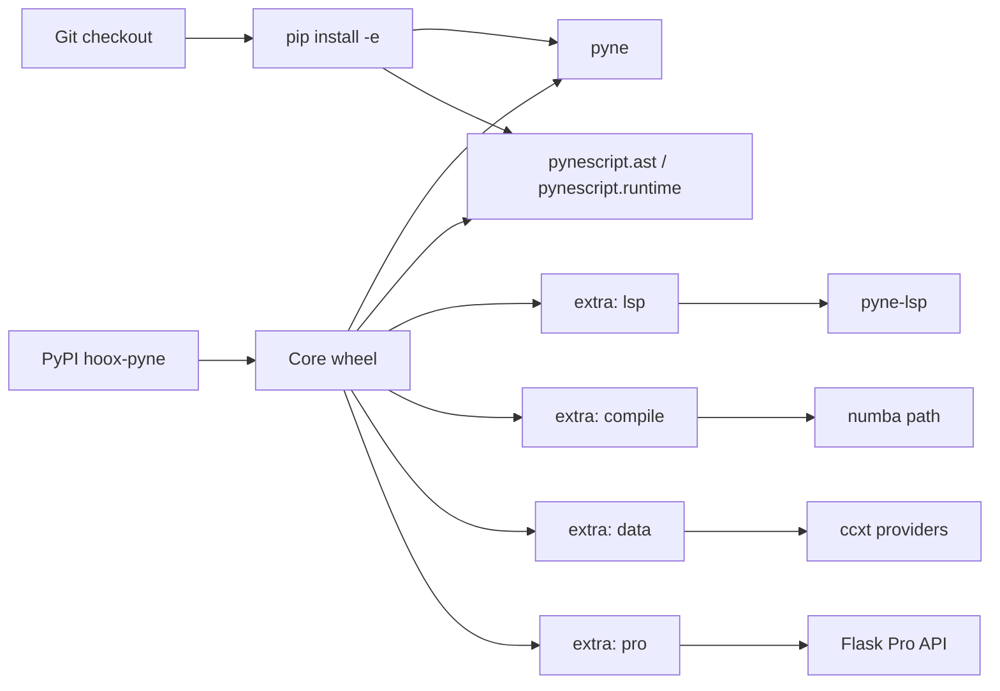

# Copyright (C) 2024-2026 jango_blockchained
#
# This file is part of pynescript.
#
# pynescript is free software: you can redistribute it and/or modify
# it under the terms of the GNU Affero General Public License as published by
# the Free Software Foundation, either version 3 of the License, or
# (at your option) any later version.
#
# pynescript is distributed in the hope that it will be useful,
# but WITHOUT ANY WARRANTY; without even the implied warranty of
# MERCHANTABILITY or FITNESS FOR A PARTICULAR PURPOSE.  See the
# GNU Affero General Public License for more details.
#
# You should have received a copy of the GNU Affero General Public License
# along with pynescript.  If not, see <https://www.gnu.org/licenses/>.
#
# SPDX-License-Identifier: AGPL-3.0-or-later

---
title: "Installation"
description: "Install hoox-pyne from PyPI (live) or a source checkout — CLI, LSP, compile, data, and Pro API extras."
---

# Installation

## Abstract

**PYNE is live on PyPI** as **[`hoox-pyne`](https://pypi.org/project/hoox-pyne/)** (currently **0.3.13+**). The **import package** remains **`pynescript`** (src-layout under `src/pynescript/`). Preferred console scripts are **`pyne`** / **`pyne-lsp`**; legacy **`pynescript`** / **`pynescript-lsp`** remain installed as aliases.

Do **not** install:

- plain **`pyne` / `PyNE`** from PyPI without the `hoox-` prefix — unrelated 0.1.0 process-networking library (our wheel is **`hoox-pyne`**)
- upstream **`pynescript`** ([elbakramer](https://pypi.org/project/pynescript/)) — different project

```bash
pip install hoox-pyne
pip install "hoox-pyne[lsp]"       # language server
pip install "hoox-pyne[compile]"   # Numba compile path
pip install "hoox-pyne[data]"      # ccxt market data
pip install "hoox-pyne[pro]"       # Flask Pro API stack
```

## Conceptual model



| Install flavor | What you get | When |
| --- | --- | --- |
| `pip install hoox-pyne` | CLI + library (`pynescript.runtime` SoT) | Desk use, scripts, CI lint |
| `pip install "hoox-pyne[lsp]"` | + pygls LSP server | Editors |
| `pip install "hoox-pyne[compile]"` | + numpy / numba | `compile` / `prewarm` / `run` Numba modes |
| `pip install "hoox-pyne[data]"` | + ccxt | Exchange data providers |
| `pip install "hoox-pyne[pro]"` | + Flask Pro API stack | Self-hosted `/run` |
| `pip install -e ".[dev-lsp]"` | Editable + LSP test harness | Contributing to LSP |
| Docker CLI image | Full CLI image | CI gates / isolated runs |
| Hatch env | Matrix tests, lint, docs | Full monorepo workflow |

## Interface surface

### Prerequisites

- **Python ≥ 3.10** (classifiers declare 3.10–3.13)
- `pip` or an equivalent installer; virtualenv strongly recommended
- Optional: Docker for the CLI image; Node 22+ only if building the VS Code extension

### Core install (PyPI)

```bash
python3 -m venv .venv
source .venv/bin/activate   # Windows: .venv\Scripts\activate
pip install -U pip
pip install "hoox-pyne[lsp,compile]"
pyne --version
pyne info
```

Project page: [pypi.org/project/hoox-pyne](https://pypi.org/project/hoox-pyne/) · owner account [jango-blockchained](https://pypi.org/user/jango-blockchained/).

### Extras

Defined in `pyproject.toml` under `[project.optional-dependencies]`:

```bash
pip install "hoox-pyne[lsp]"
pip install "hoox-pyne[compile]"
pip install "hoox-pyne[data]"      # alias: datafeed
pip install "hoox-pyne[pro]"
pip install "hoox-pyne[lsp,compile,data]"
```

### Source checkout

```bash
git clone https://github.com/hoox-sh/pyne.git
cd pyne
pip install -e ".[lsp,pro]"
# or:
make install
```

### Docker CLI

```bash
docker pull   # when published to a registry; or build from source:
git clone https://github.com/hoox-sh/pyne.git && cd pyne
make docker-build-cli
docker run --rm -v "$PWD:/work" -w /work pynescript-cli:latest check script.pine
# ≡ make docker-cli ARGS="check script.pine"
```

### Console scripts

| Command | Purpose |
| --- | --- |
| `pyne` | Preferred Click CLI (check, format, lint, compile, prewarm, run, data, info) |
| `pyne-lsp` | Preferred language server (requires `[lsp]`) |
| `pynescript` | Alias of `pyne` (same callable) |
| `pynescript-lsp` | Alias of `pyne-lsp` (same callable) |

```bash
pyne --version
pyne --help
pyne check script.pine
which pyne-lsp   # only after [lsp]
```

Standalone binaries and a CLI image tarball also ship on [GitHub Releases](https://github.com/hoox-sh/pyne/releases).

## Internals (repo paths)

| Path | Role |
| --- | --- |
| `pyproject.toml` | Package metadata (`name = "hoox-pyne"`), extras, scripts |
| `src/pynescript/` | Library + CLI + LSP package tree |
| `src/pynescript/__about__.py` | `__version__` |
| `src/pynescript/__main__.py` | CLI implementation |
| `src/pynescript/runtime/` | Package Runtime SoT (bar-loop host, series, evaluator) |
| `src/pynescript/langserver/__main__.py` | `pyne-lsp` entry |
| `Dockerfile` target `cli` | Ephemeral CLI image |
| `Makefile` | `package`, `docker-build-cli`, `install`, … |
| `CONTRIBUTING.md` | Publish / Hatch workflow |

## Invariants & edge cases

- **PyPI name ≠ import name.** Install **`hoox-pyne`**; `import pynescript`. CLIs: **`pyne`** / **`pyne-lsp`**.
- **License.** AGPL-3.0-or-later. Network use triggers AGPL source-offer obligations (see GNU AGPL §13).
- **LSP is not a CLI subcommand.** Use **`pyne-lsp`** (or `python -m pynescript.langserver`).
- **Pro API.** `pip install "hoox-pyne[pro]"` or monorepo `pip install -r backend/requirements.txt` + `make run` (default `:5002`).
- **Source extensions.** Prefer **`.pyne`** for stack sources; `.pine` / `.pinev5` / `.pinev6` still work.

## Worked examples

### Smoke-test CLI and library

```bash
python - <<'PY'
from pynescript.ast import parse, unparse
from pynescript import __about__
print("version", __about__.__version__)
src = '//@version=6\nindicator("t")\nplot(close)\n'
print(unparse(parse(src)))
PY

pyne check examples/rsi_strategy.pine
pyne lint examples/rsi_strategy.pine
# optional (needs [compile] for Numba):
# pyne prewarm
# pyne run examples/rsi_strategy.pine --bars 50
```

### Monorepo desk + Pro API

```bash
git clone https://github.com/hoox-sh/pyne.git
cd pyne
pip install -e ".[lsp,pro]"
make run   # Flask on :5002
```

## Failure modes

| Failure | Diagnosis | Fix |
| --- | --- | --- |
| `ModuleNotFoundError: pynescript` | Wrong env / not installed | Activate venv; `pip install hoox-pyne` |
| `No module named 'pygls'` | LSP without extra | `pip install "hoox-pyne[lsp]"` |
| `No module named 'numba'` | compile path without extra | `pip install "hoox-pyne[compile]"` |
| `No module named 'ccxt'` | data path without extra | `pip install "hoox-pyne[data]"` |
| Wrong package / missing APIs | Installed upstream `pynescript` or plain `pyne` | `pip uninstall pynescript pyne` then `pip install hoox-pyne` |
| `pyne` / `pynescript` not found | Scripts not on PATH | `python -m pynescript` or fix venv `bin/` |

## See also

- [Quick start](/pyne/docs/enduser/getting-started/quick-start)
- [CLI guide](/pyne/docs/enduser/guides/cli)
- [Editors / LSP](/pyne/docs/enduser/guides/editors)
- [PyPI publish (maintainers)](/pyne/docs/devops/pypi-publish)
- [End User hub](/pyne/docs/enduser)
