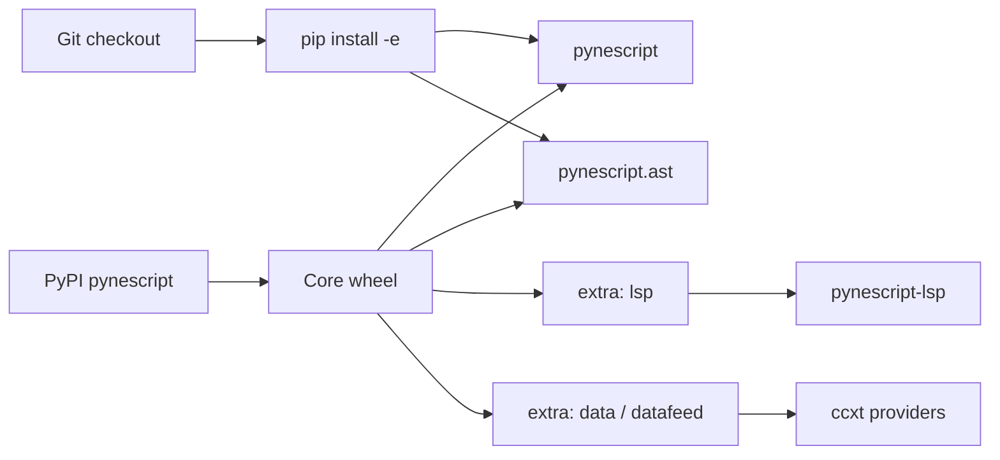

# Copyright (C) 2024-2026 jango_blockchained
#
# This file is part of pynescript.
#
# pynescript is free software: you can redistribute it and/or modify
# it under the terms of the GNU Affero General Public License as published by
# the Free Software Foundation, either version 3 of the License, or
# (at your option) any later version.
#
# pynescript is distributed in the hope that it will be useful,
# but WITHOUT ANY WARRANTY; without even the implied warranty of
# MERCHANTABILITY or FITNESS FOR A PARTICULAR PURPOSE.  See the
# GNU Affero General Public License for more details.
#
# You should have received a copy of the GNU Affero General Public License
# along with pynescript.  If not, see <https://www.gnu.org/licenses/>.
#
# SPDX-License-Identifier: AGPL-3.0-or-later

---
title: "Installation"
description: "Install pynescript from PyPI or a source checkout, select extras for LSP and market data, and verify the CLI and library imports."
---

# Installation

## Abstract

PYNE ships as the Python package **`pynescript`** (src-layout under `src/pynescript/`). The default install gives you the Click CLI (`pynescript`) and the AST library (`parse`, `unparse`, `dump`, `walk`, `literal_eval`, linter). Optional extras add the Language Server (`pynescript-lsp`) and CCXT-backed market data. A Hatch-managed checkout is the supported path for contributors who need tests, grammar tooling, or the Flask Pro API in-tree.

## Conceptual model



| Install flavor | What you get | When |
| --- | --- | --- |
| `pip install pynescript` | CLI + library | Desk use, scripts, CI lint |
| `pip install "pynescript[lsp]"` | + pygls LSP server | Editors |
| `pip install "pynescript[data]"` | + ccxt | Live/historical exchange data |
| `pip install -e ".[dev-lsp]"` | Editable + LSP test harness | Contributing to LSP |
| Hatch env | Matrix tests, lint, docs | Full monorepo workflow |

## Interface surface

### Prerequisites

- **Python ≥ 3.10** (classifiers declare 3.10–3.12; 3.13 may work in CI — {/* TODO: verify */} pin to 3.10+ for production)
- `pip` or an equivalent installer; virtualenv strongly recommended
- For Pro API locally: `flask`, `flask-cors`, `numpy`, `matplotlib` (see `backend/requirements.txt`)
- For VS Code extension build: Node 22+ under `vscode-extension/` (optional)

### Core install (PyPI / local package)

From a release or built wheel:

```bash
pip install pynescript
```

From a cloned monorepo root (non-editable):

```bash
pip install .
```

Editable (preferred for development):

```bash
pip install -e .
# or with Make:
make install
```

### Extras

Defined in `pyproject.toml` under `[project.optional-dependencies]`:

```bash
# Language Server (pygls + lsprotocol)
pip install "pynescript[lsp]"

# CCXT for exchange data / datafeed
pip install "pynescript[data]"
# alias:
pip install "pynescript[datafeed]"

# LSP + pytest-lsp for protocol tests
pip install -e ".[dev-lsp]"
```

Combine extras:

```bash
pip install -e ".[lsp,data]"
```

### Hatch (contributor)

```bash
# Install Hatch if needed, then:
hatch shell
hatch run test:test
hatch run lint:style
```

Make targets used in-repo (see `AGENTS.md`):

```bash
make install         # pip install -e ".[lsp]"
make test            # pytest tests/ -v --tb=short
make lint            # ruff check src/ tests/ backend/
make run             # python -m backend.app
make run-lsp         # python -m pynescript.langserver
make build-check     # fast import check without Nuitka
```

### Console scripts

After install, two entry points should resolve:

| Command | Purpose |
| --- | --- |
| `pynescript` | Click CLI group |
| `pynescript-lsp` | Language server (requires `[lsp]`) |

```bash
pynescript --version
pynescript --help
which pynescript-lsp   # only after [lsp]
```

## Internals (repo paths)

| Path | Role |
| --- | --- |
| `pyproject.toml` | Package metadata, deps, optional extras, scripts |
| `src/pynescript/` | Library + CLI + LSP package tree |
| `src/pynescript/__about__.py` | `__version__` (e.g. `0.2.0`) |
| `src/pynescript/__main__.py` | CLI implementation |
| `src/pynescript/langserver/__main__.py` | `pynescript-lsp` entry |
| `backend/requirements.txt` | Pro API server deps (not in core extras) |
| `Makefile` | Convenience install / test / run targets |
| `CONTRIBUTING.md` | Hatch-based contributor workflow |

Base runtime dependencies (core):

- `antlr4-python3-runtime>=4.13.1`
- `click>=8.1.7`
- `requests`
- `tqdm`

## Invariants & edge cases

- **License.** Package license is **AGPL-3.0-or-later** (`pyproject.toml`). Network use triggers AGPL source-offer obligations (see GNU AGPL §13); consult your counsel for commercial embedding.
- **Src layout.** Imports are `pynescript.*`, not a flat package. Editable install requires hatchling to map `src/`.
- **LSP is not a CLI subcommand of `pynescript` in the current Click group.** README sometimes says `pynescript lsp`; the registered script is **`pynescript-lsp`**. {/* TODO: verify if a `lsp` subcommand was added later */}
- **Pro API is not a pip extra.** Run from monorepo with backend deps, or call a hosted endpoint. Local: `make run` binds `HOST`/`PORT` (default `127.0.0.1:5002`).
- **Anaconda / Nuitka.** Building the onefile LSP binary may need `libpython-static` or `--static-libpython=no` (see build docs). End users rarely need this.
- **Generated artifacts.** Do not hand-edit `src/pynescript/ast/grammar/antlr4/generated/` or ASDL generated modules.

## Worked examples

### Smoke-test CLI and library

```bash
python - <<'PY'
from pynescript.ast import parse, unparse
from pynescript import __about__
print("version", __about__.__version__)
src = '//@version=5\nindicator("t")\nplot(close)\n'
print(unparse(parse(src)))
PY

pynescript parse-and-dump examples/rsi_strategy.pine | head
pynescript lint examples/rsi_strategy.pine
```

### Fresh venv recipe

```bash
python3.12 -m venv .venv
source .venv/bin/activate
pip install -U pip
pip install "pynescript[lsp,data]"
pynescript --version
pynescript-lsp --help 2>/dev/null || true  # server may only speak stdio
```

### Monorepo desk + Pro API

```bash
git clone https://github.com/jango-blockchained/pynescript.git
cd pynescript
pip install -e ".[lsp]"
pip install -r backend/requirements.txt
make run   # Flask on :5002
```

### CI-style install

```bash
pip install .
# or matrix:
# pip install -e ".[dev-lsp]"
pytest tests/test_parse_and_unparse.py -q
```

## Failure modes

| Failure | Diagnosis | Fix |
| --- | --- | --- |
| `ModuleNotFoundError: pynescript` | Wrong env / not installed | Activate venv; reinstall |
| `No module named 'pygls'` | LSP import without extra | `pip install "pynescript[lsp]"` |
| `No module named 'ccxt'` | data CLI/provider path | `pip install "pynescript[data]"` |
| `pynescript` not found | Scripts not on PATH | Use `python -m pynescript` or fix venv `bin/` |
| Import error from editable | Incomplete install / broken path | Re-run `pip install -e .` from repo root |
| Backend `ImportError: flask` | Pro API without backend deps | `pip install -r backend/requirements.txt` |
| ANTLR / grammar mismatch on odd syntax | Older package vs newer scripts | Upgrade package; see [Troubleshooting](/pyne/docs/enduser/guides/troubleshooting) |

## See also

- [Quick start](/pyne/docs/enduser/getting-started/quick-start)
- [Configuration](/pyne/docs/enduser/getting-started/configuration)
- [CLI guide](/pyne/docs/enduser/guides/cli)
- [Editors / LSP](/pyne/docs/enduser/guides/editors)
- [Pro API usage](/pyne/docs/enduser/guides/pro-api-usage)
- [End User hub](/pyne/docs/enduser)
