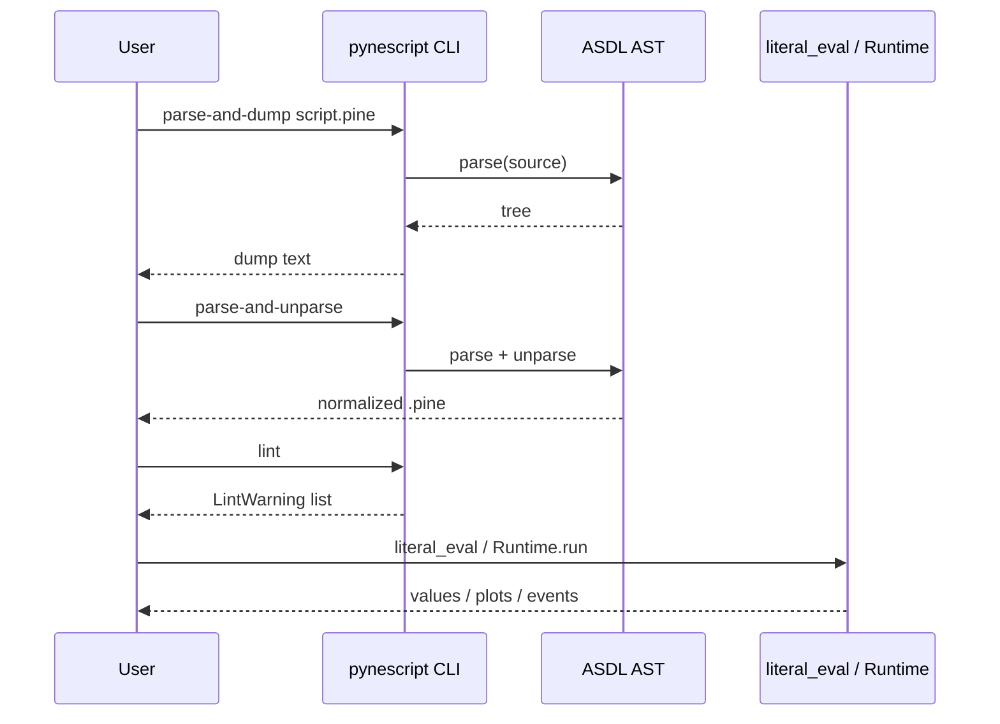

# Copyright (C) 2024-2026 jango_blockchained
#
# This file is part of pynescript.
#
# pynescript is free software: you can redistribute it and/or modify
# it under the terms of the GNU Affero General Public License as published by
# the Free Software Foundation, either version 3 of the License, or
# (at your option) any later version.
#
# pynescript is distributed in the hope that it will be useful,
# but WITHOUT ANY WARRANTY; without even the implied warranty of
# MERCHANTABILITY or FITNESS FOR A PARTICULAR PURPOSE.  See the
# GNU Affero General Public License for more details.
#
# You should have received a copy of the GNU Affero General Public License
# along with pynescript.  If not, see <https://www.gnu.org/licenses/>.
#
# SPDX-License-Identifier: AGPL-3.0-or-later

---
title: "Quick Start"
description: "Parse, dump, unparse, lint, and evaluate Pine Script™ with the pynescript CLI and library in under ten minutes."
---

# Quick Start

## Abstract

This page is a linear path from a working install to the five desk operations most users need: **parse**, **dump**, **unparse**, **lint**, and **evaluate**. Full option trees live in [CLI commands](/pyne/docs/enduser/reference/cli-commands); deeper evaluation semantics live in [Evaluate scripts](/pyne/docs/enduser/guides/evaluate-scripts).

## Conceptual model



## Interface surface

Assumes:

```bash
pip install hoox-pyne
# optional for data:
# pip install "hoox-pyne[data]"
```

Sample script in-tree: `examples/rsi_strategy.pine`.

## Internals (repo paths)

| Step | Implementation |
| --- | --- |
| CLI parse/dump | `src/pynescript/__main__.py` → `parse_and_dump` |
| CLI unparse | `parse_and_unparse` |
| CLI lint | `lint` → `pynescript.ast.linter.lint_script` |
| Library helpers | `src/pynescript/ast/helper.py` |
| Example scripts | `examples/parse_dump_unparse.py`, `examples/evaluate_expressions.py` |

## Invariants & edge cases

- Always declare `//@version=5` or `//@version=6` at the top; the linter warns (`W001`) if missing.
- `parse-and-unparse` is a **formatter via AST**, not a semantic optimizer.
- `literal_eval` is for expressions / built-in calls with optional series context — not a full multi-bar strategy backtester. For bar loops, use `backend.runtime.Runtime` or the Pro API `/run`.
- Filename arguments to the CLI must exist and be readable; lint may also read stdin (`-` or no file).

## Worked examples

### 1. Parse and dump the AST

```bash
pynescript parse-and-dump examples/rsi_strategy.pine
```

Pretty-print with indent and optional file output:

```bash
pynescript parse-and-dump examples/rsi_strategy.pine --indent 2 --output-file /tmp/rsi.ast.txt
```

Library equivalent:

```python
from pynescript.ast import parse, dump

with open("examples/rsi_strategy.pine", encoding="utf-8") as f:
    tree = parse(f.read(), "examples/rsi_strategy.pine")
print(dump(tree, indent=2))
```

### 2. Round-trip unparse (normalize)

```bash
pynescript parse-and-unparse examples/rsi_strategy.pine
pynescript parse-and-unparse messy.pine --output-file clean.pine
```

```python
from pynescript.ast import parse, unparse

source = """
//@version=5
indicator("My RSI")
rsi(close, 14)
"""
print(unparse(parse(source)))
```

Canonical demo: `examples/parse_dump_unparse.py`.

### 3. Lint before upload

```bash
pynescript lint examples/rsi_strategy.pine
pynescript lint --fail-on warnings examples/rsi_strategy.pine
echo '//@version=5\nindicator("x")\nplot(close)' | pynescript lint -
```

Library:

```python
from pynescript.ast.linter import lint_script

issues = lint_script(open("examples/rsi_strategy.pine").read(), "rsi_strategy.pine")
for w in issues:
    print(w)  # severity: [CODE] message at line N
```

### 4. Evaluate expressions

```python
from pynescript.ast.helper import literal_eval

print(literal_eval("1 + 2 * 3"))  # 7
print(literal_eval("math.sqrt(16)"))
prices = [100, 102, 101, 103, 105, 104, 106, 108, 107, 110]
print(literal_eval(f"ta.rsi({prices}, 9)"))

# Series history with context
ctx = {
    "close": [100, 102, 101, 103, 105],
    "open": [99, 101, 100, 102, 104],
}
print(literal_eval("close[0] - close[1]", ctx))
```

Broader demo: `examples/evaluate_expressions.py`.

### 5. Fetch sample market data (CLI)

```bash
# mock provider (no network)
pynescript data AAPL --provider mock

# Yahoo (network)
pynescript data AAPL --provider yahoo --period 6mo --interval 1d

# CCXT (needs pynescript[data])
pynescript data BTC/USDT --provider ccxt --exchange binance
```

### 6. Optional: local Pro API `/run`

```bash
# from monorepo with backend deps
make run
```

```bash
curl -s -X POST http://127.0.0.1:5002/run \
  -H 'Content-Type: application/json' \
  -d '{
    "script": "//@version=5\nindicator(\"t\")\nplot(close)",
    "mode": "auto",
    "data": [
      {"time": 1, "open": 1, "high": 2, "low": 0.5, "close": 1.5, "volume": 100},
      {"time": 2, "open": 1.5, "high": 2.5, "low": 1.0, "close": 2.0, "volume": 120}
    ]
  }' | python -m json.tool
```

Omit `mode` to use the schema default **`auto`** (warm compile when eligible, else interpret). Response may include `series`, `plot_meta`, `events`, `drawings`, and `alerts`. See [Pro API usage](/pyne/docs/enduser/guides/pro-api-usage) for batch mode, webhooks, and prewarm.

Prefer saving stack sources as **`.pyne`** (`.pine` still works).

### 7. Optional: start LSP for editors

```bash
pip install "hoox-pyne[lsp]"
pynescript-lsp   # stdio; normally launched by the editor
```

Wire Neovim / Zed / Emacs using [Editors](/pyne/docs/enduser/guides/editors) and `clients/`.

## Failure modes

| Step fails | Check |
| --- | --- |
| Dump raises `SyntaxError` | Script version / unsupported construct — try a minimal `indicator` + `plot(close)` |
| Unparse output differs cosmetically | Expected; compare semantic structure via dump |
| Lint exits non-zero | `--fail-on` threshold; inspect codes `E001`, `W001`, … |
| `literal_eval` `NotImplementedError` | Expression not in literal/builtin subset; use full Runtime |
| `data` provider error | Network, API key, missing `ccxt` extra |

## See also

- [Installation](/pyne/docs/enduser/getting-started/installation)
- [Configuration](/pyne/docs/enduser/getting-started/configuration)
- [CLI guide](/pyne/docs/enduser/guides/cli)
- [Library API](/pyne/docs/enduser/guides/library-api)
- [Evaluate scripts](/pyne/docs/enduser/guides/evaluate-scripts)
- [CLI command reference](/pyne/docs/enduser/reference/cli-commands)
