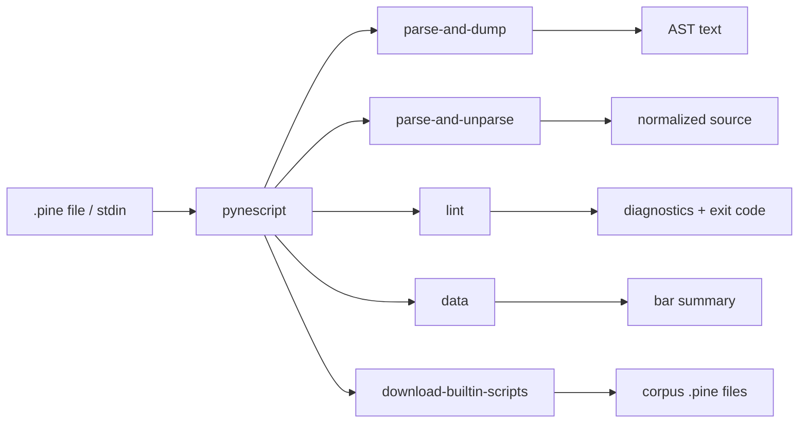

# Copyright (C) 2024-2026 jango_blockchained
#
# This file is part of pynescript.
#
# pynescript is free software: you can redistribute it and/or modify
# it under the terms of the GNU Affero General Public License as published by
# the Free Software Foundation, either version 3 of the License, or
# (at your option) any later version.
#
# pynescript is distributed in the hope that it will be useful,
# but WITHOUT ANY WARRANTY; without even the implied warranty of
# MERCHANTABILITY or FITNESS FOR A PARTICULAR PURPOSE.  See the
# GNU Affero General Public License for more details.
#
# You should have received a copy of the GNU Affero General Public License
# along with pynescript.  If not, see <https://www.gnu.org/licenses/>.
#
# SPDX-License-Identifier: AGPL-3.0-or-later

---
title: "CLI Guide"
description: "Use the pynescript Click CLI to dump ASTs, round-trip format, lint scripts, fetch market data, and download builtin corpora."
---

# CLI Guide

## Abstract

The `pynescript` console script is a thin Click group over the same helpers used by the library API. It is optimized for **shell pipelines, CI gates, and one-shot inspection** — not for multi-bar evaluation (use the library `Runtime` or Pro API for that). This guide covers workflows; exhaustive flags are in [CLI commands](/pyne/docs/enduser/reference/cli-commands).

## Conceptual model



Commands mirror `pynescript.ast.helper` and friends:

| CLI | Library |
| --- | --- |
| `parse-and-dump` | `parse` + `dump` |
| `parse-and-unparse` | `parse` + `unparse` |
| `lint` | `lint_script` |
| `data` | `pynescript.util.data.get_provider` |
| `download-builtin-scripts` | `pynescript.util.pine_facade.download_builtin_scripts` |

## Interface surface

```bash
pynescript --help
pynescript --version
pynescript <command> --help
```

| Command | Input | Output |
| --- | --- | --- |
| `parse-and-dump PATH` | file | AST dump (stdout or `--output-file`) |
| `parse-and-unparse PATH` | file | Pine source |
| `lint [PATH\|-]` | file or stdin | human diagnostics |
| `data SYMBOL` | symbol + provider opts | summary stats |
| `download-builtin-scripts` | `--script-dir` | downloads reference scripts |

**Not** part of this Click group: starting the language server — use `pynescript-lsp`.

## Install options

| Method | When |
| --- | --- |
| `pip install hoox-pyne` | Default desk / CI use |
| `pip install "hoox-pyne[compile]"` | Need Numba `compile` / `run` modes |
| GitHub Release binary `pynescript-cli-*` | No Python install |
| Docker `pynescript-cli` | Isolated CI / one-shot checks |

```bash
# Docker
docker buildx bake cli
docker run --rm -v "$PWD:/work" -w /work pynescript-cli:latest check script.pine

# Compose (repo root)
make docker-cli ARGS="lint script.pine --json"

# Standalone binary (from GitHub Release)
chmod +x pynescript-cli-linux-x86_64
./pynescript-cli-linux-x86_64 info
```

## Internals (repo paths)

| Path | Role |
| --- | --- |
| `src/pynescript/__main__.py` | All command implementations |
| `src/pynescript/ast/helper.py` | `parse`, `dump`, `unparse` |
| `src/pynescript/ast/linter.py` | `lint_script` |
| `src/pynescript/util/data.py` | providers + `DataProviderError` |
| `src/pynescript/util/pine_facade.py` | builtin script download |
| `examples/` | sample `.pine` inputs |

## Invariants & edge cases

- **Encoding default is UTF-8** for file reads/writes.
- **`--output-file -`** means stdout (Click `allow_dash=True`).
- **Lint without a path** reads stdin — useful in git hooks and `cat script.pine | pynescript lint`.
- **`--fail-on`** defaults to `errors` (syntax/`E001`); `warnings` fails on any warning severity too; `all` fails if any issue exists.
- **`data` default provider is `mock`** — offline-safe.
- **Alpha Vantage without key** prints a warning and uses `demo`.
- Download command requires an explicit directory; create parents as needed (implementation writes into the given path).

## Worked examples

### Inspect structure of a strategy

```bash
pynescript parse-and-dump examples/rsi_strategy.pine --indent 2 | less
```

Compare two scripts’ shapes in CI:

```bash
pynescript parse-and-dump a.pine --output-file /tmp/a.ast
pynescript parse-and-dump b.pine --output-file /tmp/b.ast
diff -u /tmp/a.ast /tmp/b.ast
```

### Format / normalize

```bash
pynescript parse-and-unparse messy.pine --output-file clean.pine
# in-place-ish via shell:
pynescript parse-and-unparse strategy.pine --output-file strategy.pine.tmp \
  && mv strategy.pine.tmp strategy.pine
```

### Lint gate in CI

```bash
set -e
pynescript lint strategies/ --help  # note: single file PATH, not directory recursion
# {/* TODO: verify multi-file; current CLI is one file or stdin */}
for f in strategies/*.pine; do
  pynescript lint --fail-on warnings "$f"
done
```

Stdin pipeline:

```bash
git show HEAD:strategies/rsi.pine | pynescript lint --fail-on errors -
```

### Market data smoke checks

```bash
pynescript data AAPL
pynescript data AAPL --provider yahoo --period 1y --interval 1d
pynescript data BTC/USDT --provider ccxt --exchange binance
pynescript data EUR/USD --provider alphavantage --api-key "$AV_KEY"
```

Typical stdout shape (fields from `__main__.py`):

```text
Symbol: AAPL
Bars: N
Date range: N bars
First close: ...
Last close: ...
Volume (avg): ...
```

### Refresh builtin corpus (contributors / offline tests)

```bash
pynescript download-builtin-scripts --script-dir tests/data/builtin_scripts
```

Use sparingly: network + rate limits; CI may cache the corpus.

### Compose with library for evaluation

CLI stops at parse/lint/data. Chain:

```bash
# normalize then evaluate in Python
pynescript parse-and-unparse strat.pine --output-file /tmp/s.pine
python - <<'PY'
from pathlib import Path
from pynescript.ast.helper import parse
# hand off to Runtime or your own visitor
print(parse(Path("/tmp/s.pine").read_text()).__class__.__name__)
PY
```

## Failure modes

| Exit / message | Cause | Mitigation |
| --- | --- | --- |
| Click path errors | missing file | check `PATH` exists and is a file |
| Parse exception during dump | invalid syntax | fix source; use smaller repro |
| `Lint failed with errors.` | `--fail-on` threshold | read `E00x` / `W00x` lines |
| `DataProviderError` → ClickException | network / auth / missing dep | install `[data]`, fix keys |
| Empty dump / unexpected tree | `mode` always exec for CLI | expression-only needs library `mode="eval"` |

## See also

- [CLI commands reference](/pyne/docs/enduser/reference/cli-commands)
- [Library API](/pyne/docs/enduser/guides/library-api)
- [Quick start](/pyne/docs/enduser/getting-started/quick-start)
- [Troubleshooting](/pyne/docs/enduser/guides/troubleshooting)
