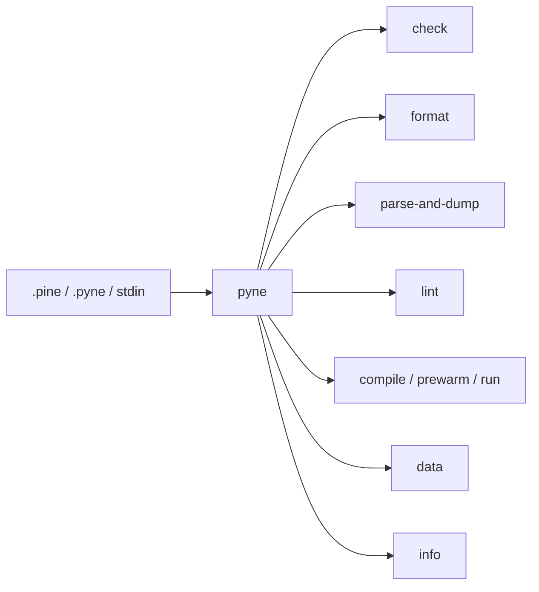

# Copyright (C) 2024-2026 jango_blockchained
#
# This file is part of pynescript.
#
# pynescript is free software: you can redistribute it and/or modify
# it under the terms of the GNU Affero General Public License as published by
# the Free Software Foundation, either version 3 of the License, or
# (at your option) any later version.
#
# pynescript is distributed in the hope that it will be useful,
# but WITHOUT ANY WARRANTY; without even the implied warranty of
# MERCHANTABILITY or FITNESS FOR A PARTICULAR PURPOSE.  See the
# GNU Affero General Public License for more details.
#
# You should have received a copy of the GNU Affero General Public License
# along with pynescript.  If not, see <https://www.gnu.org/licenses/>.
#
# SPDX-License-Identifier: AGPL-3.0-or-later

---
title: "CLI Guide"
description: "Use the pyne Click CLI to check, format, lint, compile, run, prewarm, fetch data, and more."
---

# CLI Guide

## Abstract

The preferred **`pyne`** console script (alias **`pynescript`**) is a Click group over the same helpers used by the library API. Install with **`pip install hoox-pyne`** ([live on PyPI](https://pypi.org/project/hoox-pyne/)). It is optimized for **shell pipelines, CI gates, one-shot inspection, and light compile/run smokes**. Full multi-bar evaluation with real OHLCV belongs on the package `pynescript.runtime.Runtime` or Pro API. Exhaustive flags: [CLI commands](/pyne/docs/enduser/reference/cli-commands).

## Conceptual model



| CLI | Library / subsystem |
| --- | --- |
| `check` | `parse` only (exit codes) |
| `format` / `fmt` | `parse` + `unparse` |
| `parse-and-dump` / `dump` | `parse` + `dump` |
| `lint` | `lint_script` |
| `compile` / `prewarm` / `run` | `pynescript.compiler` (+ `[compile]` extra) |
| `data` | `pynescript.util.data.get_provider` |
| `info` | version + optional extras |

## Interface surface

```bash
pyne --help
pyne --version
pyne <command> --help
# alias: pynescript …
```

| Command | Input | Output |
| --- | --- | --- |
| `check PATHS…` | files / dirs / stdin | ok/fail lines + exit code |
| `format PATH` | file or `-` | formatted source (`-w` / `--check`) |
| `parse-and-dump PATH` | file | AST dump |
| `parse-and-unparse PATH` | file | Pine source |
| `lint [PATH\|-]` | file or stdin | diagnostics (`--json`) |
| `compile PATH` | file | emit Python or compile-check |
| `prewarm [PATH…]` | optional files | warm Numba / IR cache |
| `run PATH` | file | synthetic-bar execute |
| `data SYMBOL` | symbol + provider opts | table / json / csv |
| `info` | — | version + extras |

**Not** part of this Click group: language server — use **`pyne-lsp`** (alias `pynescript-lsp`).

## Install options

| Method | When |
| --- | --- |
| `pip install hoox-pyne` | Default desk / CI use |
| `pip install "hoox-pyne[compile]"` | Need Numba `compile` / `run` modes |
| GitHub Release binary `pynescript-cli-*` | No Python install |
| Docker `pynescript-cli` | Isolated CI / one-shot checks |

```bash
# Docker
docker buildx bake cli
docker run --rm -v "$PWD:/work" -w /work pynescript-cli:latest check script.pine

# Compose (repo root)
make docker-cli ARGS="lint script.pine --json"

# Standalone binary (from GitHub Release)
chmod +x pynescript-cli-linux-x86_64
./pynescript-cli-linux-x86_64 info
```

## Internals (repo paths)

| Path | Role |
| --- | --- |
| `src/pynescript/__main__.py` | All command implementations |
| `src/pynescript/ast/helper.py` | `parse`, `dump`, `unparse` |
| `src/pynescript/ast/linter.py` | `lint_script` |
| `src/pynescript/compiler/` | `compile` / `prewarm` / `run` |
| `src/pynescript/util/data.py` | providers + `DataProviderError` |
| `examples/` | sample `.pine` inputs |
| `tests/test_cli.py` | CLI unit suite (CI) |

## Invariants & edge cases

- **Encoding default is UTF-8** for file reads/writes.
- **`--output-file -`** means stdout (Click `allow_dash=True`).
- **Lint without a path** reads stdin — useful in git hooks and `cat script.pine | pyne lint`.
- **`--fail-on`** defaults to `errors` (syntax/`E001`); `warnings` fails on any warning severity too; `all` fails if any issue exists.
- **`data` default provider is `mock`** — offline-safe.
- **Alpha Vantage without key** prints a warning and uses `demo`.
- **`lint` is one file or stdin** — no directory walk. Use `check` for recursive parse-only (`--ext`).
- **`run` is compile-only** on synthetic bars (`--bars` default 50). It does not call `Runtime.run` and has no `--mode`.

## Worked examples

### Inspect structure of a strategy

```bash
pyne parse-and-dump examples/rsi_strategy.pine --indent 2 | less
```

Compare two scripts’ shapes in CI:

```bash
pyne parse-and-dump a.pine --output-file /tmp/a.ast
pyne parse-and-dump b.pine --output-file /tmp/b.ast
diff -u /tmp/a.ast /tmp/b.ast
```

### Format / normalize

```bash
pyne format messy.pine -w
pyne format strategy.pine --check    # CI drift gate (exit 1 if would change)
pyne parse-and-unparse messy.pine --output-file clean.pine
```

### Lint gate in CI

```bash
set -e
# lint is one file or stdin — not a directory walk
for f in strategies/*.pine strategies/*.pyne; do
  pyne lint --fail-on warnings "$f"
done
# parse-only gate over a tree:
pyne check strategies/ --ext .pine
```

Stdin pipeline:

```bash
git show HEAD:strategies/rsi.pine | pyne lint --fail-on errors -
```

### Market data smoke checks

```bash
pyne data AAPL
pyne data AAPL --provider yahoo --period 1y --interval 1d
pyne data BTC/USDT --provider ccxt --exchange binance
pyne data EUR/USD --provider alphavantage --api-key "$AV_KEY"
```

Typical table keys (from `__main__.py`): `symbol`, `provider`, `bars`, `period / interval`, `first close`, `last close`, `change`, `high / low`, `avg volume`. `--format json` emits full OHLCV lists.

### Compile, prewarm, synthetic run

```bash
pip install "hoox-pyne[compile]"
pyne compile script.pine              # compile-check (Numba or object-mode)
pyne compile script.pine --emit       # print generated Python
pyne prewarm                          # warm shared Numba kernels
pyne prewarm script.pine              # also compile that source into IR caches
pyne run script.pine --bars 100       # compile-only execute on synthetic OHLCV
```

### Compose with library for evaluation

`pyne run` is compile-only smoke. Real bars + `mode` / `libraries` / `timeout_seconds` belong on the package Runtime:

```bash
pyne format strat.pine -o /tmp/s.pine
python - <<'PY'
from pathlib import Path
from pynescript.runtime import Runtime
# hand off to Runtime or your own visitor
print(Path("/tmp/s.pine").read_text()[:40])
PY
```

## Failure modes

| Exit / message | Cause | Mitigation |
| --- | --- | --- |
| Click path errors | missing file | check `PATH` exists and is a file |
| Parse exception during dump | invalid syntax | fix source; use smaller repro |
| `Lint failed with errors.` | `--fail-on` threshold | read `E00x` / `W00x` lines |
| `DataProviderError` → ClickException | network / auth / missing dep | install `[data]`, fix keys |
| Empty dump / unexpected tree | `mode` always exec for CLI | expression-only needs library `mode="eval"` |

## See also

- [CLI commands reference](/pyne/docs/enduser/reference/cli-commands)
- [Runtime modes](/pyne/docs/enduser/reference/modes)
- [Library API](/pyne/docs/enduser/guides/library-api)
- [Quick start](/pyne/docs/enduser/getting-started/quick-start)
- [Troubleshooting](/pyne/docs/enduser/guides/troubleshooting)
