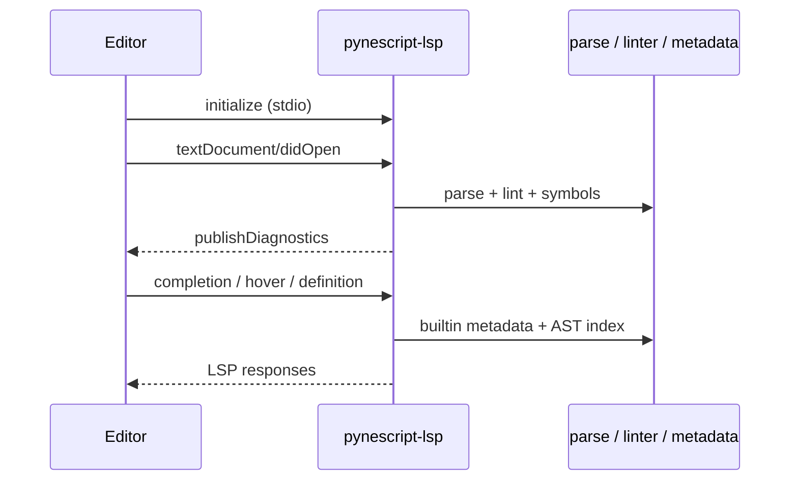

# Editors & LSP

## Abstract

`pynescript-lsp` is a **stdio Language Server** (pygls) over the same parse/lint/metadata stack as the desk tools. Editors do not reimplement Pine intelligence; they speak LSP. This guide covers install, client configs in `clients/`, and feature expectations. Server architecture is documented under [LSP](/pyne/docs/lsp).

## Conceptual model



| Feature | Role |
| --- | --- |
| Diagnostics | Lint rules + parse errors as squiggles |
| Completion | Builtins (`ta.*`, `strategy.*`, …) + snippets |
| Hover | Signature / docs from metadata |
| Definition / references | Symbol index in document |
| Document symbols | Outline / breadcrumb |
| Formatting | Full document + range via unparser path |

Builtin metadata is generated (`scripts/generate_builtin_metadata.py`); encrypted blobs may appear in release builds.

## Interface surface

### Install server

```bash
pip install "pynescript[lsp]"
# monorepo:
pip install -e ".[lsp]"
# or: make install

command -v pynescript-lsp
python -m pynescript.langserver  # equivalent entry
```

The process speaks **LSP over stdio** by default (`PynescriptLanguageServer.start_io()`). Do not expect a useful interactive TTY UI.

### VS Code / Cursor / Antigravity

1. Build or install the extension from `vscode-extension/`:

```bash
cd vscode-extension
npm ci
npm run compile
# package: npx vsce package  (or make build-vscode)
```

2. Open a `.pine` / `.pinev5` / `.pinev6` file — LSP activates when enabled.

Settings:

| Key | Default | Notes |
| --- | --- | --- |
| `pynescript.lsp.enabled` | `true` | Master switch |
| `pynescript.lsp.command` | `pynescript-lsp` | Absolute path if not on PATH |
| `pynescript.formatting.enabled` | `true` | |
| `pynescript.diagnostics.enabled` | `true` | |
| `pynescript.completion.snippets` | `true` | |

Marketplace availability may lag git — {/* TODO: verify marketplace ID */}.

### Neovim (nvim-lspconfig)

```lua
require("lspconfig").pynescript.setup({})
```

Manual config from `clients/neovim.lua`:

```lua
return {
  cmd = { "pynescript-lsp" },
  filetypes = { "pinescript" },
  root_dir = function(fname)
    return vim.fs.root(fname, { ".git", "*.pine", "*.pinev5", "*.pinev6", "pyproject.toml" })
      or vim.fn.getcwd()
  end,
  settings = {
    pinescript = {
      formatting = { enabled = true },
      diagnostics = { enabled = true },
      completion = { snippets = true },
    },
  },
}
```

Suggested maps: `gd` definition, `gr` references, `K` hover, format via `vim.lsp.buf.format`.

Ensure filetype detection maps `*.pine` → `pinescript` if your distro does not ship it.

### Zed

Merge `clients/zed.json` or:

```json
{
  "languages": {
    "Pine Script": {
      "language_servers": ["pynescript"]
    }
  },
  "language_servers": {
    "pynescript": {
      "command": "pynescript-lsp",
      "arguments": ["--stdio"]
    }
  }
}
```

### Emacs (lsp-mode)

```elisp
(use-package lsp-mode
  :hook ((pinescript-mode . lsp))
  :config
  (lsp-register-client
   (make-lsp-client
    :new-connection (lsp-stdio-connection '("pynescript-lsp" "--stdio"))
    :major-modes '(pinescript-mode)
    :server-id 'pynescript)))
```

Or `(load-file "clients/emacs.el")` from a checkout.

### Helix

`~/.config/helix/languages.toml`:

```toml
[[language]]
name = "pinescript"
scope = "source.pinescript"
file-types = ["pine", "pinev5", "pinev6"]
roots = ["pyproject.toml"]
command = "pynescript-lsp"
args = ["--stdio"]
```

### Sublime Text (LSP package)

```json
{
  "clients": {
    "pynescript": {
      "command": ["pynescript-lsp", "--stdio"],
      "selector": "source.pinescript",
      "initializationOptions": {}
    }
  }
}
```

### Generic

Any LSP client:

```text
Command: pynescript-lsp
Args:    (none or --stdio depending on client)
Transport: stdio
```

## Internals (repo paths)

| Path | Role |
| --- | --- |
| `src/pynescript/langserver/__main__.py` | CLI entry `main()` |
| `src/pynescript/langserver/server.py` | `PynescriptLanguageServer` |
| `src/pynescript/langserver/features/` | diagnostics, completion, hover, … |
| `clients/README.md` | Canonical client matrix |
| `clients/neovim.lua`, `zed.json`, `emacs.el` | Drop-in snippets |
| `vscode-extension/` | VS Code extension |
| `scripts/generate_builtin_metadata.py` | Completion/hover corpus |

## Invariants & edge cases

- **Python 3.10+** required on the machine running the server.
- **Server must be on PATH** or configured with absolute command.
- **One server per workspace** is typical; large monorepos with many `.pine` files still parse on demand.
- **Formatting** uses the unparser pipeline — expect normalization, not clang-format style knobs.
- **Diagnostics** reuse linter codes (`E001`, `W001`, …); severity maps to LSP DiagnosticSeverity.
- **Nuitka binary** (`dist/lsp/pynescript-lsp`) may replace the Python entry in packaged distributions — point the editor at that binary if you ship it.

## Worked examples

### Verify server starts (stdio smoke)

```bash
# Editors start this; manual smoke is limited.
python -c "from pynescript.langserver.server import PynescriptLanguageServer; print(PynescriptLanguageServer)"
```

### Neovim minimal `init.lua` fragment

```lua
vim.api.nvim_create_autocmd("FileType", {
  pattern = "pinescript",
  callback = function()
    vim.lsp.start({
      name = "pynescript",
      cmd = { "pynescript-lsp" },
      root_dir = vim.fn.getcwd(),
    })
  end,
})
```

### Force a specific venv binary in VS Code

```json
{
  "pynescript.lsp.command": "/home/you/project/.venv/bin/pynescript-lsp"
}
```

## Failure modes

| Symptom | Fix |
| --- | --- |
| Client: executable not found | Install `[lsp]`; fix PATH / command setting |
| `No module named pygls` | Reinstall extra in the same env as the command |
| No diagnostics | Enable diagnostics; confirm filetype; check server logs |
| Stale completions | Regenerate metadata in dev builds; restart server |
| Format does nothing | Enable formatting; ensure document is valid enough to parse |
| High CPU on huge files | Split libraries; wait for parse; check for pathological nesting |

## See also

- [Installation](/pyne/docs/enduser/getting-started/installation)
- [LSP architecture](/pyne/docs/lsp/architecture)
- [VS Code extension](/pyne/docs/lsp/vscode-extension)
- [LSP clients (systems)](/pyne/docs/lsp/clients)
- [Troubleshooting](/pyne/docs/enduser/guides/troubleshooting)
