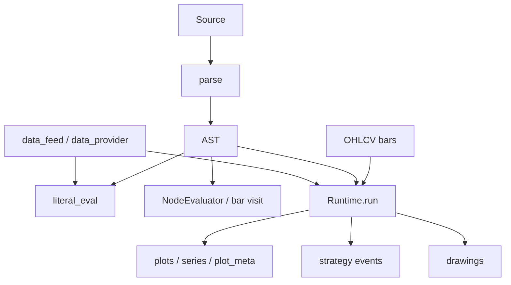

# Copyright (C) 2024-2026 jango_blockchained
#
# This file is part of pynescript.
#
# pynescript is free software: you can redistribute it and/or modify
# it under the terms of the GNU Affero General Public License as published by
# the Free Software Foundation, either version 3 of the License, or
# (at your option) any later version.
#
# pynescript is distributed in the hope that it will be useful,
# but WITHOUT ANY WARRANTY; without even the implied warranty of
# MERCHANTABILITY or FITNESS FOR A PARTICULAR PURPOSE.  See the
# GNU Affero General Public License for more details.
#
# You should have received a copy of the GNU Affero General Public License
# along with pynescript.  If not, see <https://www.gnu.org/licenses/>.
#
# SPDX-License-Identifier: AGPL-3.0-or-later

---
title: "Evaluate Scripts"
description: "Run Pine expressions and multi-bar scripts with literal_eval, the AST evaluator, backend Runtime, data providers, and strategy events."
---

# Evaluate Scripts

## Abstract

Evaluation is the second half of the PYNE pipeline: given an AST (or source) and **market context**, produce plots, series, strategy events, and drawings. End users typically choose among three graded tools:

1. **`literal_eval`** — pure/builtin expressions, optional series context  
2. **AST evaluator** (`NodeLiteralEvaluator` / full evaluator mixins) — script-shaped evaluation in-process  
3. **`pynescript.runtime.Runtime`** (package SoT; `backend.runtime` re-exports) or **Pro API `POST /run`** — bar-loop over OHLCV with shared evaluate contract. TypeScript: **`@hoox-sh/pynets` `Runtime.run`** — [PyneTS](/pyne/docs/pynets). Defaults differ by surface — [modes](/pyne/docs/enduser/reference/modes).  

This guide stays at the consumer level; series semantics and builtin inventories are under [Runtime](/pyne/docs/runtime).

## Conceptual model



| Mode | Bar loop | Strategy | Typical use |
| --- | --- | --- | --- |
| `literal_eval` | no (single shot) | limited | TA on arrays, math, strings |
| Evaluator in tests / tools | optional | yes via state | Unit tests, notebooks |
| `Runtime.run` / `/run` | yes | yes | Charts, AXIS, backtests |
| `mode="compile"` | yes (numeric + object) | yes (object mode) | Faster bar loop when eligible |
| `mode="auto"` | yes | yes | Prefer compile; fall back to interpret |

## Runtime modes (`interpret` | `compile` | `auto`)

`pynescript.runtime.Runtime.run` accepts a `mode` argument that selects how the bar loop executes:

| Mode | Behavior |
| --- | --- |
| `interpret` | AST walker (full host semantics: `input.*` overrides, `request.*`, libraries, profiler). |
| `compile` | Transpile to a Numba numeric kernel when possible, otherwise a pure-Python **object-mode** bar loop. Requires the compiler package. |
| `auto` | Try compile first; on eligibility failure, compile error, or compiled runtime error, **fall back to interpret**. |

**Defaults differ by surface:**

- Direct `Runtime.run(..., mode=None)` → `PYNE_RUNTIME_MODE` env, else **`interpret`**.
- Pro API `POST /run` body omit `mode` → schema default **`auto`** (warm compile + fallback).

```python
from pynescript.runtime import Runtime

runtime = Runtime(symbol="AAPL")
result = runtime.run(source, ohlcv_data=ohlcv, mode="auto")
# result["mode"] / result.get("auto_backend") → "compile" | "interpret"
# on fallback: result.get("compile_fallback_reason")
# optional wall-clock budget (0.3.6+):
# result = runtime.run(..., timeout_seconds=12.0)
# → may set timed_out + error_kind="runtime" with partial plots
# optional published libs (0.3.7+; export finalize 0.3.8):
# result = runtime.run(..., libraries=[{"namespace":"ns","name":"Lib","version":1,"source": lib_src}])
```

### Warm compile / prewarm

Product hosts cache compiled IR (in-process LRU + optional disk under `PYNE_COMPILE_CACHE_DIR`). Pro API defaults `mode=auto` and can warm Numba builtins once per worker (`PYNE_COMPILE_PREWARM`, `POST /compile/prewarm`, or `pyne prewarm` when the CLI subcommand is present). First-hit latency still pays JIT when cold; subsequent runs of the same source reuse IR. See [Compiler overview](/pyne/docs/runtime/compiler/overview).

Related host knobs (interpret path): `PYNE_SERIES_CAP` / `PYNE_SERIES_MAX` (history trim) and `PYNE_TA_INCREMENTAL` (bar-mode TA hot path)—see [Series & history](/pyne/docs/runtime/series-and-history) and [Configuration](/pyne/docs/enduser/getting-started/configuration).

### When compile falls back (or is skipped)

`mode="auto"` (and explicit prefilters) skip or abandon compile for stable reasons. Common `compile_fallback_reason` values:

| Reason (examples) | Why |
| --- | --- |
| `input.* overrides require interpret path` | Non-empty `inputs=` are interpret-only; compile does not apply overrides. |
| `import statements not supported in compile path` | Library `import` needs the interpreter registry. |
| `request.* not supported in compile path` | Multi-symbol / external data plumbing is interpret-only. |
| `compiler package unavailable` | `pynescript.compiler` not importable in this install. |
| `Compile Error: …` / Numba required messages | Deterministic transpile/env failures (cached per source for auto). |
| Compiled runtime errors | Data-dependent failures still fall back once; not permanently cached as “never compile.” |

Other force-interpret paths:

- **`profiler=True`** — line timings need the AST walker; compile/auto are coerced to interpret.
- **`mode="compile"`** (strict) — does **not** fall back; you get an error payload instead of a silent interpret run.

Numba is **not** required for compile eligibility: strategy / UDT / map-heavy scripts can still run in object-mode compile. Missing Numba only blocks pure-numeric emit.

### Plot series parity

Both backends export the same Runtime contract shape: `series` (title → per-bar values), `plots`, `plot_meta`, `events`, `drawings`, plus `mode` / diagnostics. For charting, **shared plot series keys** should agree within floating-point tolerance (`na`/None/NaN treated as NA).

Known structural residuals (not value bugs):

- **Constant `hline`-like keys** sometimes appear on one side only.
- **Background / fill / bgcolor** series titles may differ in presence between interpret and object-mode compile.

Use the parity harness (below) with `--ignore-hline-keys` / `--ignore-fill-keys` when you care about value parity of real plots, not decorative fill keys. Deeper compiler notes: [Compiler overview](/pyne/docs/runtime/compiler/overview).

### Compare interpret vs compile (corpus harness)

From the repo root (monorepo with `backend/` + editable `pynescript`):

```bash
# Smoke: first 50 corpus scripts × 1000 synthetic bars
python scripts/compare_interp_compile.py --bars 1000 --limit 50

# Full list from a file, no script limit, 4 workers, 30s per script;
# ignore one-sided hline/fill keys when judging value parity
python scripts/compare_interp_compile.py --file-list path.txt --limit 0 --workers 4 --timeout-sec 30 --ignore-hline-keys --ignore-fill-keys
```

The harness runs each script with `mode="interpret"` and `mode="compile"`, then nan-aware `allclose` on common `result["series"]` keys (`rtol=1e-5`, `atol=1e-6`). Report: `.cache/interp_compile_parity.json`. Exit 0 when there are no value/NaN mismatches on shared keys (`both_error_same` counts as success unless `--strict-errors`).

## Interface surface

### Expression evaluation

```python
from pynescript.ast.helper import literal_eval

literal_eval("1 + 2 * 3")
literal_eval("math.max(1, 5, 3)")
literal_eval('str.upper("hi")')
literal_eval("array.size([1, 2, 3])")

prices = [100, 102, 101, 103, 105, 104, 106, 108, 107, 110]
literal_eval(f"ta.sma({prices}, 5)")
literal_eval(f"ta.rsi({prices}, 9)")
bb = literal_eval(f"ta.bb({prices}, 5, 2)")  # middle, upper, lower
```

Series history context (Pine-style `[0]` current / `[1]` previous as implemented):

```python
context = {
    "close": [100, 102, 101, 103, 105],
    "open": [99, 101, 100, 102, 104],
    "high": [101, 103, 102, 104, 106],
    "low": [98, 100, 99, 101, 103],
}
literal_eval("close[0]", context)
literal_eval("close[0] - close[1]", context)
```

Optional live/historical wiring:

```python
literal_eval(expr, context, data_feed=feed, data_provider=provider)
```

### Script evaluation helper

```python
from pynescript.ast.evaluator import NodeLiteralEvaluator

ev = NodeLiteralEvaluator()
result = ev.evaluate_script(
    """
//@version=6
indicator("demo")
// body depends on what the evaluator implements for statements
"""
)
```

Libraries:

```python
ev.register_library_source(namespace="MyNs", name="Lib", version=1, source=lib_source)
mod = ev.lookup_library(namespace="MyNs", name="Lib", version=1)
```

### Bar-loop Runtime (package SoT · HTTP contract shape)

From **0.3.4** the bar-loop host lives in the installable package:

```python
from pynescript.runtime import Runtime  # SoT (backend.runtime re-exports for Pro API)

runtime = Runtime(symbol="AAPL")
ohlcv = [
    {"time": 1_700_000_000, "open": 100, "high": 101, "low": 99, "close": 100.5, "volume": 1_000},
    {"time": 1_700_086_400, "open": 100.5, "high": 102, "low": 100, "close": 101.5, "volume": 1_200},
]
result = runtime.run(
    source_code='//@version=6\nindicator("t")\nplot(close)\n',
    ohlcv_data=ohlcv,
    mode="auto",  # interpret | compile | auto (see Runtime modes)
    # timeout_seconds=12.0,  # optional wall-clock circuit breaker (interpret path)
)
# result: plots, series, plot_meta, events, drawings, script_id, run_id, count, ...
# auto may set auto_backend + compile_fallback_reason
# or {"error": "...", "error_kind": "parse|compile|runtime|data|order|mode", ...}
```

`backend.runtime.Runtime` remains a thin compat import for monorepo Pro API code. Dual-host TA goldens (ATR / Supertrend / Keltner) and `tests/test_ta_incremental` gate interpret↔compile numerical parity. Pro API wraps the same runtime — see [Pro API usage](/pyne/docs/enduser/guides/pro-api-usage).

### Data providers and feeds

Historical CLI/library:

```python
from pynescript.util.data import get_provider

prov = get_provider("mock")
# or yahoo / alphavantage / ccxt with kwargs
bars = prov.fetch("AAPL", "6mo", "1d")
# bars: dict with close/open/... lists
```

Realtime (requires ccxt / pro):

```python
# examples/realtime_datafeed.py
from pynescript.util.datafeed import get_datafeed

feed = get_datafeed("ccxtpro", exchange="binance")
# async with feed: async for candle in feed.watch_ohlcv("BTC/USDT", "1m"): ...
```

### Educational bar executor

`examples/execute_script.py` implements a **teaching** RSI strategy executor with a custom visitor and pandas history (`examples/historical_data.py` / yfinance). It is not the production `Runtime`, but demonstrates bar iteration patterns.

## Internals (repo paths)

| Path | Role |
| --- | --- |
| `src/pynescript/ast/helper.py` | `literal_eval` |
| `src/pynescript/ast/evaluator/base.py` | Context, series, visitor base |
| `src/pynescript/ast/evaluator/__init__.py` | `NodeLiteralEvaluator` composition |
| `src/pynescript/ast/evaluator/builtins/` | `ta.*`, `strategy.*`, arrays, … |
| `src/pynescript/ast/evaluator/events.py` | Event emission hooks |
| `src/pynescript/runtime/host.py` | Multi-bar `Runtime.run` SoT (`interpret` / `compile` / `auto`, `timeout_seconds`) |
| `src/pynescript/runtime/series.py` | `PineSeries` history model |
| `backend/runtime.py` / `backend/series.py` | Compat re-exports of package Runtime |
| `src/pynescript/compiler/` | Transpile + Numba/object bar loops |
| `src/pynescript/util/data.py` | Providers + `resolve_request_sources` |
| `src/pynescript/util/datafeed.py` | Realtime feeds |
| `scripts/compare_interp_compile.py` | Interpret vs compile series parity harness |
| `tests/test_interp_compile_parity.py` | Always-on smoke + optional full mark |
| `examples/evaluate_expressions.py` | Expression gallery |
| `examples/execute_script.py` | Didactic strategy loop |
| `examples/rsi_strategy.pine` | Sample strategy source |

## Invariants & edge cases

- **Determinism.** Same source + same OHLCV + same mode should yield reproducible series (mock providers seedable via options where supported).
- **`na` / warmup.** TA functions need enough bars; early bars may be `na`/None-like — guard like Pine (`not na(x)`).
- **`mode="compile"`** uses numeric Numba when the script is pure-numeric; otherwise **object-mode** compile. Strict `compile` errors instead of falling back; use **`auto`** for production “prefer fast path” behavior (see [Runtime modes](#runtime-modes-interpret--compile--auto)).
- **`mode="auto"`** may set `compile_fallback_reason` and still return a successful interpret result — check `auto_backend` if you need to know which path ran.
- **Series parity.** Shared `series` keys should match within harness tolerances; hline/fill keys can be one-sided — not necessarily a value bug.
- **History indexing.** Confirm `[0]`/`[1]` semantics against your evaluator version before porting TV scripts that assume closed-bar rules.
- **Strategy events** include run/script ids when stamped by Runtime — useful for HOOX downstream.
- **Body size / bar count.** HTTP path caps payload size (5 MiB); very long histories should be downsampled or chunked.

## Worked examples

### RSI on a synthetic series

```python
from pynescript.ast.helper import literal_eval

closes = [float(x) for x in range(100, 130)]
print(literal_eval(f"ta.rsi({closes}, 14)"))
```

### Multi-indicator expressions

```python
highs = [c + 1 for c in closes]
lows = [c - 1 for c in closes]
macd, signal, hist = literal_eval(f"ta.macd({closes}, 12, 26, 9)")
atr = literal_eval(f"ta.atr({highs}, {lows}, {closes}, 14)")
```

### Full script via Runtime (monorepo)

```python
from pathlib import Path
from backend.runtime import Runtime

script = Path("examples/rsi_strategy.pine").read_text(encoding="utf-8")
# Build ohlcv list from your provider...
rt = Runtime(symbol="EXAMPLE")
out = rt.run(script, ohlcv_data=ohlcv, mode="interpret")
if "error" in out:
    raise RuntimeError(out["error"])
print(out.get("count"), len(out.get("events", [])), out.get("series", {}).keys())
```

### Strategy event inspection

```python
for ev in out.get("events", []):
    # shape depends on StrategyState / event schema
    print(ev)
```

### request.* with resolved sources

When calling `/run` or Runtime, pass `data_source` / providers so `request.security` and friends resolve; without configuration they may use chart bars or mocks.

## Failure modes

| Symptom | Interpretation |
| --- | --- |
| `NotImplementedError` / incomplete builtin | Expression outside supported surface — check [missing features](/pyne/docs/reference/missing-features) |
| `{"error": "Parse Error: ..."}` | Runtime caught parse failure |
| `{"error": …}` with `mode="compile"` | Strict compile path failed — retry with `auto` or `interpret`, or fix unsupported construct |
| `compile_fallback_reason` set under `auto` | Compile skipped/failed; result is from interpret if no top-level `error` |
| `EXECUTION_ERROR` via HTTP | Exception during bar loop |
| Empty plots | No `plot`/`plotshape` executed; wrong declaration type |
| Numerical mismatch vs TV | Warmup, float path, or builtin parity gap — [numerical validation](/pyne/docs/reference/numerical-validation) |
| Interpret vs compile series MISMATCH | Run `scripts/compare_interp_compile.py` on the script; check report buckets |
| `DataProviderError` | Provider misconfig |
| Async feed errors | Missing ccxt.pro / network |

## See also

- [Pro API usage](/pyne/docs/enduser/guides/pro-api-usage)
- [Library API](/pyne/docs/enduser/guides/library-api)
- [Runtime series model](/pyne/docs/runtime/series-and-history)
- [Compiler overview](/pyne/docs/runtime/compiler/overview)
- [Strategy builtins](/pyne/docs/runtime/builtins/strategy)
- [Evaluate contract](/pyne/docs/api/contract)
- [AXIS](/axis/docs) — visualizing series
- [HOOX](/docs) — consuming strategy events on the edge
