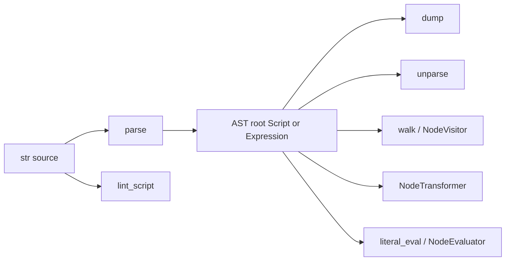

# Copyright (C) 2024-2026 jango_blockchained
#
# This file is part of pynescript.
#
# pynescript is free software: you can redistribute it and/or modify
# it under the terms of the GNU Affero General Public License as published by
# the Free Software Foundation, either version 3 of the License, or
# (at your option) any later version.
#
# pynescript is distributed in the hope that it will be useful,
# but WITHOUT ANY WARRANTY; without even the implied warranty of
# MERCHANTABILITY or FITNESS FOR A PARTICULAR PURPOSE.  See the
# GNU Affero General Public License for more details.
#
# You should have received a copy of the GNU Affero General Public License
# along with pynescript.  If not, see <https://www.gnu.org/licenses/>.
#
# SPDX-License-Identifier: AGPL-3.0-or-later

---
title: "Library API"
description: "Embed pynescript: parse, dump, unparse, walk, transform, and lint Pine Script™ from Python."
---

# Library API

## Abstract

The public Python surface for language work lives primarily under **`pynescript.ast`**: parse source into an ASDL-backed tree, serialize it (`dump`), regenerate source (`unparse`), traverse (`walk`, visitors), rewrite (`NodeTransformer`), and lint (`lint_script`). Expression evaluation (`literal_eval`) and full script execution (evaluator / `Runtime`) sit adjacent; this page focuses on **structural** APIs. Evaluation workflows are covered in [Evaluate scripts](/pyne/docs/enduser/guides/evaluate-scripts).

## Conceptual model



Design intent mirrors Python’s `ast` module: **stable tree operations**, location attributes, and visitor protocols — specialized for Pine’s script model (annotations, series-aware semantics live at evaluation time).

## Interface surface

### Imports

```python
# Re-exported convenience (node classes, helpers, visitors, transformers)
from pynescript.ast import parse, unparse, dump, walk
from pynescript.ast import NodeVisitor, NodeTransformer
from pynescript.ast.helper import literal_eval, iter_child_nodes, get_source_segment
from pynescript.ast.linter import lint_script, lint_file, PineLinter, LintWarning
```

`pynescript.ast.__init__` star-imports `helper`, `node`, `visitor`, `transformer`, and `error`.

### `parse(source, filename="<unknown>", mode="exec") -> AST`

| Arg | Meaning |
| --- | --- |
| `source` | Full script or expression text |
| `filename` | Error reporting; absolutized if file exists |
| `mode` | `"exec"` → script statements; `"eval"` → single expression |

Raises `ValueError` on bad mode; `SyntaxError` (via error listener) on grammar failure.

```python
tree = parse('//@version=5\nindicator("x")\nplot(close)\n')
expr = parse("close > open", mode="eval")
```

### `unparse(node) -> str`

Round-trips an AST through `NodeUnparser`.

```python
normalized = unparse(parse(messy_source))
```

### `dump(node, *, annotate_fields=True, include_attributes=False, indent=None) -> str`

Human-readable tree serialization (debug, tests, CLI).

```python
print(dump(tree, indent=2, include_attributes=True))
```

### `walk(node) -> Iterator[AST]`

Breadth-first (deque) traversal yielding every node.

```python
from pynescript.ast import walk
names = [n for n in walk(tree) if n.__class__.__name__ == "Name"]
```

### Location helpers

| Function | Role |
| --- | --- |
| `copy_location(new, old)` | Copy lineno/col offsets |
| `fix_missing_locations(node)` | Fill missing positions |
| `increment_lineno(node, n=1)` | Shift lines |
| `get_source_segment(source, node, *, padded=False)` | Slice original text |
| `iter_fields` / `iter_child_nodes` | Schema-aware iteration |

### Visitors and transformers

```python
from pynescript.ast import NodeVisitor, NodeTransformer, parse

class CallCounter(NodeVisitor):
    def __init__(self):
        self.calls = 0
    def visit_Call(self, node):
        self.calls += 1
        self.generic_visit(node)

class RenameClose(NodeTransformer):
    def visit_Name(self, node):
        # {/* TODO: verify exact Name field names on your generated nodes */}
        if getattr(node, "id", None) == "close":
            node.id = "price"
        return node

tree = parse(source)
CallCounter().visit(tree)
tree2 = RenameClose().visit(tree)
```

### Linter

```python
from pynescript.ast.linter import lint_script, LintWarning

warnings: list[LintWarning] = lint_script(source, "strat.pine")
for w in warnings:
    print(w.code, w.severity, w.line, w.message)
```

| Code family | Examples |
| --- | --- |
| `E001` | Syntax error (error severity) |
| `W001`–`W002` | Missing / old `@version` |
| `W101`–`W103` | Deprecated patterns |
| `C001`–`C004` | Naming / style (line length 120, trailing newline, …) |

`PineLinter.lint` runs: syntax → version → deprecated → naming → style.

### `literal_eval` (bridge to evaluation)

```python
from pynescript.ast.helper import literal_eval

literal_eval("ta.sma([1,2,3,4,5], 3)")
literal_eval("close[1]", {"close": [10.0, 11.0, 12.0]})
```

Optional `data_feed` / `data_provider` for `request.*` in literal contexts.

## Internals (repo paths)

| Path | Role |
| --- | --- |
| `src/pynescript/ast/helper.py` | Public parse/dump/walk/unparse/literal_eval |
| `src/pynescript/ast/builder.py` | Parse tree → ASDL nodes |
| `src/pynescript/ast/unparser.py` | `NodeUnparser` |
| `src/pynescript/ast/visitor.py` | `NodeVisitor` |
| `src/pynescript/ast/transformer.py` | `NodeTransformer` |
| `src/pynescript/ast/node.py` | Node re-exports / helpers |
| `src/pynescript/ast/grammar/asdl/resource/Pinescript.asdl` | Algebraic schema |
| `src/pynescript/ast/linter.py` | Static rules |
| `src/pynescript/ast/error.py` | Error types |
| `examples/parse_dump_unparse.py` | Round-trip demo |

Pipeline inside `parse`:

1. `InputStream` / `FileStream`
2. `PinescriptLexer` + `PinescriptParser` (error listener)
3. `PinescriptASTBuilder.visit`
4. In `exec` mode: `StatementCollector`, comment collection, `@` annotation attach

## Invariants & edge cases

- **Annotation comments** (`//@version`, etc.) attach to script / function / type / assign nodes by kind suffix — see `_add_annotations` in `helper.py`.
- **Deep nesting:** temporary `sys.setrecursionlimit(max(old, 5000))` during parse.
- **`dump` requires a true AST node** — `TypeError` otherwise.
- **Transformers mutate or replace nodes** depending on your visit methods; prefer returning new nodes if you need purity.
- **Round-trip fidelity** is tested against a large corpus but is not a proof of bit-identical source; whitespace and some sugar may normalize.
- **Do not edit generated grammar modules**; extend via resource grammars if contributing.

## Worked examples

### End-to-end inspect

```python
from pynescript.ast import parse, dump, unparse, walk

source = open("examples/rsi_strategy.pine", encoding="utf-8").read()
tree = parse(source, "examples/rsi_strategy.pine")
print(dump(tree, indent=2)[:500], "...")
print("---")
print(unparse(tree))
print("node count", sum(1 for _ in walk(tree)))
```

### Collect all call names

```python
from pynescript.ast import parse, NodeVisitor

class Calls(NodeVisitor):
    def __init__(self):
        self.names = []
    def visit_Call(self, node):
        func = node.func
        # Attribute vs Name depending on ta.rsi vs f()
        self.names.append(func)
        self.generic_visit(node)

c = Calls()
c.visit(parse(source))
```

### Lint programmatically with fail semantics

```python
from pynescript.ast.linter import lint_script

def assert_clean(path: str) -> None:
    text = open(path, encoding="utf-8").read()
    issues = lint_script(text, path)
    errors = [i for i in issues if i.severity == "error"]
    if errors:
        raise SystemExit("\n".join(map(str, errors)))
```

### Expression mode for tooling

```python
from pynescript.ast import parse, dump

print(dump(parse("ta.rsi(close, 14)", mode="eval"), indent=2))
```

## Failure modes

| Exception / result | Meaning |
| --- | --- |
| `SyntaxError` | Lexer/parser rejection |
| `ValueError: invalid argument mode` | mode not in `{exec,eval}` |
| Empty / odd tree | Empty body scripts; annotations-only edge cases |
| Unparse mismatch | Node kinds without unparser support — file issue against unparser |
| Linter false positives | Style rules are heuristic (regex naming) — treat `C00x` as advisory |

## See also

- [Evaluate scripts](/pyne/docs/enduser/guides/evaluate-scripts)
- [CLI guide](/pyne/docs/enduser/guides/cli)
- [Helper API (core)](/pyne/docs/core/helper-api)
- [Visitor / transformer (core)](/pyne/docs/core/visitor-transformer)
- [Linter (core)](/pyne/docs/core/linter)
