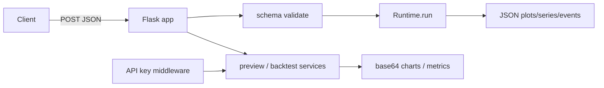

# Copyright (C) 2024-2026 jango_blockchained
#
# This file is part of pynescript.
#
# pynescript is free software: you can redistribute it and/or modify
# it under the terms of the GNU Affero General Public License as published by
# the Free Software Foundation, either version 3 of the License, or
# (at your option) any later version.
#
# pynescript is distributed in the hope that it will be useful,
# but WITHOUT ANY WARRANTY; without even the implied warranty of
# MERCHANTABILITY or FITNESS FOR A PARTICULAR PURPOSE.  See the
# GNU Affero General Public License for more details.
#
# You should have received a copy of the GNU Affero General Public License
# along with pynescript.  If not, see <https://www.gnu.org/licenses/>.
#
# SPDX-License-Identifier: AGPL-3.0-or-later

---
title: "Pro API Usage"
description: "Call the PYNE Flask Pro API as a consumer: health, /run, /run/batch, chart preview, indicator preview, quick backtest, and auth."
---

# Pro API Usage

## Abstract

The Pro API is the **HTTP evaluate contract** for PYNE: POST Pine source plus OHLCV, receive plots, series, events, drawings, and **alerts**. Free-tier evaluate endpoints (`/run`, `/run/batch`) are usable without a key but are **guarded** (bar/script caps, IP rate limit, concurrency, chart/mock-only free data, SSRF-safe webhooks). Optional **L2 alert webhooks** POST last-bar firings to `webhook_url` or `ALERT_WEBHOOK_URL`. Pro preview/backtest routes track usage via API keys. This page is for **callers** (AXIS, scripts, workers). Server lifecycle and auth design are under [API](/pyne/docs/api).

## Conceptual model



| Endpoint | Auth | Purpose |
| --- | --- | --- |
| `GET /` / `GET /health` | none | Health + endpoint map (`default_run_mode`: `auto`) |
| `POST /run` | none (free) | Single script evaluate |
| `POST /run/batch` | none (free) | ≤8 scripts, shared OHLCV |
| `POST /compile/prewarm` | none (free) | Warm Numba builtins / script IR |
| `WS /ws/run` | none (free) | AXIS WebSocket evaluate channel |
| `POST /preview/chart` | Pro usage | Chart thumbnail |
| `POST /preview/indicator` | Pro usage | Indicator-style preview |
| `POST /backtest/quick` | Pro usage | Equity / summary |
| `POST /auth/create_key` | admin token | Mint key |
| `GET /auth/usage` | Pro | Usage stats |
| `POST /auth/validate` | body key | Validate key |
| `POST /lsp/{completion,hover,diagnostics}` | none (free) | AXIS HTTP LSP bridge — see [LSP](/pyne/docs/lsp) |

Default local bind: `127.0.0.1:5002`.

## Interface surface

### Run the server (local)

```bash
pip install -r backend/requirements.txt
export API_KEY_STORE="$PWD/.data/api_keys.json"
python -m backend.app
# or: make run
```

### Health

```bash
curl -s http://127.0.0.1:5002/ | python -m json.tool
```

### `POST /run`

**Schema** (`RUN_SCHEMA`):

| Field | Type | Required | Default |
| --- | --- | --- | --- |
| `script` | string | yes | |
| `data` | list (OHLCV bars) | yes | |
| `symbol` | string | no | `"CHART"` |
| `data_source` | string | no | `""` |
| `data_options` | object | no | `{}` |
| `mode` | string | no | `"auto"` |
| `inputs` | object | no | `{}` — `input.*` by title (forces interpret under `auto`) |
| `libraries` | list | no | `[]` — `[{namespace, name, version, source}]`, max 32 |
| `profiler` | bool | no | `false` — forces interpret |
| `webhook_url` | string | no | `""` (else env `ALERT_WEBHOOK_URL`) |
| `forward_alerts` | bool | no | `true` |
| `alert_last_bar` | bool | no | `true` |
| `alert_batch` | bool | no | `true` |

Not in the schema (sending them → `UNKNOWN_FIELDS`): `timeout_seconds` (library `Runtime.run` only), extra undocumented keys. Query `?mode=` overrides only when the body omits `mode`.

Bar objects are expected to carry at least open/high/low/close/time (volume optional depending on script).

```bash
curl -s -X POST http://127.0.0.1:5002/run \
  -H 'Content-Type: application/json' \
  -d '{
    "script": "//@version=6\nindicator(\"Demo\")\nplot(ta.sma(close, 3))",
    "symbol": "AAPL",
    "mode": "interpret",
    "data": [
      {"time": 1, "open": 10, "high": 11, "low": 9, "close": 10.5, "volume": 1000},
      {"time": 2, "open": 10.5, "high": 12, "low": 10, "close": 11.5, "volume": 1100},
      {"time": 3, "open": 11.5, "high": 12.5, "low": 11, "close": 12, "volume": 1200}
    ]
  }'
```

Success shape (conceptual):

```json
{
  "status": "success",
  "plots": [],
  "series": {},
  "plot_meta": {},
  "events": [],
  "drawings": [],
  "alerts": [],
  "script_id": "...",
  "run_id": "...",
  "count": 3,
  "mode": "interpret",
  "data_source": "chart"
}
```

When a webhook URL is configured, the response may also include `alert_forward` (delivery counts). See [Alerts](/pyne/docs/runtime/alerts).

Error codes include `NO_SCRIPT`, `NO_DATA`, `DATA_SOURCE_ERROR`, `EXECUTION_ERROR`, plus schema codes `INVALID_BODY`, `MISSING_FIELD`, `INVALID_FIELD`, `UNKNOWN_FIELDS`.

### `POST /run/batch`

Shared OHLCV, multiple scripts (max **8**). Envelope:

```json
{
  "scripts": [
    {"id": "sma", "script": "//@version=6\nindicator(\"s\")\nplot(ta.sma(close, 5))"},
    {"id": "rsi", "script": "//@version=6\nindicator(\"r\")\nplot(ta.rsi(close, 14))"}
  ],
  "data": [/* bars */],
  "symbol": "AAPL",
  "mode": "interpret"
}
```

String entries in `scripts` are accepted and auto-id’d as `script_0`, …. Per-script errors do not necessarily fail the whole HTTP status (route returns 200 with per-item status — verify against deployment).

### `POST /preview/chart` (Pro)

```json
{
  "script": "",
  "data": {"close": [100, 101, 102], "volume": [1, 2, 3]},
  "options": {
    "type": "line",
    "color": "#2196F3",
    "width": 600,
    "height": 300,
    "show_volume": false
  }
}
```

Response includes base64 PNG `chart` + `meta`. Width/height clamped (e.g. max 1200×600).

### `POST /preview/indicator` (Pro)

```json
{
  "expression": "ta.sma(close, 20)",
  "data": {"close": [/* ... */]},
  "options": {}
}
```

### `POST /backtest/quick` (Pro)

```json
{
  "script": "//@version=6\nstrategy(\"x\")\n...",
  "data": {},
  "initial_capital": 10000.0,
  "mock_data": true,
  "mock_bars": 252
}
```

### `POST /compile/prewarm` (free)

Warm Numba builtins / optional script list so the first interactive `/run` with `mode=auto|compile` skips cold JIT. Soft-fails without Numba (object-mode compile still works).

```bash
curl -s -X POST http://127.0.0.1:5002/compile/prewarm \
  -H 'Content-Type: application/json' \
  -d '{"force": true}' | python -m json.tool
```

Optional body: `scripts` (list of Pine sources to compile-warm), `force` (re-run builtins). Response includes timing / prewarm stats. Deploy hosts may also set `PYNE_COMPILE_PREWARM` for once-per-worker start. See [Compiler overview](/pyne/docs/runtime/compiler/overview).

### Auth helpers

```bash
# Mint key (admin)
curl -s -X POST http://127.0.0.1:5002/auth/create_key \
  -H "Content-Type: application/json" \
  -H "X-Admin-Token: $ADMIN_TOKEN" \
  -d '{"tier":"hobby"}'

# Validate
curl -s -X POST http://127.0.0.1:5002/auth/validate \
  -H "Content-Type: application/json" \
  -d '{"api_key":"pyn_..."}'
```

Send Pro requests with the key as required by middleware (`Authorization: Bearer …` / documented API-key header — see [Auth and keys](/pyne/docs/api/auth-and-keys)).

There is **no** `pynescript.api.PynescriptAPI` client in this package. Call the HTTP contract with `requests` / `curl` as above.

## Internals (repo paths)

| Path | Role |
| --- | --- |
| `backend/app.py` | Routes `/`, `/run`, `/run/batch`, `/compile/prewarm`, auth |
| `backend/api/preview.py` | `/preview/*`, `/backtest/quick` |
| `backend/middleware/schemas.py` | Strict request schemas (`mode` default `auto`, alert flags) |
| `backend/middleware/auth.py` | Keys, usage, admin token |
| `src/pynescript/runtime/host.py` | Package Runtime SoT (`interpret` / `compile` / `auto`) |
| `backend/runtime.py` | Compat shim → `pynescript.runtime` |
| `backend/alert_forwarder.py` | L2 webhook POST batching |
| `backend/services/chart_renderer.py` | PNG rendering |
| `backend/services/backtest.py` | Quick backtest + mock OHLCV |

## Invariants & edge cases

- **Max body 5 MiB** — oversized JSON → Flask 413.
- **Strict schemas** — unknown fields rejected.
- **CORS** — browser clients need listed origins; server-to-server without `Origin` is fine.
- **`mode` default `auto`** — prefer warm compile; fall back to interpret (`auto_backend`, optional `compile_fallback_reason`). Strict `compile` errors instead of falling back; use `interpret` for alerts, `input.*` overrides, libraries, and full `request.*`.
- **`libraries` (0.3.7+)** — `[{namespace, name, version, source}]` binds `import ns/Name/ver` (max 32). `register_library_source` finalizes exports in 0.3.8; auto-mode keeps the list on interpret fallback. Same field on pyne-worker `/run` and deployed scripts.
- **Alerts** — `alerts[]` on success (interpret). L2 webhooks: body `webhook_url` or env `ALERT_WEBHOOK_URL`; defaults last-bar + batch POST. See [Alerts](/pyne/docs/runtime/alerts).
- **Batch cap 8** — `TOO_MANY_SCRIPTS` if exceeded.
- **Free-tier guards (0.3.4+)** — process-local limits on unauthenticated `/run`, `/run/batch`, `/compile/prewarm` (and WS run):
  | Env | Default | Role |
  | --- | ---: | --- |
  | `FREE_MAX_BARS` | 5000 | Max OHLCV bars |
  | `FREE_MAX_SCRIPT_CHARS` | 256 KiB | Max Pine source length |
  | `FREE_MAX_CONCURRENT` | 4 | Simultaneous free runs per worker |
  | `FREE_RATE_LIMIT` / `FREE_RATE_WINDOW_SEC` | 60 / 60s | Sliding-window IP rate limit |
  | Free `data_source` | `chart` / `mock` / `none` only | No outbound ccxt/yahoo on free paths |
  Webhook URLs are SSRF-filtered. Raise limits via env for local demos; put a reverse proxy in front for multi-worker production.
- AXIS multi-indicator UIs prefer `/run/batch` to share bar payloads; read `series` + `plot_meta` (including fill band refs) for charts.

## Worked examples

### Python `requests` client for `/run`

```python
import requests

SCRIPT = """
//@version=6
indicator("SMA", overlay=true)
plot(ta.sma(close, 5))
"""

bars = [
    {"time": i, "open": 100 + i, "high": 101 + i, "low": 99 + i, "close": 100.5 + i, "volume": 1000}
    for i in range(30)
]

r = requests.post(
    "http://127.0.0.1:5002/run",
    json={"script": SCRIPT, "data": bars, "symbol": "DEMO", "mode": "auto"},
    timeout=60,
)
r.raise_for_status()
payload = r.json()
assert payload["status"] == "success", payload
print(payload["count"], payload.get("mode"), list(payload.get("series", {})))
# optional: payload.get("alerts"), payload.get("alert_forward")
```

### Batch two indicators

```python
r = requests.post(
    "http://127.0.0.1:5002/run/batch",
    json={
        "scripts": [
            {"id": "sma", "script": "//@version=6\nindicator(\"s\")\nplot(ta.sma(close, 5))"},
            {"id": "ema", "script": "//@version=6\nindicator(\"e\")\nplot(ta.ema(close, 5))"},
        ],
        "data": bars,
    },
    timeout=120,
)
print(r.json())
```

### Bind published libraries

```python
r = requests.post(
    "http://127.0.0.1:5002/run",
    json={
        "script": '//@version=6\nimport Demo/Lib/1 as L\nindicator("t")\nplot(L.x)\n',
        "data": bars,
        "mode": "interpret",
        "libraries": [
            {
                "namespace": "Demo",
                "name": "Lib",
                "version": 1,
                "source": '//@version=6\nlibrary("Lib")\nexport x = 1.0\n',
            }
        ],
    },
    timeout=60,
)
```

### Wire optional CCXT data source

```json
{
  "script": "...",
  "data": [/* chart bars */],
  "symbol": "BTC/USDT",
  "data_source": "ccxt",
  "data_options": {"exchange": "binance"}
}
```

Requires server environment with `ccxt` installed.

## Failure modes

| Code / HTTP | Meaning | Action |
| --- | --- | --- |
| 400 `MISSING_FIELD` | No `script`/`data` | Fix body |
| 400 `UNKNOWN_FIELDS` | Extra keys | Strip undocumented fields |
| 400 `DATA_SOURCE_ERROR` | Provider config | Fix `data_options` / deps |
| 500 `EXECUTION_ERROR` | Runtime exception | Simplify script; check message |
| 403 on create_key | `ADMIN_TOKEN` unset/wrong | Export token |
| 413 | Body too large | Fewer bars / compress strategy |
| CORS browser error | Origin not allowed | Update `ALLOWED_ORIGINS` |
| Empty series | Script never plotted | Add `plot` / check declaration |

## See also

- [Evaluate scripts](/pyne/docs/enduser/guides/evaluate-scripts)
- [Runtime modes](/pyne/docs/enduser/reference/modes)
- [Configuration](/pyne/docs/enduser/getting-started/configuration)
- [API contract](/pyne/docs/api/contract)
- [Auth and keys](/pyne/docs/api/auth-and-keys)
- [AXIS](/axis/docs) — AXIS over `/run` results
- [HOOX](/docs) — edge mesh after strategy events
