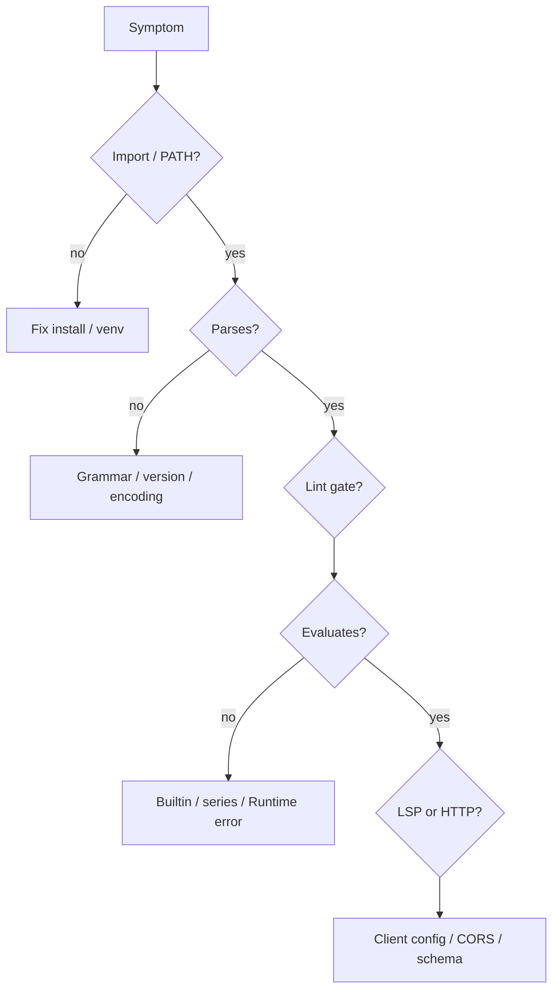

# Copyright (C) 2024-2026 jango_blockchained
#
# This file is part of pynescript.
#
# pynescript is free software: you can redistribute it and/or modify
# it under the terms of the GNU Affero General Public License as published by
# the Free Software Foundation, either version 3 of the License, or
# (at your option) any later version.
#
# pynescript is distributed in the hope that it will be useful,
# but WITHOUT ANY WARRANTY; without even the implied warranty of
# MERCHANTABILITY or FITNESS FOR A PARTICULAR PURPOSE.  See the
# GNU Affero General Public License for more details.
#
# You should have received a copy of the GNU Affero General Public License
# along with pynescript.  If not, see <https://www.gnu.org/licenses/>.
#
# SPDX-License-Identifier: AGPL-3.0-or-later

---
title: "Troubleshooting"
description: "Diagnose pynescript install, parse, lint, evaluation, LSP, data providers, and Pro API failures with concrete checks."
---

# Troubleshooting

## Abstract

Failures cluster by layer: **environment**, **parse**, **lint**, **evaluation**, **data I/O**, **LSP**, **HTTP**. Work top-down: confirm the binary/module, then a minimal script, then full strategy complexity. This page is a runbook; deep protocol and runtime docs are linked per section.

## Conceptual model



## Interface surface (diagnostic commands)

```bash
python -c "import pynescript; from pynescript import __about__; print(__about__.__version__)"
python -c "from pynescript.ast import parse, unparse; print(unparse(parse('//@version=5\nindicator(\"t\")\nplot(close)\n')))"
pynescript --version
pynescript lint - <<< $'//@version=5\nindicator("t")\nplot(close)\n'
python -c "import pygls"  # LSP extra
python -c "import ccxt"   # data extra
curl -s http://127.0.0.1:5002/ | head
```

## Internals (where errors originate)

| Layer | Path |
| --- | --- |
| CLI | `src/pynescript/__main__.py` |
| Parse | `src/pynescript/ast/helper.py`, ANTLR error listener |
| Lint | `src/pynescript/ast/linter.py` |
| Eval | `src/pynescript/ast/evaluator/`, `backend/runtime.py` |
| Data | `src/pynescript/util/data.py` |
| LSP | `src/pynescript/langserver/` |
| HTTP | `backend/app.py`, `backend/middleware/schemas.py` |

## Invariants & edge cases

- Minimal green script for isolation:

```pine
//@version=5
indicator("t")
plot(close)
```

- Encoding must be UTF-8 unless you pass `--encoding`.
- Pine v4 and earlier trigger linter deprecation (`W002`); parser support may still differ by construct.
- Recursion limit is raised only during parse; extreme generated scripts can still fail.

## Worked examples (by symptom)

### 1. `pynescript: command not found`

```bash
which python
python -m pynescript --help
# If module works but script does not:
python -m pip show pynescript
ls "$(python -c 'import sysconfig; print(sysconfig.get_path("scripts"))')"
```

Fix: activate the venv used for install; reinstall `pip install hoox-pyne` (import package is still `pynescript`).

### 2. `ModuleNotFoundError: pynescript`

Wrong interpreter (IDE using system Python). Point the IDE at the venv; reinstall editable from repo root: `pip install -e .`.

### 3. Parse / SyntaxError

```bash
pynescript parse-and-dump broken.pine
```

Checks:

- `//@version=5` or `6` present  
- Balanced parentheses / indentation (Pine uses line structure)  
- Multiline strings / v6 features need a package version that includes them  
- Binary/null bytes in file  

Reduce to a minimal repro; if TV accepts it and PYNE does not, consult [missing features](/pyne/docs/reference/missing-features) and file a grammar issue.

### 4. Round-trip looks “wrong”

`unparse` normalizes formatting. Compare dumps:

```bash
pynescript parse-and-dump a.pine > /tmp/a.ast
pynescript parse-and-unparse a.pine | pynescript parse-and-dump /dev/stdin
# stdin may not work for parse-and-dump (file path required) — use a temp file:
pynescript parse-and-unparse a.pine --output-file /tmp/a2.pine
pynescript parse-and-dump /tmp/a2.pine > /tmp/a2.ast
diff -u /tmp/a.ast /tmp/a2.ast
```

Structural diff empty ⇒ cosmetic only.

### 5. Lint noise / CI red

| Code | Action |
| --- | --- |
| `E001` | Fix syntax first |
| `W001` | Add `//@version=5` |
| `W002` | Upgrade version pragma |
| `C001`–`C004` | Style; use `--fail-on errors` if style should not gate CI |

```bash
pynescript lint script.pine --fail-on errors
```

### 6. `literal_eval` fails

- Use `mode="eval"`-compatible **expressions**, not full `strategy()` scripts  
- Pass series as Python lists inside the expression or via `context`  
- Missing builtin → incomplete implementation  

Escalate to `Runtime.run` for multi-bar scripts.

### 7. Runtime / `/run` execution error

```bash
curl -s -X POST http://127.0.0.1:5002/run -H 'Content-Type: application/json' -d '{"script":"//@version=5\nindicator(\"t\")\nplot(close)","data":[{"time":1,"open":1,"high":1,"low":1,"close":1,"volume":1}]}'
```

If minimal works but strategy fails: remove `request.*`, drawings, then strategy entries until isolated. Check `mode`; try `"interpret"`.

### 8. Schema validation errors

`UNKNOWN_FIELDS` means you sent a key not in the schema — remove it. Do not rely on servers ignoring extras.

### 9. CORS from AXIS / browser

```bash
export ALLOWED_ORIGINS="http://localhost:8081,http://127.0.0.1:8081"
```

Restart Flask after changing env.

### 10. LSP will not start

```bash
pip install "hoox-pyne[lsp]"
python -c "import pygls, lsprotocol"
command -v pynescript-lsp
# Run with editor logging enabled; check stderr for import traces
```

Ensure the editor’s `command` matches the venv. For Neovim, confirm `filetypes` include your buffer’s filetype.

### 11. Data provider failures

| Provider | Checklist |
| --- | --- |
| `mock` | Should always work offline |
| `yahoo` | Network; symbol format |
| `alphavantage` | API key; demo limits |
| `ccxt` | `pip install "hoox-pyne[data]"`; exchange id; symbol `BTC/USDT` |

```bash
pynescript data AAPL --provider mock
```

### 12. Version / parity confusion

PYNE is independent of TradingView®. Behavioral gaps are expected for edge builtins, broker emulators, and UI-only calls. Use [compatibility](/pyne/docs/reference/compatibility) and [implementation status](/pyne/docs/reference/implementation-status).

## Failure modes (quick matrix)

| Symptom | Layer | First check |
| --- | --- | --- |
| Command not found | env | `python -m pynescript` |
| Import error pygls | extra | `[lsp]` |
| Import error ccxt | extra | `[data]` |
| SyntaxError | parse | minimal script + version |
| Lint CI fail | lint | `--fail-on` level |
| Empty plots | eval | `plot()` present; enough bars |
| 400 UNKNOWN_FIELDS | HTTP | schema |
| 403 create_key | HTTP | `ADMIN_TOKEN` |
| 413 | HTTP | body size |
| Squiggles missing | LSP | diagnostics enabled + filetype |
| Numerical drift | eval | warmup / parity docs |

## See also

- [Installation](/pyne/docs/enduser/getting-started/installation)
- [Configuration](/pyne/docs/enduser/getting-started/configuration)
- [CLI guide](/pyne/docs/enduser/guides/cli)
- [Evaluate scripts](/pyne/docs/enduser/guides/evaluate-scripts)
- [Pro API usage](/pyne/docs/enduser/guides/pro-api-usage)
- [Editors](/pyne/docs/enduser/guides/editors)
- [FAQ](/pyne/docs/enduser/reference/faq)
