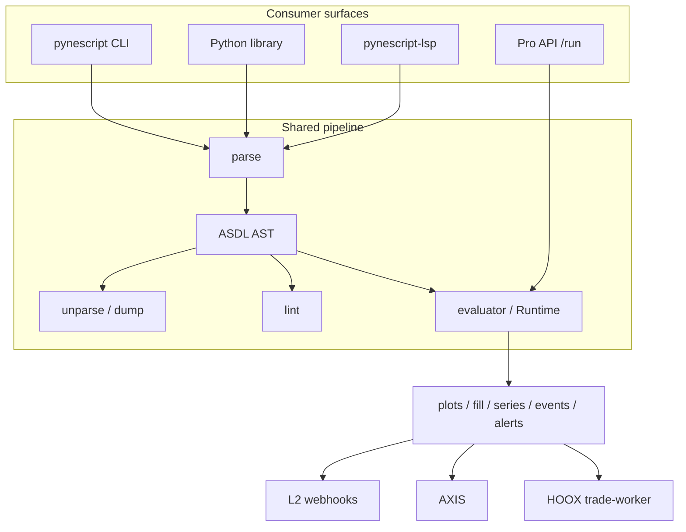

# Copyright (C) 2024-2026 jango_blockchained
#
# This file is part of pynescript.
#
# pynescript is free software: you can redistribute it and/or modify
# it under the terms of the GNU Affero General Public License as published by
# the Free Software Foundation, either version 3 of the License, or
# (at your option) any later version.
#
# pynescript is distributed in the hope that it will be useful,
# but WITHOUT ANY WARRANTY; without even the implied warranty of
# MERCHANTABILITY or FITNESS FOR A PARTICULAR PURPOSE.  See the
# GNU Affero General Public License for more details.
#
# You should have received a copy of the GNU Affero General Public License
# along with pynescript.  If not, see <https://www.gnu.org/licenses/>.
#
# SPDX-License-Identifier: AGPL-3.0-or-later

---
title: "End User Hub"
description: "Install PYNE (pip install hoox-pyne), run CLI/library eval with mode=auto, wire editors (.pyne/.pine), and call Pro API alerts + webhooks."
---

# End User Hub

This track is for people who **consume** PYNE: parse and reformat Pine Script™, lint before upload, evaluate expressions or full scripts against OHLCV (`mode=auto` / interpret / compile), export **alerts** (optional L2 webhooks), wire an editor via LSP (`.pyne` / `.pine`), or call the HTTP evaluate contract. Contributor internals (grammar regeneration, AST builder, bar-loop semantics) live under [Core](/pyne/docs/core), [Runtime](/pyne/docs/runtime), and [DevOps](/pyne/docs/devops).

## Abstract

PYNE exposes one language pipeline through several thin surfaces:

```
.pyne / .pine source
  → parse (ANTLR4 + ASDL AST)
  → optional: dump | unparse | lint | walk/transform
  → optional: evaluate (literal_eval | Runtime mode=auto|interpret|compile)
  → plots / fill / events / drawings / alerts / metrics
  → optional L2 webhooks (Pro API / edge)
```

The **desk path** is the `pynescript` Click CLI and `pynescript.ast` library API (PyPI distribution name **[`hoox-pyne`](https://pypi.org/project/hoox-pyne/)**). The **editor path** is `pynescript-lsp` (stdio; first-class `.pyne` association). The **HTTP path** is the Flask Pro API (`POST /run` with alerts export + webhooks, preview, backtest). The optional chart is [AXIS](/axis/docs); the optional trade mesh is [HOOX](/docs). Evaluation does not require either.

## Conceptual model



| Surface | Entry | Typical job |
| --- | --- | --- |
| CLI | `pynescript …` | One-shot parse, format, lint, market data, prewarm |
| Library | `from pynescript.ast import parse, unparse` | Embed parse/transform/eval in tools |
| LSP | `pynescript-lsp` | Diagnostics, completion, hover (`.pyne` / `.pine`) |
| Pro API | `POST /run` | Evaluate contract: plots, alerts, optional webhooks |
| AXIS | separate product | Chart PWA AXIS over evaluate results |
| HOOX | separate product | Edge execution mesh after strategy events |

## Choose your path

### 1. Getting started

New install, first parse, and environment knobs:

- **[Installation](/pyne/docs/enduser/getting-started/installation)** — PyPI **`pip install hoox-pyne`** (import `pynescript`), extras (`lsp`, `compile`, `data`, `pro`), Hatch checkout, smoke checks.
- **[Quick start](/pyne/docs/enduser/getting-started/quick-start)** — Parse → dump → unparse → lint → `literal_eval` in under ten minutes.
- **[Configuration](/pyne/docs/enduser/getting-started/configuration)** — Extras, console scripts, Pro API env vars (`ALERT_WEBHOOK_URL`, compile cache), editor settings.

### 2. Operational guides

Daily workflows against the same pipeline:

- **[CLI](/pyne/docs/enduser/guides/cli)** — `parse-and-dump`, `parse-and-unparse`, `lint`, `data`, `download-builtin-scripts`.
- **[Library API](/pyne/docs/enduser/guides/library-api)** — `parse`, `unparse`, `dump`, `walk`, visitors, transformers, linter.
- **[Evaluate scripts](/pyne/docs/enduser/guides/evaluate-scripts)** — Expression eval, bar-loop Runtime (`mode=auto`), strategy events, **alerts export**, mock vs live data.
- **[Editors](/pyne/docs/enduser/guides/editors)** — VS Code (`.pyne` first-class), Neovim, Zed, Emacs, Helix; `clients/` snippets.
- **[Pro API usage](/pyne/docs/enduser/guides/pro-api-usage)** — `/run` (+ `webhook_url` / L2 webhooks), `/run/batch`, preview, backtest as a **consumer**.
- **[Troubleshooting](/pyne/docs/enduser/guides/troubleshooting)** — Parse failures, recursion limits, missing extras, CORS, auth.

### 3. Reference

- **[CLI commands](/pyne/docs/enduser/reference/cli-commands)** — Full option trees for every Click command.
- **[Glossary](/pyne/docs/enduser/reference/glossary)** — AST, series, bar-loop, Runtime, ASDL, and related terms.
- **[FAQ](/pyne/docs/enduser/reference/faq)** — Version support, TradingView parity, licensing, AXIS/HOOX boundaries.

## Interface surface (consumer map)

| Want | Command / import | Docs |
| --- | --- | --- |
| Install core | `pip install hoox-pyne` (import `pynescript`) | [Installation](/pyne/docs/enduser/getting-started/installation) |
| Install LSP | `pip install "hoox-pyne[lsp]"` | [Editors](/pyne/docs/enduser/guides/editors) |
| Install market data deps | `pip install "hoox-pyne[data]"` | [CLI data](/pyne/docs/enduser/guides/cli) |
| Parse file | `pynescript parse-and-dump path.pyne` | [CLI](/pyne/docs/enduser/guides/cli) |
| Normalize source | `pynescript parse-and-unparse path.pine` | [CLI](/pyne/docs/enduser/guides/cli) |
| Lint | `pynescript lint path.pine` | [CLI](/pyne/docs/enduser/guides/cli) |
| Library parse | `from pynescript.ast import parse, unparse` | [Library API](/pyne/docs/enduser/guides/library-api) |
| Expression eval | `from pynescript.ast.helper import literal_eval` | [Evaluate](/pyne/docs/enduser/guides/evaluate-scripts) |
| Bar-loop eval | `Runtime.run(..., mode="auto")` | [Evaluate](/pyne/docs/enduser/guides/evaluate-scripts) |
| Alerts + webhooks | `/run` → `alerts[]` / `webhook_url` | [Alerts](/pyne/docs/runtime/alerts) |
| Start LSP | `pynescript-lsp` (stdio) | [Editors](/pyne/docs/enduser/guides/editors) |
| Local Pro API | `make run` / `python -m backend.app` | [Pro API usage](/pyne/docs/enduser/guides/pro-api-usage) |

Two console scripts are registered in `pyproject.toml`:

| Script | Module | Role |
| --- | --- | --- |
| `pynescript` | `pynescript.__main__:cli` | Desk CLI (Click group) |
| `pynescript-lsp` | `pynescript.langserver.__main__:main` | Language server (pygls) |

Do not conflate them: lint and parse live on `pynescript`; editor features live on `pynescript-lsp`.

## Internals (repo paths)

Consumer-relevant code only — deeper design is linked from each guide:

| Path | Role |
| --- | --- |
| `src/pynescript/__main__.py` | Click CLI: parse-and-dump, parse-and-unparse, lint, data, download-builtin-scripts |
| `src/pynescript/ast/helper.py` | Public `parse`, `unparse`, `dump`, `walk`, `literal_eval` |
| `src/pynescript/ast/linter.py` | `lint_script` / `PineLinter` |
| `src/pynescript/ast/evaluator/` | Bar-aware and literal evaluators |
| `src/pynescript/langserver/` | LSP features and server |
| `src/pynescript/util/data.py` | Historical data providers (mock, yahoo, alphavantage, ccxt) |
| `backend/app.py` | Flask Pro API entry (`/run`, auth, blueprints) |
| `backend/runtime.py` | HTTP-facing `Runtime.run` bar loop |
| `examples/` | Worked scripts (parse, RSI strategy, datafeed) |
| `clients/` | Editor client configs (Neovim, Zed, Emacs) |
| `vscode-extension/` | VS Code extension package |

## Invariants & edge cases

- **Round-trip is first-class.** `parse` → `unparse` should preserve semantics; use it to normalize formatting, not as a semantic rewrite.
- **Mode split.** `parse(..., mode="exec")` yields a script tree; `mode="eval"` parses a single expression (used by `literal_eval`).
- **No proprietary host required.** Evaluation works offline with mock or supplied OHLCV; AXIS/HOOX are optional.
- **Extras are opt-in.** Core parse/lint needs only base deps (`antlr4-python3-runtime`, `click`, …). LSP needs `[lsp]`; CCXT paths need `[data]` / `[datafeed]`.
- **Parametrized corpus.** Tests under `tests/data/builtin_scripts/` are large; a fixture using `pinescript_filepath` can explode CI runtime if misused.

## Worked examples

Minimal library round-trip:

```python
from pynescript.ast import parse, unparse

source = """
//@version=5
indicator("My RSI")
plot(ta.rsi(close, 14))
"""
tree = parse(source)
print(unparse(tree))
```

Minimal CLI:

```bash
pip install hoox-pyne
pynescript parse-and-dump examples/rsi_strategy.pine
pynescript lint examples/rsi_strategy.pine
```

Minimal HTTP evaluate (local server running):

```bash
curl -s http://127.0.0.1:5002/ \
  | python -m json.tool
```

## Failure modes

| Symptom | Likely cause | Where to go |
| --- | --- | --- |
| `pynescript: command not found` | Package not on PATH / venv inactive | [Installation](/pyne/docs/enduser/getting-started/installation) |
| `pynescript-lsp` missing | Installed without `[lsp]` extra | [Editors](/pyne/docs/enduser/guides/editors) |
| `SyntaxError` on parse | Grammar mismatch or truncated source | [Troubleshooting](/pyne/docs/enduser/guides/troubleshooting) |
| `/run` 400 `NO_DATA` | Missing OHLCV list | [Pro API usage](/pyne/docs/enduser/guides/pro-api-usage) |
| Numerical drift vs TradingView | Builtin / series edge case | [Compatibility](/pyne/docs/reference/compatibility) |

## See also

- [PYNE product map](/pyne/docs) — full stack overview
- [Installation](/pyne/docs/enduser/getting-started/installation)
- [Quick start](/pyne/docs/enduser/getting-started/quick-start)
- [Evaluate contract (API)](/pyne/docs/api/contract)
- [AXIS docs](/axis/docs) — optional chart
- [HOOX docs](/docs) — optional edge trade mesh
